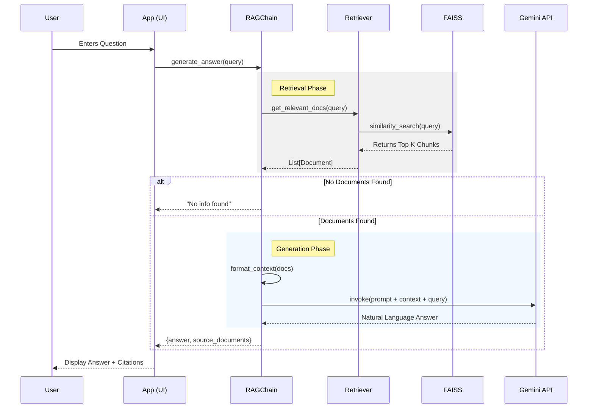

## [2025-12-20] Task: Initial MVP Implementation & Testing Framework
### 1. Technical Explanation
- **Changes**: 
    - **Architecture**: Established a **Modular Monolith** structure as per `Designing.md`.
    - **Configuration**: Implemented `src/config.py` for centralized environment and path management.
    - **Ingestion Layer** (`src/ingestion/`):
        - `DocumentLoader`: Handles PDF/Docx loading using LangChain's `PyPDFLoader` and `Docx2txtLoader`.
        - `TextSplitter`: Implements `RecursiveCharacterTextSplitter` with chunk size of 1000 and overlap of 200.
        - `VectorIndexer`: Uses `HuggingFaceEmbeddings` (`bkai-foundation-models/vietnamese-bi-encoder`) and `FAISS` for vector storage.
    - **RAG Engine** (`src/rag_engine/`):
        - `SemanticRetriever`: Encapsulates FAISS index loading and similarity search.
        - `RAGChain`: Orchestrates the retrieval and generation flow using `Google Gemini API` (`gemini-pro`).
    - **UI** (`app.py`): Built a Streamlit interface for Chat and Data Re-indexing.
    - **Testing**: Added a robust test suite (`tests/`) using `pytest` to verify Ingestion (Loader, Splitter, Indexer) and RAG logic (mocking LLM).
- **Why**: To provide a functional prototype of the "AI Legal Assistant" that meets the core requirement of answering legal questions with accurate citations using a local vector database and a cloud-based LLM.

### 2. Flow Visualization (Mermaid)

