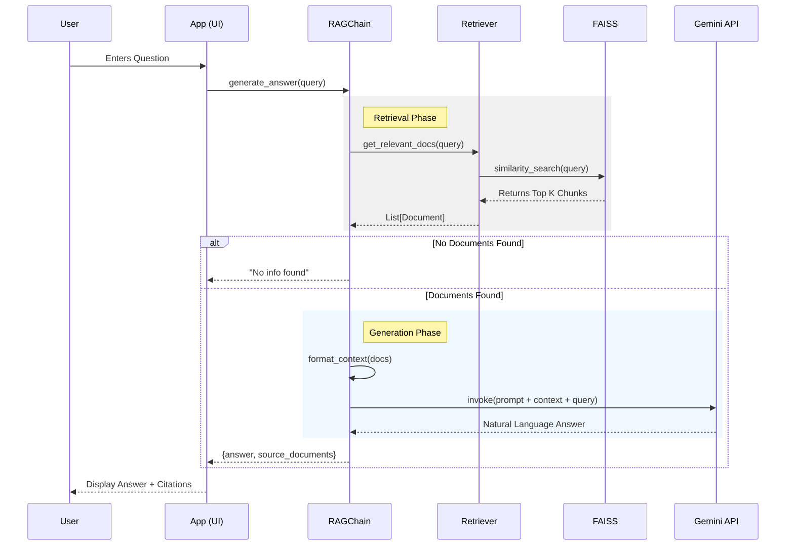
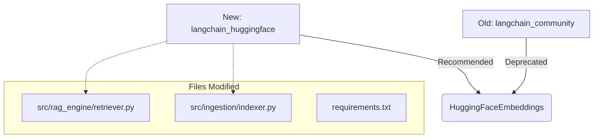
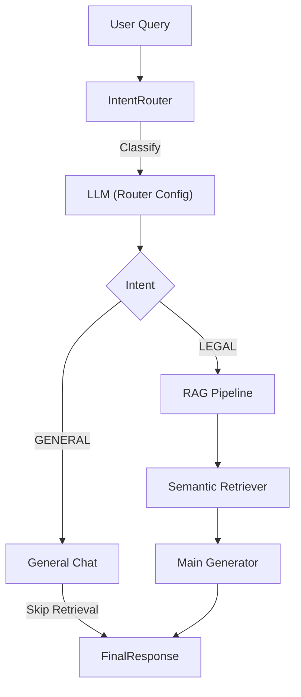
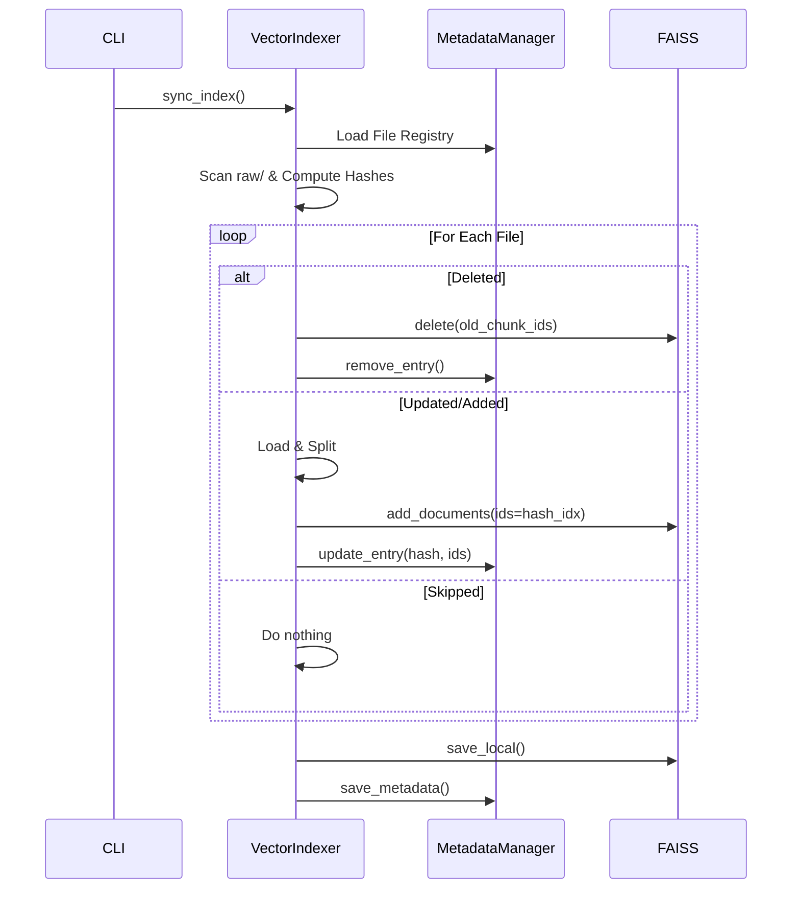
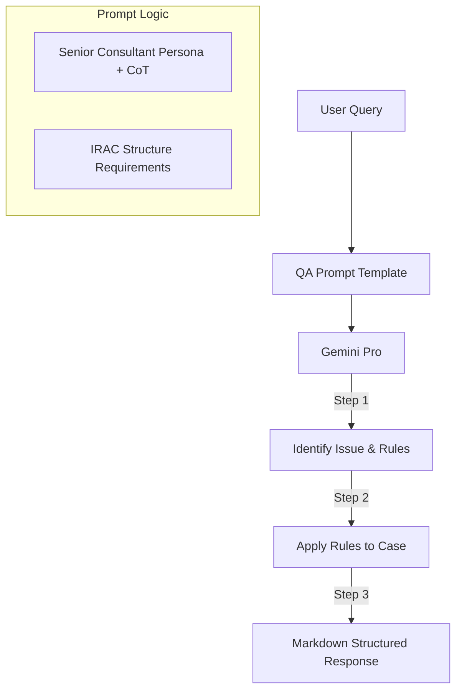
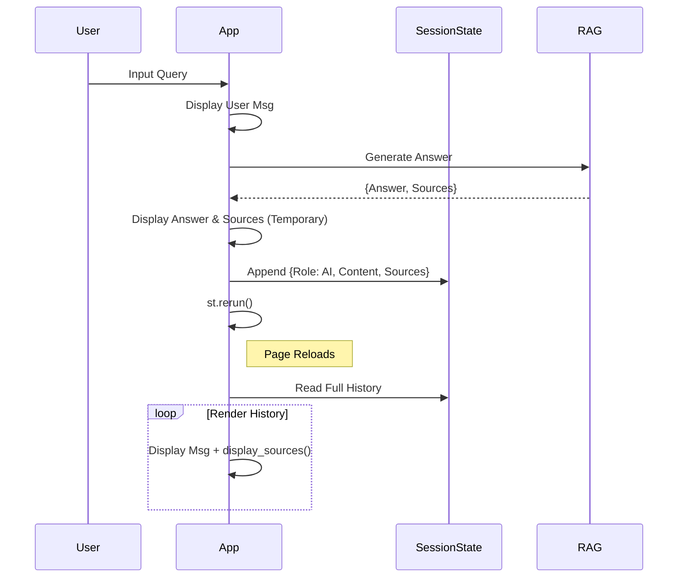
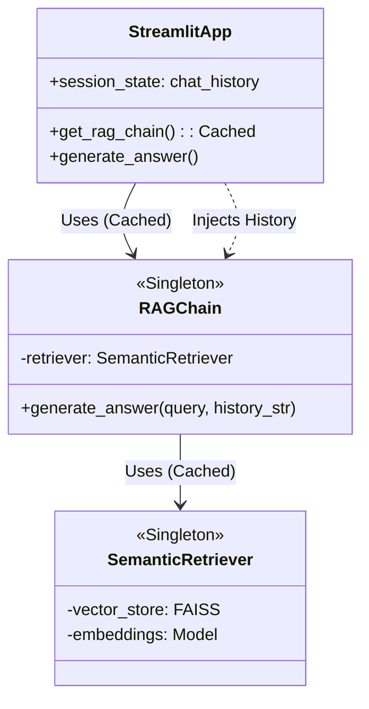

<style>
    /* Force white background and black text for the whole page */
    body, .vscode-body {
        background-color: #ffffff !important;
        color: #000000 !important;
    }
    /* Style code blocks to be readable on white */
    code, pre {
        background-color: #f0f0f0 !important;
        color: #222222 !important;
    }
</style>

## [2025-12-20] Task: Initial MVP Implementation & Testing Framework
### 1. Technical Explanation
- **Changes**: 
    - **Architecture**: Established a **Modular Monolith** structure as per `Designing.md`.
    - **Configuration**: Implemented `src/config.py` for centralized environment and path management.
    - **Ingestion Layer** (`src/ingestion/`):
        - `DocumentLoader`: Handles PDF/Docx loading using LangChain's `PyPDFLoader` and `Docx2txtLoader`.
        - `TextSplitter`: Implements `RecursiveCharacterTextSplitter` with chunk size of 1000 and overlap of 200.
        - `VectorIndexer`: Uses `HuggingFaceEmbeddings` (`bkai-foundation-models/vietnamese-bi-encoder`) and `FAISS` for vector storage.
    - **RAG Engine** (`src/rag_engine/`):
        - `SemanticRetriever`: Encapsulates FAISS index loading and similarity search.
        - `RAGChain`: Orchestrates the retrieval and generation flow using `Google Gemini API` (`gemini-pro`).
    - **UI** (`app.py`): Built a Streamlit interface for Chat and Data Re-indexing.
    - **Testing**: Added a robust test suite (`tests/`) using `pytest` to verify Ingestion (Loader, Splitter, Indexer) and RAG logic (mocking LLM).
- **Why**: To provide a functional prototype of the "AI Legal Assistant" that meets the core requirement of answering legal questions with accurate citations using a local vector database and a cloud-based LLM.

### 2. Flow Visualization (Mermaid)


## [2025-12-23] Task: LangChain Deprecation Refactor
### 1. Technical Explanation
- **Changes**: 
    - **Dependency**: Switched from `sentence-transformers` to `langchain-huggingface`.
    - **Code Refactor**: Updated `HuggingFaceEmbeddings` imports in `retriever.py` and `indexer.py` to use the new `langchain_huggingface` package.
- **Why**: To comply with LangChain 0.2.2+ standards and prevent future breaking changes when LangChain 1.0 is released. This also removed the associated deprecation warnings in the console.

### 2. Flow Visualization (Mermaid)


## [2025-12-23] Task: Intent Classification & Routing (Advanced)
### 1. Architectural Decision (ADR)
- **Context**: Users ask off-topic questions ("Hello", "Weather"), and the system awkwardly tries to search legal docs. Also, need flexibility to use different LLMs.
- **Decision**: Implemented a **Router-Based Architecture** with **LLM Factory Pattern**.
    - **IntentRouter**: Uses a lightweight LLM call to classify queries as `LEGAL` or `GENERAL`.
    - **LLMFactory**: Abstracts LLM creation, supporting multi-provider (Google, Ollama, etc.) and separating Router config from Generator config.
- **Impact**: 
    - Improved UX: Natural chat for off-topic queries.
    - Extensibility: Can swap Router model to a smaller/cheaper one (e.g., local Mistral) without touching core logic.

### 2. Flow Visualization (Mermaid)


## [2025-12-24] Task: Incremental Indexing System
### 1. Architectural Decision (ADR)
- **Context**: The previous indexing strategy was "Full Rebuild" (delete all and re-embed), which is inefficient as the dataset grows.
- **Decision**: Implemented **Differential/Incremental Indexing** with a Metadata Registry.
    - **MetadataManager**: Tracks file hashes and chunk IDs in `indexing_metadata.json`.
    - **VectorIndexer.sync_index()**: Replaces `build_index`. It calculates file hashes, detects changes (Add/Update/Delete/Skip), and updates the Vector Store atomically per file.
    - **ID Strategy**: Chunk IDs are deterministic (`[hash]_[index]`) to allow precise deletion of old chunks during updates.
- **Impact**: 
    - **Performance**: Significant reduction in processing time for small updates (only new/changed files are processed).
    - **Schema**: Added `indexing_metadata.json` to `data/vector_store/`. Vector Store now relies on custom IDs.

### 2. Flow Visualization (Mermaid)


## [2025-12-24] Task: Integration & Cleanup (Incremental Indexing)
### 1. Architectural Decision (ADR)
- **Context**: After implementing `sync_index`, the legacy `build_index` method and its manual calls in `ingest.py`, `app.py`, and tests caused deprecation warnings and architectural inconsistency.
- **Decision**: Fully migrate all entry points to the new Incremental flow and remove legacy code.
- **Changes**:
    - **Refactor**: Updated `ingest.py` and Streamlit `app.py` to call `VectorIndexer.sync_index()` directly.
    - **Cleanup**: Deleted the deprecated `build_index` method from `src/ingestion/indexer.py`.
    - **Test Alignment**: Updated `tests/test_ingestion.py` and `tests/test_rag.py` to use `sync_index` and fixed `fpdf` version compatibility issues in `tests/conftest.py`.
- **Impact**: 
    - Zero deprecation warnings.
    - Unified data pipeline across CLI, UI, and Tests.
    - Improved UI experience with a simplified synchronization status.

## [2025-12-24] Task: UX Refinement (Citation Display)
### 1. Technical Explanation
- **Context**: `PyPDFLoader` extracts page numbers using 0-based indexing (e.g., Page 1 is `page: 0`). This confused users when verifying citations.
- **Change**: Updated `app.py` to display `page + 1` in the UI (Chat History and New Answers).
- **Impact**: Citations now match the physical page numbers of the documents.

## [2025-12-24] Task: Bug Fix - LLM Citation Page Numbers
### 1. Scientific Debugging (Protocol D)
- **Symptom**: LLM response cites "Trang 70" while the UI correctly displays "Trang 71" (for a document where the content is on physical page 71).
- **Root Cause**: `PyPDFLoader` uses 0-based indexing. `app.py` was patched to display `page+1`, but `format_context` in `prompts.py` was still feeding the raw 0-based index to the LLM. The LLM was faithfully citing what it was told.
- **Fix**: Updated `src/rag_engine/prompts.py` to increment the page number by 1 within `format_context` before generating the context string.
- **Verification**: Code review confirms `page = int(raw_page) + 1` logic is now applied in the prompt generation flow.

## [2026-01-02] Task: Prompt Engineering & Structured Reasoning

### 1. Architectural Decision (ADR)

- **Context**: Previous responses were flat and lacked professional legal depth. AI sometimes struggled to synthesize multiple sources effectively.

- **Decision**: Implemented **Structured Persona & IRAC Reasoning**.

    - **Persona**: Upgraded from "Assistant" to "Senior Legal Consultant" (Cố vấn pháp lý cấp cao).

    - **Strategy**: Introduced **Chain-of-Thought (CoT)** instructions in the System Prompt.

    - **Structure**: Enforced **IRAC** (Issue, Rule, Analysis, Conclusion) format in the User Prompt template to ensure logical flow.

- **Impact**: 

    - Responses are now structured with distinct "Legal Basis", "Analysis", and "Conclusion" sections.

    - Improved citation reliability through explicit placement rules.

    - Enhanced professional tone suitable for legal consulting.


### 2. Flow Visualization (Mermaid)



## [2026-01-02] Task: Context Memory & Conversational RAG
### 1. Architectural Decision (ADR)
- **Context**: The system was stateless. Users couldn't ask follow-up questions (e.g., "Does *it* apply to men?") because the RAG engine didn't know what "*it*" referred to.
- **Decision**: Implemented **Conversational RAG** with **Query Reformulation**.
    - **Sliding Window Memory**: Added `InMemoryHistoryManager` (in `src/utils/history_manager.py`) to store the last 10 messages per session.
    - **Query Rewriting**: Added a `CONDENSE_QUESTION_PROMPT` and a rewrite step in `RAGChain`. Before retrieval, the system uses LLM to rewrite the user's query into a "Standalone Question" based on history.
    - **Session Management**: Updated `app.py` to generate and persist `session_id`.
- **Impact**: 
    - **UX**: Users can now have natural, multi-turn conversations.
    - **Accuracy**: Retrieval is significantly improved for follow-up questions as pronouns are resolved before searching.
    - **Transparency**: UI now shows how the AI "understood" the question (Standalone Query) in debug mode.

## [2026-01-02] Task: Fix - Chat Context & Prompt Engineering
### 1. Architectural Decision (ADR)
- **Context**: 
    - **Issue 1**: `GENERAL` intent chat was stateless. Users saying "My name is Hung" then "What is my name?" got generic responses because `chat_history` wasn't passed to the General Chain.
    - **Issue 2**: The `CONDENSE_QUESTION_PROMPT` was hallucinating conversational replies instead of strictly rewriting queries for search (e.g., replying "Can you tell me..." instead of outputting "What is the user's name?").
- **Decision**: 
    - **Prompt Hardening**: Rewrote `CONDENSE_QUESTION_PROMPT` with strict negative constraints ("KHÔNG trả lời câu hỏi").
    - **Context Injection**: Updated `GENERAL_PROMPT` to accept `chat_history` and modified `RAGChain.generate_answer` to inject it.
- **Impact**: 
    - General chat now remembers user context (Name, previous topics).
    - RAG retrieval is more robust against "chatty" rewrites.

### 2. Flow Visualization (Mermaid)
```mermaid
%%{init: {'theme': 'default', 'themeVariables': { 'background': '#ffffff' }}}%%
flowchart TD
    UserQuery --> History[Load History]
    History --> Rewriter[Rewrite Query (Strict Mode)]
    Rewriter --> Router{Intent?}
    
    Router -- GENERAL --> GenChain[General Chain]
    History --> GenChain
    GenChain --> Response
    
    Router -- LEGAL --> Retriever
    Retriever --> RAGChain
    RAGChain --> Response
```

## [2026-01-02] Task: UI Optimization & Rendering Logic
### 1. Technical Explanation
- **Context**: 
    - **Issue 1**: Code duplication in `app.py` for displaying source documents (once in history loop, once in new message block).
    - **Issue 2**: Streamlit's immediate rendering vs session state update caused potential "flicker" or double rendering of source expanders if not handled via a clean rerun.
- **Change**: 
    - **Refactor**: Extracted `display_sources(sources)` helper function in `app.py`.
    - **Flow**: Implemented `st.rerun()` immediately after saving the assistant's response to history. This ensures the UI is rebuilt entirely from `session_state.chat_history`, guaranteeing a single, consistent source of truth for rendering.
- **Impact**: 
    - Cleaner code (DRY).
    - Stable UI with no duplicate source widgets.

### 2. Flow Visualization (Mermaid)


## [2026-01-03] Task: Performance Benchmarking
### 1. Scientific Debugging (Protocol D)
- **Goal**: Assess system latency (Embedding vs. Retrieval) and determine if optimization (ONNX/API) is needed.
- **Experiment**:
    - Created `tests/benchmark_embedding.py` and `tests/benchmark_retrieval.py`.
    - Measured Cold Start (Load), Single Query Latency, and Batch Throughput.
- **Results**:
    - **Cold Start**: ~17s (High - Needs Caching).
    - **Embedding**: ~550ms (First run/Cold CPU).
    - **Retrieval (Warm)**: ~112ms (Includes Embedding + FAISS Search).
- **Conclusion**: 
    - Retrieval latency (~100ms) is excellent and not a bottleneck.
    - No need to migrate to ONNX or External API (which adds network latency).
    - **Action**: Focus optimization on **Application Caching** to solve Cold Start issues.

## [2026-01-03] Task: Stateless RAG & Singleton Caching
### 1. Architectural Decision (ADR)
- **Context**: 
    - **Issue**: Users experienced a ~7s delay when reloading the page.
    - **Root Cause**: `RAGChain` was being re-initialized per session, triggering redundant LLM connection handshakes.
- **Decision**: Implemented **Singleton Pattern** via `@st.cache_resource`.
    - **Refactor**: Converted `RAGChain` to be **Stateless** (removed internal `InMemoryHistoryManager`).
    - **Flow**: `app.py` now manages chat history and injects it into `RAGChain.generate_answer(query, history_str)`.
    - **Caching**: `SemanticRetriever` and `RAGChain` are now global singletons, loaded once per server instance.
- **Impact**:
    - **Performance**: Page reload delay reduced from ~7s to <1s (Instant).
    - **Efficiency**: Memory usage reduced (shared Model/Index across users).
    - **Architecture**: Cleaner separation of concerns (UI manages State, Engine is Pure Logic).

### 2. Flow Visualization (Mermaid)

