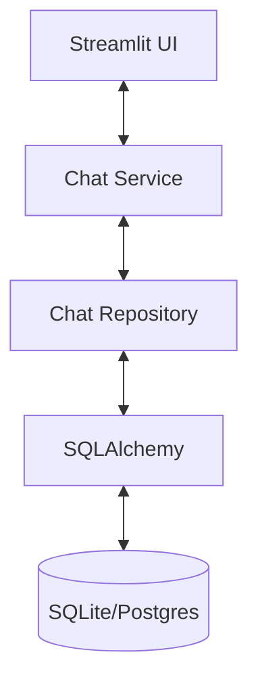
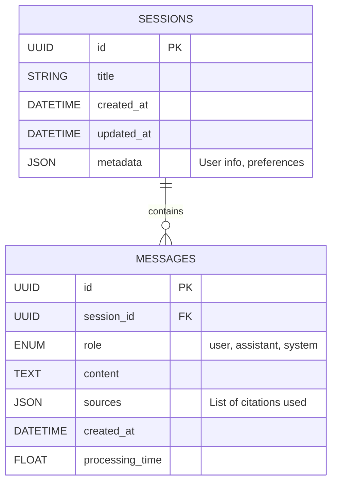

<style>
    /* Force white background and black text for the whole page */
    body, .vscode-body {
        background-color: #ffffff !important;
        color: #000000 !important;
    }
    /* Style code blocks to be readable on white */
    code, pre {
        background-color: #f0f0f0 !important;
        color: #222222 !important;
    }
</style>

# DESIGN DOCUMENT: PERSISTENT CHAT MEMORY SYSTEM
**Date:** 2026-01-13
**Status:** DRAFT
**Context:** Upgrade from In-Memory/Session State to Database Persistence.

---

## 1. ARCHITECTURAL OVERVIEW
The current system stores chat history in `st.session_state` (RAM). This limits history to the active browser tab and is lost on refresh (partially mitigated by recent caches, but not persistent).
We will introduce a **Persistence Layer** using **SQLite** (Dev) / **PostgreSQL** (Prod) managed by **SQLAlchemy**.

### 1.1. High-Level Layers


---

## 2. DATABASE SCHEMA DESIGN

We will use a normalized relational schema.

### 2.1. Entity Relationship Diagram (ERD)



### 2.2. Table Specifications

#### Table: `chat_sessions`
| Column | Type | Constraints | Description |
|---|---|---|---|
| `id` | VARCHAR(36) | PK, Not Null | UUID v4 |
| `title` | VARCHAR(255) | Nullable | Auto-generated from first query |
| `created_at` | DATETIME | Default: UTC Now | |
| `updated_at` | DATETIME | On Update: UTC Now | For sorting "Recent Chats" |
| `metadata` | JSON | Default: `{}` | Store extra flags (e.g. `model_used`) |

#### Table: `chat_messages`
| Column | Type | Constraints | Description |
|---|---|---|---|
| `id` | VARCHAR(36) | PK, Not Null | UUID v4 |
| `session_id` | VARCHAR(36) | FK -> chat_sessions.id | Indexed |
| `role` | VARCHAR(20) | Not Null | `user`, `assistant`, `system` |
| `content` | TEXT | Not Null | The actual message |
| `original_query` | TEXT | Nullable | If `role=assistant`, stores what user asked |
| `sources` | JSON | Default: `[]` | Snapshot of used docs (Title, Page, Snippet) |
| `created_at` | DATETIME | Default: UTC Now | |
| `rating` | INTEGER | Nullable | 1 (Like) or -1 (Dislike) |

---

## 3. API DESIGN (INTERNAL SERVICE CONTRACT)

Since we are currently a Monolith (Streamlit), these "Endpoints" are implemented as **Service Methods**. However, they are designed to be instantly exposable via **FastAPI** in the future.

### 3.1. Session Management

#### `POST /api/sessions`
*   **Action**: Create a new chat session.
*   **Input**: `{"user_id": "optional", "meta": {...}}`
*   **Output**: `{"session_id": "uuid", "created_at": "..."}`

#### `GET /api/sessions`
*   **Action**: List all recent conversations.
*   **Params**: `limit=20`, `offset=0`
*   **Output**: `[{"id": "...", "title": "Luật lao động...", "updated_at": "..."}]`

#### `DELETE /api/sessions/{session_id}`
*   **Action**: Delete a conversation (Soft delete preferred).

#### `PATCH /api/sessions/{session_id}`
*   **Action**: Rename title manually.
*   **Input**: `{"title": "New Name"}`

### 3.2. Message Operations

#### `GET /api/sessions/{session_id}/messages`
*   **Action**: Load full history for the UI.
*   **Output**: List of Message Objects ordered by `created_at` ASC.

#### `POST /api/sessions/{session_id}/messages`
*   **Action**: User sends a message -> Triggers RAG -> Saves User Msg -> Saves AI Response.
*   **Input**: `{"content": "User question"}`
*   **Output**: 
    ```json
    {
      "user_message": {...},
      "ai_message": {
        "content": "Answer...",
        "sources": [...]
      }
    }
    ```

#### `POST /api/messages/{message_id}/feedback`
*   **Action**: Rate an answer.
*   **Input**: `{"rating": 1, "comment": "Good answer"}`

---

## 4. CRUD IMPLEMENTATION PLAN

### 4.1. The Repository Interface (`src/database/repository.py`)
To ensure Clean Architecture, the UI never touches the DB directly.

```python
from abc import ABC, abstractmethod

class BaseChatRepository(ABC):
    @abstractmethod
    def create_session(self, title: str = None) -> Session: pass
    
    @abstractmethod
    def get_session(self, session_id: str) -> Session: pass
    
    @abstractmethod
    def get_recent_sessions(self, limit: int = 10) -> List[Session]: pass
    
    @abstractmethod
    def add_message(self, session_id: str, role: str, content: str, sources: list = None) -> Message: pass
    
    @abstractmethod
    def get_messages(self, session_id: str) -> List[Message]: pass
```

### 4.2. Technology Stack Selection
1.  **ORM**: **SQLAlchemy 2.0** (Async support ready).
2.  **Migration**: **Alembic** (Crucial for schema evolution).
3.  **Database**: 
    *   **Dev**: SQLite (`chat_history.db`).
    *   **Prod**: PostgreSQL.

### 4.3. Integration with RAG Engine
*   **Current**: `app.py` manages state.
*   **New**: `ChatService` orchestrates.
    1.  User input -> `ChatService.process_message(session_id, input)`.
    2.  `ChatService` calls `ChatRepository.add_message(role='user')`.
    3.  `ChatService` fetches history from Repo -> formats for LLM.
    4.  `ChatService` calls `RAGChain.generate()`.
    5.  `ChatService` calls `ChatRepository.add_message(role='assistant', sources=...)`.
    6.  `ChatService` updates `Session.updated_at`.

---

## 5. MIGRATION STEPS (Roadmap)

1.  **Setup Infrastructure**:
    *   `pip install sqlalchemy alembic`
    *   Initialize Alembic config.
2.  **Implement Models**:
    *   Create `src/database/models.py`.
    *   Define `Session` and `Message` classes.
3.  **Implement Repository**:
    *   Create `src/database/sqlite_repo.py`.
4.  **Refactor App**:
    *   Replace `st.session_state.chat_history` with API calls to `ChatRepository`.
    *   Add "History Sidebar" to UI to switch sessions.

---
**Signed:** Principal Evolutionary Architect
