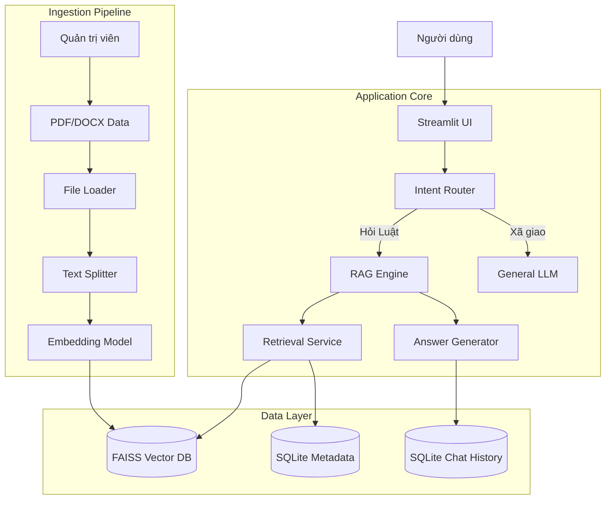

# Tổng quan Hệ thống (System Overview)

## Kiến trúc High-Level

Hệ thống được thiết kế theo mô hình **Modular Monolith**, tách biệt rõ ràng giữa UI, Logic và Data, giúp dễ dàng bảo trì và mở rộng.

## Các thành phần chính

1.  **Frontend (Streamlit)**: Giao diện tương tác, hiển thị chat và lịch sử.
2.  **Ingestion Service**: Chịu trách nhiệm đọc tài liệu, cắt nhỏ và vector hóa.
3.  **RAG Engine**: Trái tim của hệ thống, kết hợp tìm kiếm ngữ nghĩa và khả năng sinh văn bản của LLM.
4.  **Database Layer**:
    *   **Vector DB**: Lưu trữ kiến thức luật.
    *   **Relational DB**: Lưu trữ lịch sử hội thoại.
