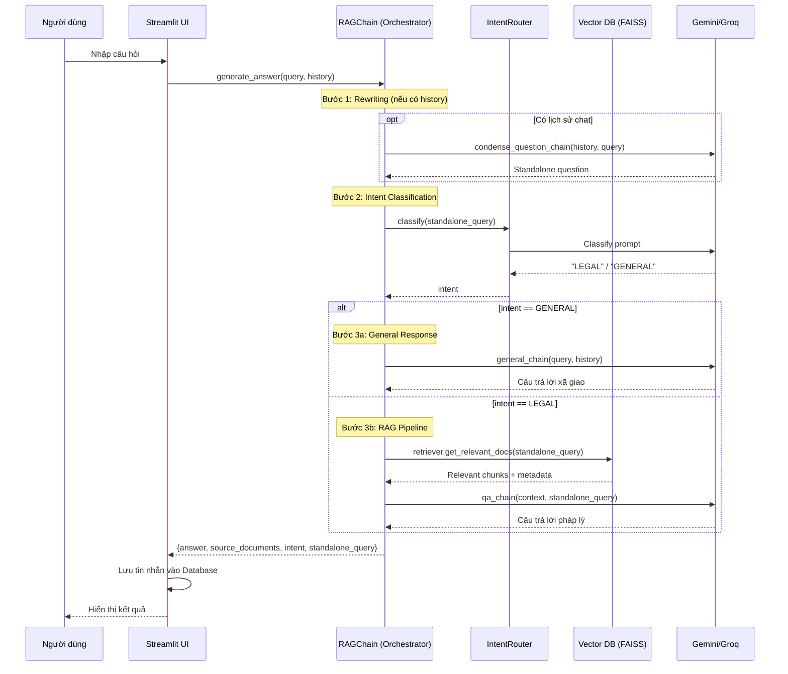

# Luồng AI RAG (Retrieval-Augmented Generation)

Tài liệu này mô tả chi tiết cách hệ thống xử lý một câu hỏi từ người dùng để đưa ra câu trả lời pháp lý chính xác.

## Sơ đồ Tuần tự (Sequence Diagram)



## Các bước xử lý chi tiết

### 1. Query Rewriting (Conditional)
*   **Điều kiện**: Chỉ thực hiện khi `chat_history_str` không rỗng (có lịch sử hội thoại).
*   **Mục đích**: Chuyển câu hỏi phụ thuộc ngữ cảnh (ví dụ: "Nó có áp dụng cho tôi không?") thành câu hỏi độc lập.
*   **Implementation**: `condense_question_chain.invoke({chat_history, question})` → `standalone_query`
*   **Fallback**: Nếu không có history hoặc rewriting thất bại → `standalone_query = query` (giữ nguyên).

### 2. Intent Classification
*   **Input**: `standalone_query` (đã rewrite hoặc query gốc).
*   **Process**: `IntentRouter.classify(standalone_query)` gọi LLM để phân loại.
*   **Output**: `"LEGAL"` hoặc `"GENERAL"`.
*   **Fallback**: Nếu classification thất bại → mặc định `"LEGAL"` để đảm bảo trả lời.

### 3. Response Generation (Branching)

#### 3a. GENERAL Intent
*   **Chain**: `general_chain.invoke({question, chat_history})`
*   **Output**: Câu trả lời xã giao, thân thiện.
*   **Không truy xuất**: Bỏ qua Vector DB.

#### 3b. LEGAL Intent (RAG Pipeline)
*   **Retrieval**:
    *   `retriever.get_relevant_docs(standalone_query)` → Vector search trong FAISS.
    *   Sử dụng model `bkai-foundation-models/vietnamese-bi-encoder` để embedding.
    *   Trả về `k` chunks có độ tương đồng cao nhất + metadata.
*   **Generation**:
    *   `qa_chain.invoke({context, standalone_query})`
    *   Context = formatted chunks từ bước Retrieval.
*   **Edge case**: Nếu không tìm thấy documents → trả về thông báo không tìm thấy.

### 4. Response Return
*   **Output format**:
    ```python
    {
        "answer": str,           # Câu trả lời cuối cùng
        "source_documents": [],  # Danh sách chunks (chỉ có với LEGAL)
        "intent": str,           # "LEGAL" hoặc "GENERAL"
        "standalone_query": str  # Query sau khi rewrite
    }
    ```
*   **Post-processing**: UI lưu tin nhắn vào Database và hiển thị kết quả.
