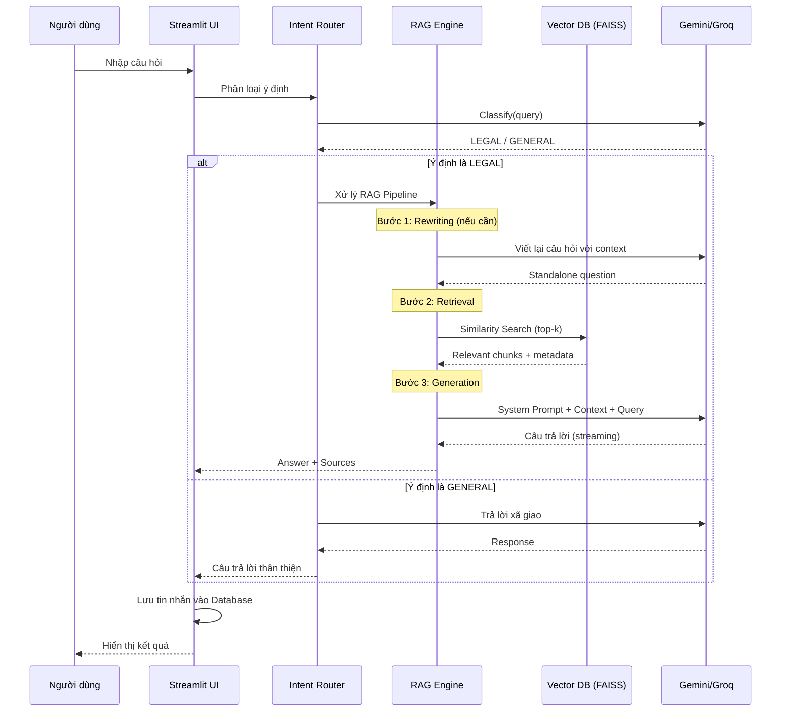

# Luồng AI RAG (Retrieval-Augmented Generation)

Tài liệu này mô tả chi tiết cách hệ thống xử lý một câu hỏi từ người dùng để đưa ra câu trả lời pháp lý chính xác.

## Sơ đồ Tuần tự (Sequence Diagram)

## Các bước xử lý chi tiết

### 1. Tiếp nhận & Tiền xử lý (Preprocessing)
*   **Input**: Câu hỏi thô của người dùng.
*   **Rewriting (Tùy chọn)**: Nếu câu hỏi phụ thuộc vào ngữ cảnh trước đó (ví dụ: "Nó có áp dụng cho tôi không?"), hệ thống sử dụng LLM để viết lại câu hỏi thành câu hoàn chỉnh dựa trên lịch sử chat.

### 2. Truy xuất (Retrieval)
*   **Embedding**: Chuyển câu hỏi thành vector sử dụng model `bkai-foundation-models/vietnamese-bi-encoder`.
*   **Vector Search**: Tìm kiếm trong FAISS index để lấy ra `k` đoạn văn bản (chunks) có độ tương đồng cao nhất.
*   **Thresholding**: (Cần bổ sung) Loại bỏ các kết quả có điểm tương đồng thấp hơn ngưỡng quy định để tránh nhiễu.

### 3. Tạo câu trả lời (Generation)
*   **Prompt Construction**: Ghép nối:
    *   System Instruction (Vai trò Luật sư AI).
    *   Context (Các đoạn văn bản luật tìm được ở bước 2).
    *   User Query.
*   **Inference**: Gửi prompt đến Google Gemini (hoặc Groq).
*   **Streaming**: Nhận phản hồi dạng stream để hiển thị thời gian thực trên UI.

### 4. Hậu xử lý (Post-processing)
*   Trích xuất nguồn tham khảo (Source citation) từ metadata của các chunks.
*   Lưu tin nhắn vào Database.
