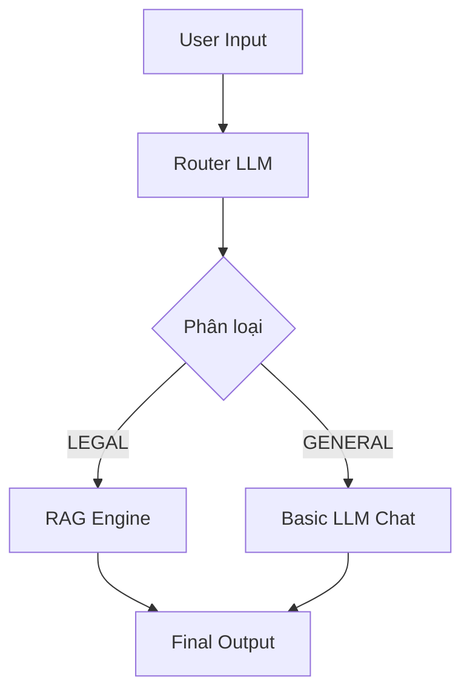
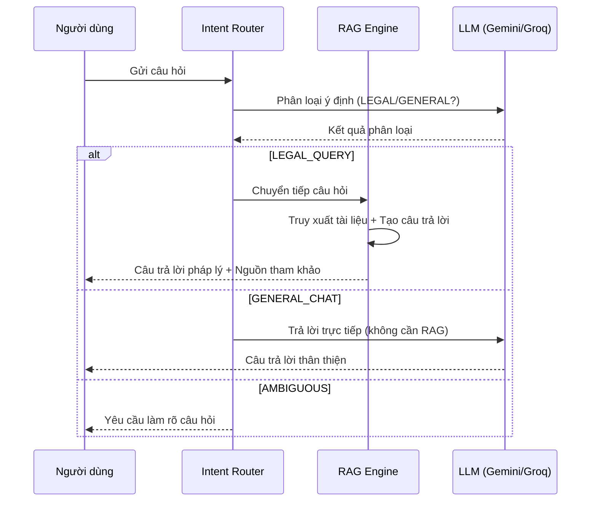

# Luồng Phân loại Ý định (Intent Classification - Router)

Để tối ưu chi phí và trải nghiệm, hệ thống không gửi mọi câu hỏi vào RAG Engine. Router đóng vai trò "người điều phối".

## Logic Phân loại

Hệ thống sử dụng một LLM nhỏ (hoặc prompt chuyên biệt) để phân loại câu hỏi vào một trong các nhóm:

1.  **LEGAL_QUERY (Hỏi luật)**:
    *   Câu hỏi cần tra cứu kiến thức pháp luật.
    *   *Hành động*: Chuyển tiếp đến **RAG Pipeline**.
2.  **GENERAL_CHAT (Giao tiếp xã giao)**:
    *   Chào hỏi, cảm ơn, hỏi các vấn đề không liên quan đến luật.
    *   *Hành động*: Trả lời trực tiếp bằng LLM (không cần tra cứu DB), giúp phản hồi nhanh hơn.
3.  **AMBIGUOUS (Mơ hồ)**:
    *   Câu hỏi không rõ nghĩa.
    *   *Hành động*: Yêu cầu người dùng làm rõ.

## Cấu trúc Prompt cho Router

```text
Bạn là một trợ lý phân loại. Hãy xác định ý định của người dùng:
User: "Xin chào" -> Output: GENERAL
User: "Luật lao động quy định thế nào về làm thêm giờ?" -> Output: LEGAL
User: "Hôm nay trời đẹp không?" -> Output: GENERAL
```

## Luồng Dữ liệu




