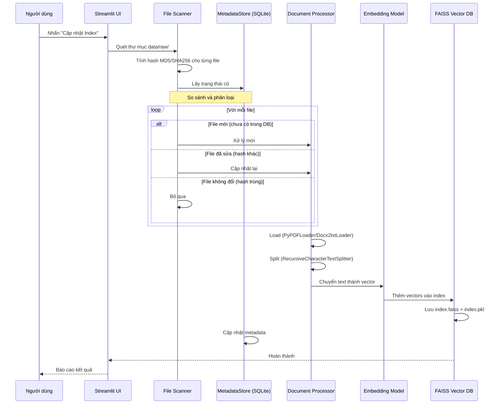
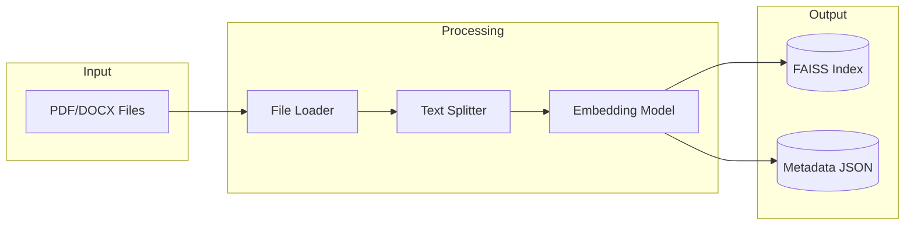

# Quy trình Nạp & Đồng bộ Dữ liệu (Data Ingestion)

Tài liệu này giải thích cách hệ thống chuyển đổi văn bản luật (PDF/DOCX) thành Vector để tìm kiếm.

## Luồng xử lý (Workflow)

### 1. Trigger
Quá trình này được kích hoạt khi người dùng nhấn nút **"Cập nhật Index"** trên giao diện Streamlit hoặc chạy script `ingest.py`.

### 2. Quét file (Scanning)
*   Hệ thống quét thư mục `data/raw`.
*   Lọc các file có đuôi `.pdf`, `.docx`, `.doc`.

### 3. Kiểm tra thay đổi (Incremental Check)
*   Sử dụng `MetadataStore` (SQLite) để lưu hash (MD5/SHA256) của các file đã xử lý.
*   **Logic**:
    *   Nếu File chưa có trong DB -> **Xử lý mới**.
    *   Nếu File có trong DB nhưng Hash thay đổi -> **Cập nhật lại**.
    *   Nếu File có trong DB và Hash khớp -> **Bỏ qua**.

### 4. Xử lý Văn bản (Processing)
Với các file cần xử lý:
1.  **Load**: Dùng `PyPDFLoader` hoặc `Docx2txtLoader` để đọc text.
2.  **Split**: Dùng `RecursiveCharacterTextSplitter`.
    *   `chunk_size`: 1000 ký tự.
    *   `chunk_overlap`: 200 ký tự.
3.  **Embed**: Gọi model Embedding để chuyển text thành vector.

### 5. Lưu trữ (Indexing)
*   Thêm vector vào FAISS Index.
*   Lưu Index xuống đĩa: `data/vector_store/index.faiss`.
*   Lưu thông tin metadata (source, page) vào `index.pkl`.
