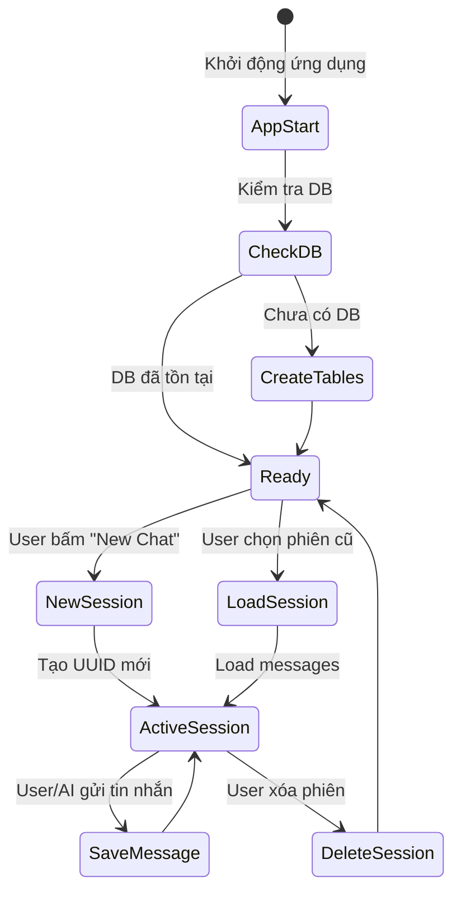
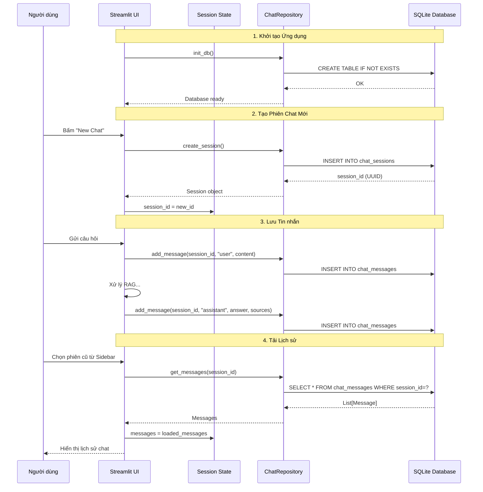

# Vòng đời Chat Session & Database Lifecycle

Tài liệu này giải thích cách dữ liệu hội thoại được khởi tạo, lưu trữ và truy xuất.

## Sơ đồ Tổng quan

## 1. Khởi tạo Ứng dụng (App Initialization)
Khi ứng dụng khởi động (`app.py`):
1.  Gọi `init_db()` từ `src.database.engine`.
2.  Kiểm tra file `chat_history.db`.
3.  Nếu chưa có, dùng SQLAlchemy `Base.metadata.create_all()` để tạo bảng `chat_sessions` và `chat_messages`.

## 2. Tạo Phiên Chat Mới (New Session)
Khi người dùng bấm "New Chat" hoặc lần đầu vào app:
1.  Tạo một `session_id` mới (UUID).
2.  Tạo record mới trong bảng `chat_sessions`:
    *   `id`: UUID
    *   `created_at`: Thời gian hiện tại.
    *   `title`: Mặc định là "New Chat" (Sau này có thể cập nhật title dựa trên câu hỏi đầu tiên).

## 3. Lưu trữ Tin nhắn (Message Persistence)
Mỗi khi có một lượt hội thoại (Turn):

### User Message
*   Insert vào bảng `chat_messages`.
*   `role`: "user"
*   `content`: Câu hỏi người dùng.
*   `session_id`: ID của phiên hiện tại.

### Assistant Message
*   Insert vào bảng `chat_messages`.
*   `role`: "assistant"
*   `content`: Câu trả lời của AI.
*   `sources`: Lưu JSON list các nguồn tham khảo (Tên file, số trang).

## 4. Tải Lịch sử (Load History)
Khi người dùng chọn một phiên cũ từ Sidebar:
1.  Query bảng `chat_messages` với `WHERE session_id = selected_id`.
2.  Sắp xếp theo `created_at` tăng dần.
3.  Load dữ liệu vào `st.session_state.messages` để hiển thị lên UI.
