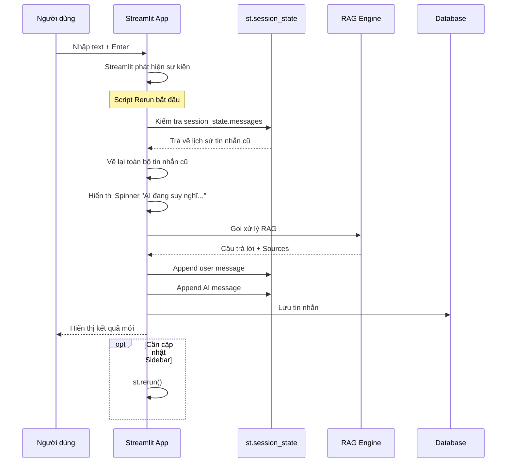
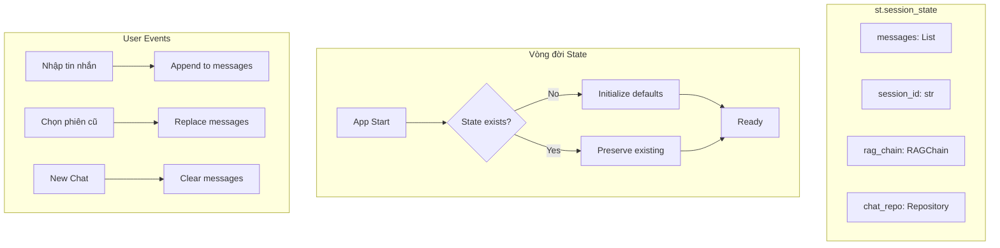

# Quản lý Trạng thái Giao diện (Streamlit State Management)

Streamlit hoạt động theo cơ chế chạy lại toàn bộ script (Rerun) mỗi khi có tương tác. Do đó, việc quản lý State là cực kỳ quan trọng để app không bị "quên" dữ liệu.

## Sơ đồ Luồng Cập nhật UI

## Các biến Session State quan trọng

| Tên biến | Kiểu dữ liệu | Mô tả |
| :--- | :--- | :--- |
| `messages` | `List[Dict]` | Lưu danh sách tin nhắn đang hiển thị trên màn hình chat hiện tại. |
| `session_id` | `str` | ID của phiên chat đang kích hoạt. Nếu `None` tức là đang ở trạng thái chờ tạo mới. |
| `uploaded_file` | `FileUploader` | Trạng thái của file tạm thời được upload (nếu có tính năng upload). |

## Luồng cập nhật UI

1.  **User Input**: Người dùng nhập text -> Nhấn Enter.
2.  **Callback**: Streamlit phát hiện sự kiện -> Rerun `app.py`.
3.  **Render History**:
    *   Kiểm tra `st.session_state.messages`.
    *   Vẽ lại toàn bộ tin nhắn cũ.
4.  **Processing**:
    *   Hiển thị Spinner ("AI đang suy nghĩ...").
    *   Gọi Backend xử lý.
5.  **Append New Message**:
    *   Thêm câu hỏi user vào `st.session_state.messages`.
    *   Thêm câu trả lời AI vào `st.session_state.messages`.
6.  **Rerun (Optional)**: Đôi khi cần `st.rerun()` để cập nhật lại tiêu đề hoặc sidebar ngay lập tức.
