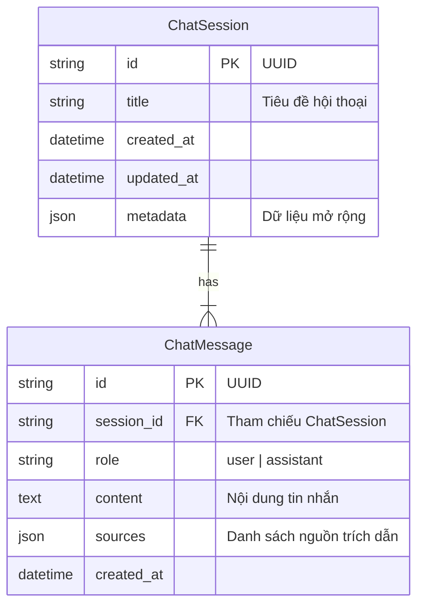

# Sơ đồ Database (Schema & ERD)

Dự án sử dụng SQLite (có thể chuyển sang PostgreSQL) với ORM SQLAlchemy.

## Mô hình Quan hệ (ER Diagram)



## Chi tiết các bảng

### 1. Bảng `chat_sessions`
Lưu trữ thông tin về các cuộc hội thoại.
*   **id**: Khóa chính, UUID.
*   **title**: Tên gợi nhớ của cuộc hội thoại (Ví dụ: "Luật lao động về thai sản").
*   **metadata_**: Cột JSON để lưu các thông tin phụ (ví dụ: user_id nếu sau này có login, tags, summary).

### 2. Bảng `chat_messages`
Lưu trữ nội dung chi tiết từng tin nhắn.
*   **session_id**: Khóa ngoại trỏ về `chat_sessions`.
*   **role**: Xác định người gửi.
    *   `user`: Người dùng.
    *   `assistant`: AI.
*   **sources**: Cột JSON quan trọng. Với tin nhắn của `assistant`, cột này lưu mảng các object:
    ```json
    [
        {"source": "Luat_Lao_Dong_2019.pdf", "page": 12},
        {"source": "Nghi_dinh_145.docx", "page": 5}
    ]
    ```
