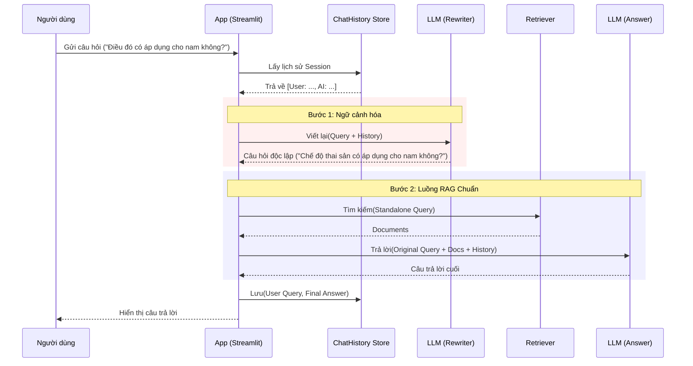

# Thiết kế: Context Memory & Conversational RAG System

## 1. Bối cảnh & Mục tiêu
- **Trạng thái hiện tại**: Hệ thống là "Stateless" (không có trạng thái). Mỗi câu hỏi được xử lý như một truy vấn mới. Các câu hỏi tham chiếu đến tin nhắn trước (ví dụ: "Điều đó có áp dụng không?") sẽ thất bại khi Retrieval.
- **Mục tiêu**: Triển khai **Kiến trúc RAG Hội thoại** để duy trì ngữ cảnh qua các lượt trao đổi.
- **Khả năng mở rộng**: Bắt đầu với In-Memory storage (MVP) nhưng thiết kế interface tương thích với Persistent Storage (Postgres/Redis) cho tương lai.

## 2. Kiến trúc Cốt lõi: Conversational RAG

Để xử lý câu hỏi tiếp nối chính xác trong hệ thống RAG, chúng ta không thể đơn giản thêm lịch sử vào prompt. Chúng ta phải triển khai bước **"Viết lại Câu hỏi"** (Query Reformulation/Standalone Question generation).

### 2.1. Luồng xử lý (Mermaid)



## 3. Chi tiết Các Thành phần

### 3.1. Memory Interface (Abstraction)
Để đảm bảo khả năng mở rộng, chúng ta định nghĩa một interface. MVP sử dụng Python Dictionary; Production sử dụng Database.

```python
# Interface Khái niệm
class BaseHistoryStore:
    def get_messages(self, session_id: str) -> List[BaseMessage]:
        pass
    def add_user_message(self, session_id: str, message: str):
        pass
    def add_ai_message(self, session_id: str, message: str):
        pass

# Triển khai MVP (In-Memory)
class InMemoryHistory(BaseHistoryStore):
    def __init__(self):
        self._store = {} # {session_id: ChatMessageHistory}
```

### 3.2. Query Rewriter (Phần "Thông minh")
Một prompt tập trung chỉ để viết lại câu hỏi. Nó *không* trả lời câu hỏi.

*   **Prompt**: "Với lịch sử chat và câu hỏi mới nhất của người dùng có thể tham chiếu đến ngữ cảnh trong lịch sử, hãy tạo một câu hỏi độc lập có thể hiểu được mà không cần lịch sử chat. KHÔNG trả lời câu hỏi, chỉ viết lại nếu cần, nếu không trả về nguyên gốc."

### 3.3. Database Schema (Mở rộng trong tương lai)
Khi chuyển sang SQL (PostgreSQL), schema sẽ như sau:

**Bảng: `chat_sessions`**
| Cột | Kiểu | Mô tả |
|---|---|---|
| `id` | UUID | Khóa chính |
| `user_id` | UUID | Người sở hữu |
| `created_at` | Timestamp | Thời gian tạo |

**Bảng: `chat_messages`**
| Cột | Kiểu | Mô tả |
|---|---|---|
| `id` | UUID | Khóa chính |
| `session_id` | UUID | FK đến chat_sessions |
| `role` | VARCHAR | 'user' hoặc 'assistant' |
| `content` | TEXT | Nội dung tin nhắn |
| `created_at` | Timestamp | Để sắp xếp ngữ cảnh |

## 4. Kế hoạch Triển khai (MVP)

### Giai đoạn 1: Cơ sở hạ tầng
1.  **Định nghĩa `HistoryManager`**: Tạo `src/utils/history_manager.py` để xử lý `InMemoryHistory`.
2.  **Cập nhật Config**: Thêm cài đặt cho `MAX_HISTORY_LENGTH` (ví dụ: 10 tin nhắn gần nhất) để quản lý giới hạn token.

### Giai đoạn 2: Nâng cấp RAG Engine
1.  **Thêm `CondenseQuestionChain`**: Tạo chain mới trong `rag_engine` chịu trách nhiệm viết lại câu hỏi.
2.  **Cập nhật `RAGChain`**:
    - Nhận `session_id`.
    - Điều phối luồng: Lấy History -> Viết lại -> Truy xuất -> Trả lời -> Lưu History.

### Giai đoạn 3: Tích hợp UI
1.  **Session State**: Sử dụng `st.session_state` của Streamlit để lưu `session_id`.
2.  **Hiển thị**: Đảm bảo UI truyền session ID đến backend.

## 5. Bảo mật & Quản trị
- **Quyền riêng tư**: Lịch sử chứa dữ liệu nhạy cảm của người dùng. Trong Production, cần được mã hóa khi lưu trữ.
- **Quản trị**: Giới hạn kích thước lịch sử (Token Window) để tránh tràn ngữ cảnh và giảm chi phí API.
