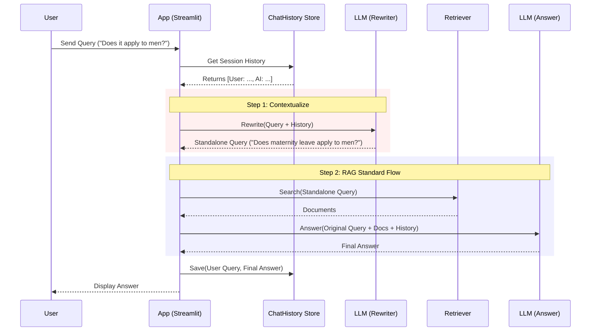

<style>
    /* Force white background and black text for the whole page */
    body, .vscode-body {
        background-color: #ffffff !important;
        color: #000000 !important;
    }
    /* Style code blocks to be readable on white */
    code, pre {
        background-color: #f0f0f0 !important;
        color: #222222 !important;
    }
</style>

# Designing: Context Memory & Conversational RAG System

## 1. Context & Objective
- **Current State**: The system is "Stateless". Each query is treated as new. References to previous messages (e.g., "What about that?") fail during Retrieval.
- **Goal**: Implement a **Conversational RAG Architecture** that retains context across turns.
- **Scalability**: Start with In-Memory storage (MVP) but design interfaces compatible with Persistent Storage (Postgres/Redis) for future scaling.

## 2. Core Architecture: Conversational RAG

To handle follow-up questions correctly in a RAG system, we cannot simply append history to the prompt. We must implement a **"Query Reformulation"** step (also known as Standalone Question generation).

### 2.1. The Flow (Mermaid)



## 3. Detailed Components

### 3.1. Memory Interface (Abstraction)
To ensure scalability, we define an interface. The MVP uses a Python Dictionary; the Production version uses a Database.

```python
# Conceptual Interface
class BaseHistoryStore:
    def get_messages(self, session_id: str) -> List[BaseMessage]:
        pass
    def add_user_message(self, session_id: str, message: str):
        pass
    def add_ai_message(self, session_id: str, message: str):
        pass

# MVP Implementation (In-Memory)
class InMemoryHistory(BaseHistoryStore):
    def __init__(self):
        self._store = {} # {session_id: ChatMessageHistory}
```

### 3.2. Query Rewriter (The "Smarter" Part)
A focused prompt just for reformulating the question. It does *not* answer the question.

*   **Prompt**: "Given a chat history and the latest user question which might reference context in the chat history, formulate a standalone question which can be understood without the chat history. Do NOT answer the question, just reformulate it if needed and otherwise return it as is."

### 3.3. Database Schema (Future Scale-up)
When moving to SQL (PostgreSQL), the schema will look like this:

**Table: `chat_sessions`**
| Column | Type | Description |
|---|---|---|
| `id` | UUID | Primary Key |
| `user_id` | UUID | Owner |
| `created_at` | Timestamp | |

**Table: `chat_messages`**
| Column | Type | Description |
|---|---|---|
| `id` | UUID | Primary Key |
| `session_id` | UUID | FK to chat_sessions |
| `role` | VARCHAR | 'user' or 'assistant' |
| `content` | TEXT | The message content |
| `created_at` | Timestamp | For ordering context |

## 4. Implementation Plan (MVP)

### Phase 1: Infrastructure
1.  **Define `HistoryManager`**: Create `src/utils/history_manager.py` to handle `InMemoryHistory`.
2.  **Update Config**: Add settings for `MAX_HISTORY_LENGTH` (e.g., last 10 messages) to manage token limits.

### Phase 2: RAG Engine Upgrade
1.  **Add `CondenseQuestionChain`**: Create a new chain in `rag_engine` responsible for rewriting queries.
2.  **Update `RAGChain`**: 
    - Accept `session_id`.
    - Coordinate the flow: Get History -> Rewrite -> Retrieve -> Answer -> Save History.

### Phase 3: UI Integration
1.  **Session State**: Use Streamlit's `st.session_state` to store `session_id`.
2.  **Display**: Ensure the UI passes the session ID to the backend.

## 5. Security & Governance
- **Privacy**: History contains sensitive user data. In Production, this must be encrypted at rest.
- **Governance**: Limit history size (Token Window) to prevent context overflow and reduce API costs.
