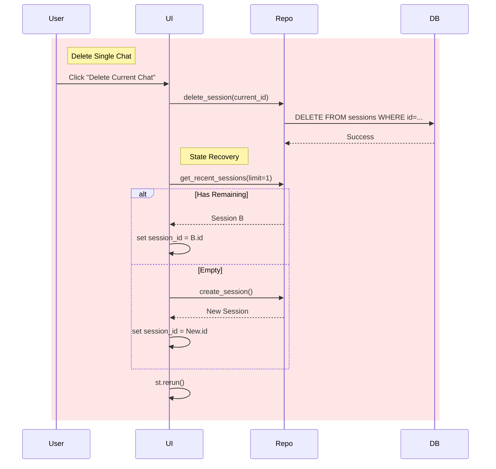

<style>
    /* Force white background and black text for the whole page */
    body, .vscode-body {
        background-color: #ffffff !important;
        color: #000000 !important;
    }
    /* Style code blocks to be readable on white */
    code, pre {
        background-color: #f0f0f0 !important;
        color: #222222 !important;
    }
</style>
# DESIGN DOCUMENT: DELETE CHAT HISTORY FEATURE
**Date:** 2026-01-13
**Status:** DRAFT
**Context:** Users need to manage their privacy and organize their workspace by removing old or irrelevant conversations.

---

## 1. OBJECTIVE
Implement functionality to allow users to:
1.  **Delete a specific conversation** (The one currently active).
2.  **Clear all history** (Global reset).
3.  Ensure data consistency (Cascade delete of messages).
4.  Handle UI state transition gracefully (e.g., if current chat is deleted, switch to another or create new).

---

## 2. TECHNICAL ARCHITECTURE

### 2.1. Database Level (Cascade Safety)
We must ensure that deleting a `ChatSession` automatically removes all associated `ChatMessage` rows to prevent orphaned data.
*   **Verification**: The current `src/database/models.py` definition for `ChatSession` already includes `cascade="all, delete-orphan"`.
    ```python
    messages: Mapped[List["ChatMessage"]] = relationship(back_populates="session", cascade="all, delete-orphan")
    ```
    *   **Action**: No schema change required. Logic relies on SQLAlchemy ORM handling this.

### 2.2. Repository Layer (`src/database/repository.py`)
We need to extend `ChatRepository` with two new methods.

#### `delete_session(session_id: str) -> bool`
*   **Logic**:
    1.  Query the session by ID.
    2.  If exists, delete it.
    3.  Commit transaction.
    4.  Return `True` if deleted, `False` if not found.

#### `delete_all_sessions() -> int`
*   **Logic**:
    1.  Execute a delete query on the `ChatSession` table.
    2.  Commit.
    3.  Return number of rows deleted.

---

## 3. UI/UX DESIGN (Streamlit `app.py`)

### 3.1. Delete Specific Session
*   **Placement**: In the Sidebar, under the "Management" or near the session title.
*   **Interaction**:
    1.  User clicks "🗑️ Xóa hội thoại này".
    2.  System performs deletion.
    3.  **State Transition (Critical)**:
        *   If the deleted session was the *active* one, the system must finding the *next available* recent session.
        *   If no sessions remain, automatically create a new "New Chat".
    4.  `st.rerun()` to refresh the sidebar list.

### 3.2. Clear All History
*   **Placement**: Inside the existing "⚙️ Quản lý Dữ liệu" (Data Management) expander in the Sidebar.
*   **Interaction**:
    1.  User clicks "🔥 Xóa toàn bộ dữ liệu".
    2.  System shows a confirmation (using `st.popover` or a nested button "Are you sure?").
    3.  On confirmation: Wipe DB -> Create 1 new session -> Rerun.

---

## 4. IMPLEMENTATION PLAN

### Step 1: Update Repository
Modify `src/database/repository.py` to add the deletion methods.

### Step 2: Implement UI Logic (Helper Function)
Create a helper function in `app.py` to handle the "Delete and Switch" logic, as it's complex.

```python
def handle_delete_session(session_id):
    repo.delete_session(session_id)
    # Logic to pick next session
    remaining = repo.get_recent_sessions(limit=1)
    if remaining:
        st.session_state.session_id = remaining[0].id
    else:
        new_sess = repo.create_session()
        st.session_state.session_id = new_sess.id
    st.rerun()
```

### Step 3: Integrate into Sidebar
Update the Sidebar rendering loop in `app.py`.

---

## 5. FLOW VISUALIZATION


