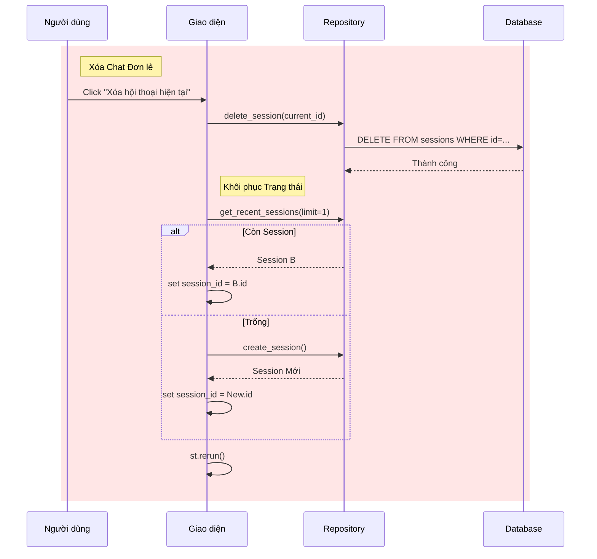

# TÀI LIỆU THIẾT KẾ: TÍNH NĂNG XÓA LỊCH SỬ CHAT
**Ngày:** 2026-01-13
**Trạng thái:** DRAFT
**Bối cảnh:** Người dùng cần quản lý quyền riêng tư và tổ chức workspace bằng cách xóa các cuộc hội thoại cũ hoặc không liên quan.

---

## 1. MỤC TIÊU
Triển khai chức năng cho phép người dùng:
1.  **Xóa một cuộc hội thoại cụ thể** (Cuộc hội thoại đang active).
2.  **Xóa toàn bộ lịch sử** (Reset toàn cục).
3.  Đảm bảo tính nhất quán dữ liệu (Cascade delete messages).
4.  Xử lý chuyển đổi trạng thái UI một cách mượt mà (ví dụ: nếu chat hiện tại bị xóa, chuyển sang chat khác hoặc tạo mới).

---

## 2. KIẾN TRÚC KỸ THUẬT

### 2.1. Tầng Database (Cascade Safety)
Chúng ta phải đảm bảo rằng việc xóa một `ChatSession` sẽ tự động xóa tất cả các `ChatMessage` liên quan để tránh dữ liệu mồ côi (orphaned data).
*   **Xác minh**: Định nghĩa hiện tại trong `src/database/models.py` cho `ChatSession` đã bao gồm `cascade="all, delete-orphan"`.
    ```python
    messages: Mapped[List["ChatMessage"]] = relationship(back_populates="session", cascade="all, delete-orphan")
    ```
    *   **Hành động**: Không cần thay đổi schema. Logic dựa vào SQLAlchemy ORM xử lý.

### 2.2. Tầng Repository (`src/database/repository.py`)
Chúng ta cần mở rộng `ChatRepository` với hai method mới.

#### `delete_session(session_id: str) -> bool`
*   **Logic**:
    1.  Query session theo ID.
    2.  Nếu tồn tại, xóa nó.
    3.  Commit transaction.
    4.  Trả về `True` nếu đã xóa, `False` nếu không tìm thấy.

#### `delete_all_sessions() -> int`
*   **Logic**:
    1.  Thực thi delete query trên bảng `ChatSession`.
    2.  Commit.
    3.  Trả về số hàng đã xóa.

---

## 3. THIẾT KẾ UI/UX (Streamlit `app.py`)

### 3.1. Xóa Session Cụ thể
*   **Vị trí**: Trong Sidebar, dưới phần "Quản lý" hoặc gần tiêu đề session.
*   **Tương tác**:
    1.  Người dùng click "🗑️ Xóa hội thoại này".
    2.  Hệ thống thực hiện xóa.
    3.  **Chuyển đổi Trạng thái (Quan trọng)**:
        *   Nếu session bị xóa là session *active*, hệ thống phải tìm session gần nhất *có sẵn* tiếp theo.
        *   Nếu không còn session nào, tự động tạo "New Chat" mới.
    4.  `st.rerun()` để refresh danh sách sidebar.

### 3.2. Xóa Toàn bộ Lịch sử
*   **Vị trí**: Bên trong expander "⚙️ Quản lý Dữ liệu" hiện có trong Sidebar.
*   **Tương tác**:
    1.  Người dùng click "🔥 Xóa toàn bộ dữ liệu".
    2.  Hệ thống hiển thị xác nhận (sử dụng `st.popover` hoặc nút lồng "Bạn có chắc chắn?").
    3.  Khi xác nhận: Xóa DB -> Tạo 1 session mới -> Rerun.

---

## 4. KẾ HOẠCH TRIỂN KHAI

### Bước 1: Cập nhật Repository
Sửa đổi `src/database/repository.py` để thêm các method xóa.

### Bước 2: Triển khai UI Logic (Helper Function)
Tạo helper function trong `app.py` để xử lý logic "Xóa và Chuyển đổi", vì nó phức tạp.

```python
def handle_delete_session(session_id):
    repo.delete_session(session_id)
    # Logic để chọn session tiếp theo
    remaining = repo.get_recent_sessions(limit=1)
    if remaining:
        st.session_state.session_id = remaining[0].id
    else:
        new_sess = repo.create_session()
        st.session_state.session_id = new_sess.id
    st.rerun()
```

### Bước 3: Tích hợp vào Sidebar
Cập nhật vòng lặp render Sidebar trong `app.py`.

---

## 5. SƠ ĐỒ LUỒNG


