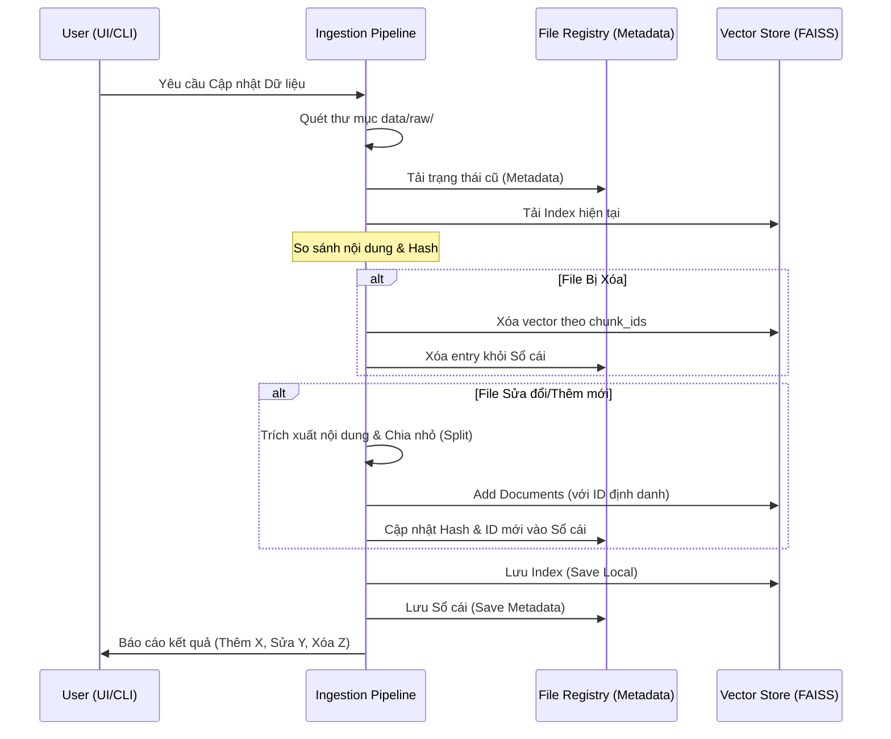

<style>
    /* Force white background and black text for the whole page */
    body, .vscode-body {
        background-color: #ffffff !important;
        color: #000000 !important;
    }
    /* Style code blocks to be readable on white */
    code, pre {
        background-color: #f0f0f0 !important;
        color: #222222 !important;
    }
</style>

# 📄 Thiết kế: Cơ chế Cập nhật Tăng phân (Incremental Indexing)

## 1. Mục tiêu
Thay thế cơ chế "Xóa và Xây lại" (Full Rebuild) hiện tại bằng cơ chế "Cập nhật phần bù" (Incremental Update). Mục tiêu là tối ưu hóa hiệu suất khi thêm/sửa/xóa một vài bộ luật trong kho dữ liệu lớn mà không cần xử lý lại toàn bộ tài liệu.

---

## 2. Nguyên lý hoạt động (Differential Indexing)

Hệ thống sẽ duy trì một **"Sổ cái theo dõi" (File Registry)** để lưu trữ trạng thái của các file tại thời điểm index cuối cùng.

### Luồng xử lý chính:
1. **Quét dữ liệu**: Duyệt toàn bộ thư mục `data/raw/`.
2. **Tính toán Hash**: Tính mã băm (MD5 hoặc SHA-256) cho từng file để phát hiện thay đổi nội dung.
3. **Đối chiếu trạng thái**: So sánh danh sách file hiện tại với Sổ cái.
4. **Phân loại**:
   - **Thêm mới (Add)**: File có trong thư mục nhưng chưa có trong Sổ cái.
   - **Cập nhật (Update)**: File có tên trùng nhưng Hash khác (nội dung đã sửa).
   - **Xóa (Delete)**: File có trong Sổ cái nhưng không còn trong thư mục.
   - **Giữ nguyên (Skip)**: File trùng cả tên và Hash.

---

## 3. Cấu trúc dữ liệu Sổ cái (Metadata)

File lưu trữ: `data/vector_store/indexing_metadata.json`

```json
{
  "last_updated": "2023-12-24T10:00:00",
  "embedding_model": "bkai-foundation-models/vietnamese-bi-encoder",
  "files": {
    "luat_dat_dai_2024.pdf": {
      "hash": "a1b2c3d4e5f6...",
      "last_modified": 1703678900,
      "chunk_ids": ["doc_1_chunk_0", "doc_1_chunk_1"]
    }
  }
}
```

---

## 4. Sơ đồ luồng (Sequence Diagram)



---

## 5. Chi tiết triển khai Kỹ thuật

### Bước 1: Quản lý ID của Chunk
- Để xóa được vector cũ, mỗi chunk khi đưa vào FAISS cần có một ID duy nhất và có thể truy vết được.
- Công thức ID đề xuất: `[filename_hash]_[chunk_index]`.

### Bước 2: Refactor `VectorIndexer`
- Thay đổi hàm `build_index` thành `sync_index`.
- Sử dụng phương thức `vector_store.add_documents(documents, ids=chunk_ids)` để ghi đè hoặc thêm mới.
- Sử dụng phương thức `vector_store.delete(ids=[...])` để loại bỏ các file đã bị xóa.

### Bước 3: Đảm bảo tính nhất quán (Atomic Ops)
- Việc cập nhật Metadata và Vector Store phải diễn ra đồng bộ. 
- Nếu quá trình `add_documents` lỗi, Metadata không được cập nhật.

---

## 6. Ưu điểm và Hạn chế

### Ưu điểm:
- **Tốc độ**: Giảm 90% thời gian xử lý nếu chỉ thay đổi 1-2 file.
- **Tài nguyên**: Giảm tải cho CPU và bộ nhớ vì không cần nhúng (embedding) lại toàn bộ.
- **Chính xác**: Xử lý triệt để các file bị xóa khỏi thư mục nguồn.

### Hạn chế:
- **Phức tạp**: Cần quản lý file Metadata cẩn thận. Nếu file Metadata bị mất, hệ thống phải thực hiện lại Full Rebuild để khôi phục.
- **Lưu trữ**: Tăng thêm một lượng nhỏ dung lượng cho file JSON lưu metadata.
