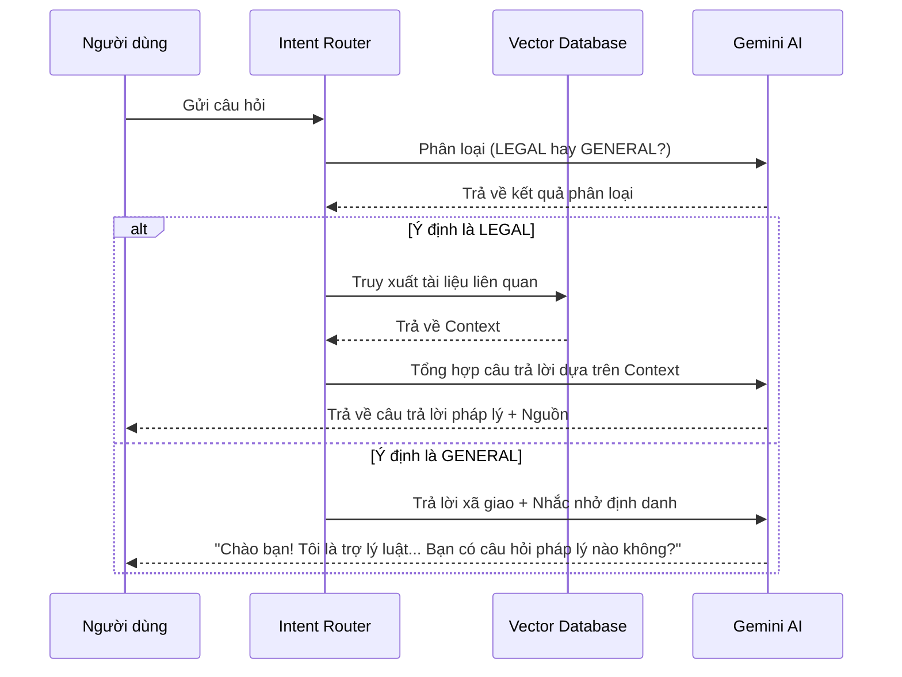

<style>
    /* Force white background and black text for the whole page */
    body, .vscode-body {
        background-color: #ffffff !important;
        color: #000000 !important;
    }
    /* Style code blocks to be readable on white */
    code, pre {
        background-color: #f0f0f0 !important;
        color: #222222 !important;
    }
</style>

# Bản Thiết Kế: Hệ Thống Phân Loại Ý Định & Xử Lý Câu Hỏi Ngoài Lề

## 1. Tổng quan (Context)
Hiện tại, hệ thống luôn cố gắng truy xuất tài liệu pháp luật cho mọi đầu vào của người dùng. Nếu người dùng hỏi các câu hỏi xã giao hoặc không liên quan (ví dụ: "Chào bạn", "Thời tiết thế nào?"), hệ thống sẽ trả về câu trả lời khô khan: *"Tôi không tìm thấy thông tin..."*.

Mục tiêu của thiết kế này là giúp trợ lý trở nên "thông minh" hơn bằng cách nhận biết được khi nào người dùng đang hỏi về luật và khi nào đang trò chuyện ngoài lề.

## 2. Kiến trúc Giải pháp (Architecture)

Chúng ta sẽ thêm một lớp **Router (Bộ điều hướng)** vào trước quy trình RAG.

### Quy trình xử lý (Flowchart)



## 3. Các thành phần thay đổi

### A. Thành phần mới: `src/rag_engine/router.py`
- **Class `IntentRouter`**: Sử dụng một Prompt siêu ngắn để phân loại nhanh ý định.
- **Tiêu chí phân loại**:
    - `LEGAL`: Liên quan đến pháp luật, quy định, thủ tục hành chính Việt Nam.
    - `GENERAL`: Chào hỏi, khen ngợi, hoặc các chủ đề không liên quan (toán học, thời tiết, giải trí...).

### B. Cập nhật Prompt: `src/rag_engine/prompts.py`
- **`ROUTER_PROMPT`**: Dùng để phân loại.
- **`GENERAL_RESPONSE_PROMPT`**: Định nghĩa phong cách trả lời xã giao.
    - *Yêu cầu*: Thân thiện, ngắn gọn, luôn nhắc lại vai trò là trợ lý pháp luật.

### C. Cập nhật Logic chính: `src/rag_engine/generator.py`
- Tích hợp `IntentRouter` vào hàm `generate_answer`.
- Kiểm tra kết quả từ Router trước khi thực hiện bước `retriever.get_relevant_docs`.

## 4. Tính mở rộng & Đa mô hình (Extensibility & LLM Factory)

Để hỗ trợ việc tự host LLM (Self-hosted/Local) hoặc chuyển đổi linh hoạt giữa các nhà cung cấp (Google, OpenAI, Ollama...), chúng ta sẽ áp dụng **Factory Pattern**.

### A. Cấu hình (Configuration Strategy)
Chúng ta sẽ quản lý cấu hình theo cặp `PROVIDER` và `MODEL_NAME` cho từng tác vụ:

*   **Main Generator (RAG)**:
    *   `LLM_PROVIDER`: "google" (mặc định)
    *   `LLM_MODEL_NAME`: "gemini-pro"
*   **Router (Intent Classification)**:
    *   `ROUTER_PROVIDER`: "google" (hoặc "ollama", "openai"...)
    *   `ROUTER_MODEL_NAME`: "gemini-2.5-flash" (hoặc "mistral", "llama3"...)

### B. LLM Factory (`src/rag_engine/llm_factory.py`)
Tạo một module mới chịu trách nhiệm khởi tạo đối tượng LLM chính xác:

```python
class LLMFactory:
    @staticmethod
    def create_llm(provider: str, model_name: str, **kwargs):
        if provider == "google":
            return ChatGoogleGenerativeAI(model=model_name, **kwargs)
        elif provider == "ollama":
            # Hỗ trợ self-hosted
            return ChatOllama(model=model_name, base_url=AppConfig.OLLAMA_BASE_URL, **kwargs)
        elif provider == "openai":
            return ChatOpenAI(model=model_name, **kwargs)
        else:
            raise ValueError(f"Unsupported provider: {provider}")
```

### C. Dependency Injection
`IntentRouter` và `RAGChain` sẽ không còn khởi tạo trực tiếp `ChatGoogleGenerativeAI`. Thay vào đó, chúng sẽ gọi `LLMFactory.create_llm(...)` dựa trên cấu hình.

## 5. Ví dụ kịch bản

| Câu hỏi | Phân loại | Phản hồi mong đợi |
| :--- | :--- | :--- |
| "Chào bạn, bạn là ai?" | `GENERAL` | "Xin chào! Tôi là Trợ lý Pháp luật AI chuyên về luật Việt Nam. Tôi có thể giúp gì cho bạn về các vấn đề pháp lý không?" |
| "Thủ tục làm sổ đỏ như thế nào?" | `LEGAL` | (Thực hiện RAG) "Theo Nghị định..., thủ tục gồm các bước..." |
| "1 + 1 bằng mấy?" | `GENERAL` | "Tôi là trợ lý chuyên về pháp luật, nên không thể giúp bạn giải toán. Tuy nhiên, nếu bạn có thắc mắc về luật, hãy cho tôi biết nhé!" |

## 5. Đánh giá tác động (Impact Analysis)
- **Tích cực**: Trải nghiệm người dùng tốt hơn, chuyên nghiệp hơn.
- **Tiêu cực**: Tăng thêm 1 lượt gọi API LLM (lượt gọi phân loại thường rất rẻ và nhanh do output ngắn).
- **Rủi ro**: Phân loại sai (câu hỏi luật bị coi là xã giao). *Cách khắc phục*: Tinh chỉnh Prompt phân loại thật kỹ.

---
**Ngày thiết kế**: 2025-12-23
