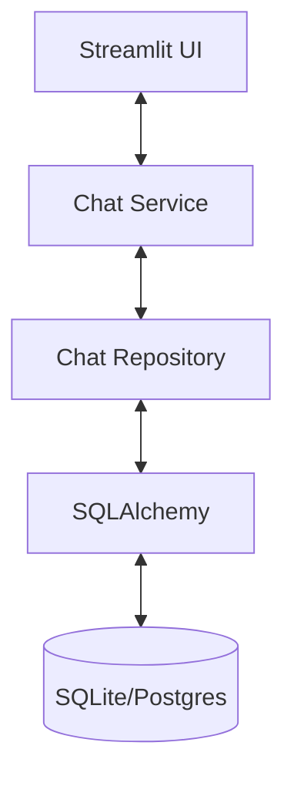
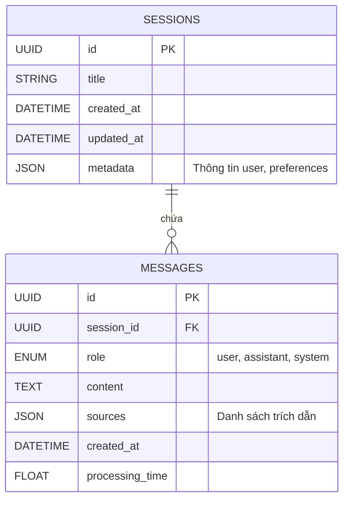

# TÀI LIỆU THIẾT KẾ: HỆ THỐNG LƯU TRỮ LỊCH SỬ CHAT
**Ngày:** 2026-01-13
**Trạng thái:** DRAFT
**Bối cảnh:** Nâng cấp từ In-Memory/Session State sang Database Persistence.

---

## 1. TỔNG QUAN KIẾN TRÚC
Hệ thống hiện tại lưu trữ lịch sử chat trong `st.session_state` (RAM). Điều này giới hạn lịch sử trong tab trình duyệt đang hoạt động và sẽ bị mất khi refresh (đã được giảm thiểu một phần bởi cache gần đây, nhưng không persistent).
Chúng ta sẽ giới thiệu một **Persistence Layer** sử dụng **SQLite** (Dev) / **PostgreSQL** (Prod) được quản lý bởi **SQLAlchemy**.

### 1.1. Các tầng High-Level


---

## 2. THIẾT KẾ DATABASE SCHEMA

Chúng ta sẽ sử dụng schema quan hệ chuẩn hóa.

### 2.1. Sơ đồ Quan hệ Thực thể (ERD)



### 2.2. Chi tiết Bảng

#### Bảng: `chat_sessions`
| Cột | Kiểu | Ràng buộc | Mô tả |
|---|---|---|---|
| `id` | VARCHAR(36) | PK, Not Null | UUID v4 |
| `title` | VARCHAR(255) | Nullable | Tự động tạo từ câu hỏi đầu tiên |
| `created_at` | DATETIME | Default: UTC Now | Thời gian tạo |
| `updated_at` | DATETIME | On Update: UTC Now | Để sắp xếp "Chat Gần đây" |
| `metadata` | JSON | Default: `{}` | Lưu các flag bổ sung (ví dụ: `model_used`) |

#### Bảng: `chat_messages`
| Cột | Kiểu | Ràng buộc | Mô tả |
|---|---|---|---|
| `id` | VARCHAR(36) | PK, Not Null | UUID v4 |
| `session_id` | VARCHAR(36) | FK -> chat_sessions.id | Indexed |
| `role` | VARCHAR(20) | Not Null | `user`, `assistant`, `system` |
| `content` | TEXT | Not Null | Nội dung tin nhắn thực tế |
| `original_query` | TEXT | Nullable | Nếu `role=assistant`, lưu câu hỏi của user |
| `sources` | JSON | Default: `[]` | Snapshot của docs đã dùng (Tiêu đề, Trang, Đoạn trích) |
| `created_at` | DATETIME | Default: UTC Now | Thời gian tạo |
| `rating` | INTEGER | Nullable | 1 (Thích) hoặc -1 (Không thích) |

---

## 3. THIẾT KẾ API (HỢP ĐỒNG SERVICE NỘI BỘ)

Vì chúng ta hiện tại là Monolith (Streamlit), các "Endpoint" này được triển khai như **Service Methods**. Tuy nhiên, chúng được thiết kế để có thể expose ngay lập tức qua **FastAPI** trong tương lai.

### 3.1. Quản lý Session

#### `POST /api/sessions`
*   **Hành động**: Tạo phiên chat mới.
*   **Input**: `{"user_id": "optional", "meta": {...}}`
*   **Output**: `{"session_id": "uuid", "created_at": "..."}`

#### `GET /api/sessions`
*   **Hành động**: Liệt kê tất cả cuộc hội thoại gần đây.
*   **Params**: `limit=20`, `offset=0`
*   **Output**: `[{"id": "...", "title": "Luật lao động...", "updated_at": "..."}]`

#### `DELETE /api/sessions/{session_id}`
*   **Hành động**: Xóa cuộc hội thoại (Ưu tiên soft delete).

#### `PATCH /api/sessions/{session_id}`
*   **Hành động**: Đổi tên tiêu đề thủ công.
*   **Input**: `{"title": "Tên mới"}`

### 3.2. Thao tác Tin nhắn

#### `GET /api/sessions/{session_id}/messages`
*   **Hành động**: Tải toàn bộ lịch sử cho UI.
*   **Output**: Danh sách Message Objects sắp xếp theo `created_at` ASC.

#### `POST /api/sessions/{session_id}/messages`
*   **Hành động**: User gửi tin nhắn -> Kích hoạt RAG -> Lưu User Msg -> Lưu AI Response.
*   **Input**: `{"content": "Câu hỏi của user"}`
*   **Output**:
    ```json
    {
      "user_message": {...},
      "ai_message": {
        "content": "Câu trả lời...",
        "sources": [...]
      }
    }
    ```

#### `POST /api/messages/{message_id}/feedback`
*   **Hành động**: Đánh giá câu trả lời.
*   **Input**: `{"rating": 1, "comment": "Câu trả lời tốt"}`

---

## 4. KẾ HOẠCH TRIỂN KHAI CRUD

### 4.1. Repository Interface (`src/database/repository.py`)
Để đảm bảo Clean Architecture, UI không bao giờ chạm trực tiếp vào DB.

```python
from abc import ABC, abstractmethod

class BaseChatRepository(ABC):
    @abstractmethod
    def create_session(self, title: str = None) -> Session: pass

    @abstractmethod
    def get_session(self, session_id: str) -> Session: pass

    @abstractmethod
    def get_recent_sessions(self, limit: int = 10) -> List[Session]: pass

    @abstractmethod
    def add_message(self, session_id: str, role: str, content: str, sources: list = None) -> Message: pass

    @abstractmethod
    def get_messages(self, session_id: str) -> List[Message]: pass
```

### 4.2. Lựa chọn Technology Stack
1.  **ORM**: **SQLAlchemy 2.0** (Hỗ trợ Async sẵn sàng).
2.  **Migration**: **Alembic** (Quan trọng cho schema evolution).
3.  **Database**:
    *   **Dev**: SQLite (`chat_history.db`).
    *   **Prod**: PostgreSQL.

### 4.3. Tích hợp với RAG Engine
*   **Hiện tại**: `app.py` quản lý state.
*   **Mới**: `ChatService` điều phối.
    1.  User input -> `ChatService.process_message(session_id, input)`.
    2.  `ChatService` gọi `ChatRepository.add_message(role='user')`.
    3.  `ChatService` lấy history từ Repo -> format cho LLM.
    4.  `ChatService` gọi `RAGChain.generate()`.
    5.  `ChatService` gọi `ChatRepository.add_message(role='assistant', sources=...)`.
    6.  `ChatService` cập nhật `Session.updated_at`.

---

## 5. CÁC BƯỚC MIGRATION (Roadmap)

1.  **Setup Infrastructure**:
    *   `pip install sqlalchemy alembic`
    *   Khởi tạo cấu hình Alembic.
2.  **Triển khai Models**:
    *   Tạo `src/database/models.py`.
    *   Định nghĩa class `Session` và `Message`.
3.  **Triển khai Repository**:
    *   Tạo `src/database/sqlite_repo.py`.
4.  **Refactor App**:
    *   Thay thế `st.session_state.chat_history` bằng API calls đến `ChatRepository`.
    *   Thêm "History Sidebar" vào UI để chuyển đổi sessions.

---
**Ký tên:** Principal Evolutionary Architect
