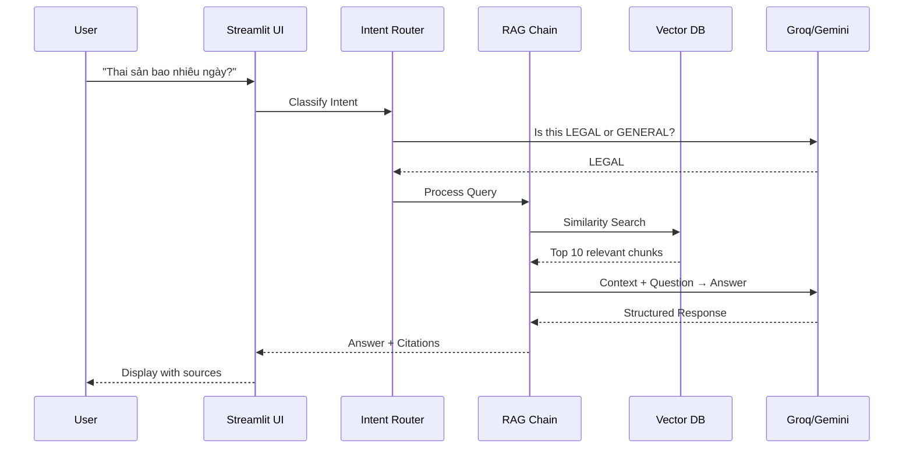

# 🏗️ Tổng Quan Kiến Trúc Hệ Thống

## Mục tiêu học tập
Sau khi đọc tài liệu này, bạn sẽ hiểu:
- Vấn đề mà dự án giải quyết
- Kiến trúc tổng quan của hệ thống
- Các tầng (layers) và trách nhiệm của từng tầng
- Luồng dữ liệu từ user đến response

---

## 1. Vấn đề cần giải quyết

### 1.1 Pain Points trong tìm kiếm văn bản pháp luật
- **Tìm kiếm thủ công**: Người dùng phải đọc toàn bộ văn bản luật để tìm điều khoản liên quan
- **Thiếu ngữ cảnh**: Keyword search không hiểu ý nghĩa câu hỏi
- **Không có trích dẫn**: Khó xác minh nguồn thông tin
- **Ngôn ngữ pháp lý**: Thuật ngữ chuyên môn khó hiểu với người thường

### 1.2 Giải pháp: AI Legal Assistant
Xây dựng **Chatbot thông minh** sử dụng kỹ thuật **RAG (Retrieval-Augmented Generation)**:
- Hiểu ngữ nghĩa câu hỏi (không chỉ keyword)
- Tự động tìm văn bản liên quan
- Trả lời bằng ngôn ngữ tự nhiên
- Luôn trích dẫn nguồn cụ thể

---

## 2. Kiến trúc Modular Monolith

Dự án sử dụng kiến trúc **Modular Monolith** - đơn giản nhưng có tổ chức rõ ràng:

```
┌─────────────────────────────────────────────────────────────┐
│                    PRESENTATION LAYER                        │
│                      (app.py - Streamlit)                    │
├─────────────────────────────────────────────────────────────┤
│                    BUSINESS LOGIC LAYER                      │
│  ┌─────────────┐  ┌─────────────┐  ┌─────────────────────┐  │
│  │ RAG Engine  │  │  Ingestion  │  │      Database       │  │
│  │             │  │             │  │                     │  │
│  │ - Generator │  │ - Loader    │  │ - Models            │  │
│  │ - Retriever │  │ - Splitter  │  │ - Repository        │  │
│  │ - Router    │  │ - Indexer   │  │ - Engine            │  │
│  │ - Prompts   │  │ - Metadata  │  │                     │  │
│  │ - Factory   │  │             │  │                     │  │
│  └─────────────┘  └─────────────┘  └─────────────────────┘  │
├─────────────────────────────────────────────────────────────┤
│                    DATA ACCESS LAYER                         │
│  ┌─────────────────────┐    ┌────────────────────────────┐  │
│  │   FAISS Vector DB   │    │   SQLite (Chat History)    │  │
│  │   (data/vector_store)│    │   (data/chat_history.db)   │  │
│  └─────────────────────┘    └────────────────────────────┘  │
├─────────────────────────────────────────────────────────────┤
│                    EXTERNAL SERVICES                         │
│  ┌─────────────────────┐    ┌────────────────────────────┐  │
│  │       Groq API      │    │     HuggingFace Models     │  │
│  │    (LLM - Kimi K2)  │    │   (vietnamese-bi-encoder)  │  │
│  └─────────────────────┘    └────────────────────────────┘  │
└─────────────────────────────────────────────────────────────┘
```

---

## 3. Các thành phần chính

### 3.1 Presentation Layer (`app.py`)
**Trách nhiệm**: Giao diện người dùng
- Streamlit Web UI
- Session management (quản lý hội thoại)
- Input/Output handling

### 3.2 RAG Engine (`src/rag_engine/`)
**Trách nhiệm**: Xử lý AI và trả lời câu hỏi
| File | Chức năng |
|------|-----------|
| `generator.py` | Điều phối toàn bộ flow RAG |
| `retriever.py` | Tìm kiếm ngữ nghĩa trong Vector DB |
| `router.py` | Phân loại intent (LEGAL/GENERAL) |
| `prompts.py` | Template prompt cho LLM |
| `llm_factory.py` | Khởi tạo LLM theo provider |

### 3.3 Ingestion (`src/ingestion/`)
**Trách nhiệm**: Xử lý và lưu trữ tài liệu
| File | Chức năng |
|------|-----------|
| `loader.py` | Đọc file PDF/DOCX |
| `splitter.py` | Chia văn bản thành chunks |
| `indexer.py` | Tạo embedding và lưu FAISS |
| `metadata.py` | Quản lý metadata file |

### 3.4 Database (`src/database/`)
**Trách nhiệm**: Lưu trữ lịch sử chat
| File | Chức năng |
|------|-----------|
| `models.py` | Định nghĩa schema (ChatSession, ChatMessage) |
| `repository.py` | CRUD operations |
| `engine.py` | Kết nối SQLite |

---

## 4. Luồng dữ liệu tổng quan



---

## 5. Nguyên tắc thiết kế

### 5.1 Clean Architecture
- **Dependency Inversion**: Các layer phụ thuộc vào abstraction, không phụ thuộc vào implementation
- **Single Responsibility**: Mỗi module có một trách nhiệm rõ ràng
- **Separation of Concerns**: UI, Logic, Data được tách biệt

### 5.2 Stateless Design
- `RAGChain` là **stateless** - không lưu trữ history bên trong
- History được quản lý bởi UI layer và inject vào khi gọi
- Cho phép cache singleton với `@st.cache_resource`

### 5.3 Factory Pattern
- `LLMFactory` tạo LLM instance dựa trên config
- Dễ dàng switch giữa các provider (Google, Groq)
- Mỗi component (Generator, Router, Rewriter) có thể dùng LLM khác nhau

---

## 6. Cấu trúc thư mục dự án

```
chat-bot-law/
├── app.py                 # Entry point - Streamlit UI
├── ingest.py              # CLI script để index data
├── requirements.txt       # Python dependencies
├── .env                   # API keys & config
│
├── src/                   # Source code
│   ├── config.py          # Centralized configuration
│   ├── rag_engine/        # AI & RAG logic
│   ├── ingestion/         # Document processing
│   ├── database/          # Persistence layer
│   └── utils/             # Logger, helpers
│
├── data/                  # Data storage
│   ├── raw/               # Source PDF/DOCX files
│   ├── vector_store/      # FAISS index
│   └── chat_history.db    # SQLite database
│
├── docs/                  # Technical documentation
└── tests/                 # Unit & integration tests
```

---

## 7. Điểm quan trọng để nhớ

> [!IMPORTANT]
> **3 điều cần nhấn mạnh khi thuyết trình:**
> 1. Hệ thống sử dụng **RAG** - không phải chatbot thông thường, có khả năng trích dẫn nguồn
> 2. Kiến trúc **Modular** - dễ bảo trì và mở rộng
> 3. **Multi-provider LLM** - có thể switch giữa Google Gemini và Groq

---

## 8. Câu hỏi thường gặp (FAQ)

**Q: Tại sao dùng RAG thay vì fine-tune model?**
A: RAG cho phép cập nhật kiến thức mới mà không cần train lại. Chỉ cần thêm document mới vào vector store.

**Q: Tại sao dùng Modular Monolith thay vì Microservices?**
A: Phù hợp với quy mô MVP. Đơn giản hóa deployment và debugging. Có thể migrate sang microservices sau nếu cần.

**Q: FAISS là gì?**
A: Facebook AI Similarity Search - thư viện tìm kiếm vector hiệu quả, hỗ trợ exact search và approximate search (IVF).

---

## Tài liệu liên quan
- [RAG Concepts](./02_rag_concepts.md)
- [Tech Stack Summary](./03_tech_stack_summary.md)
