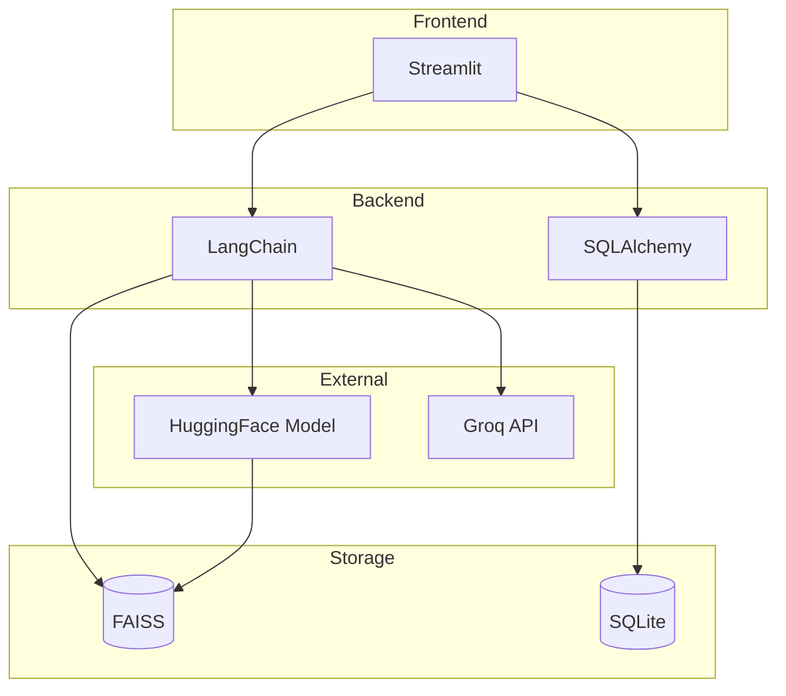

# 🛠️ Tech Stack Summary

## Mục tiêu học tập
Sau khi đọc tài liệu này, bạn sẽ hiểu:
- Các công nghệ chính được sử dụng trong dự án
- Tại sao chọn công nghệ đó (rationale)
- Cách các công nghệ tương tác với nhau

---

## 1. Tổng quan Tech Stack

```
┌────────────────────────────────────────────────────────────┐
│                        FRONTEND                             │
│                    ┌────────────────┐                       │
│                    │   Streamlit    │                       │
│                    │   (Python UI)  │                       │
│                    └────────────────┘                       │
├────────────────────────────────────────────────────────────┤
│                        BACKEND                              │
│  ┌────────────────┐  ┌────────────────┐  ┌──────────────┐  │
│  │   LangChain    │  │   SQLAlchemy   │  │    Python    │  │
│  │   Framework    │  │      ORM       │  │    3.10+     │  │
│  └────────────────┘  └────────────────┘  └──────────────┘  │
├────────────────────────────────────────────────────────────┤
│                      DATA STORAGE                           │
│  ┌────────────────┐  ┌────────────────┐                    │
│  │   FAISS        │  │    SQLite      │                    │
│  │ (Vector Store) │  │ (Chat History) │                    │
│  └────────────────┘  └────────────────┘                    │
├────────────────────────────────────────────────────────────┤
│                     AI/ML SERVICES                          │
│  ┌────────────────┐  ┌────────────────┐                    │
│  │   Groq API     │  │  HuggingFace   │                    │
│  │   (LLM)        │  │  (Embedding)   │                    │
│  └────────────────┘  └────────────────┘                    │
└────────────────────────────────────────────────────────────┘
```

---

## 2. Chi tiết từng công nghệ

### 2.1 Streamlit (Frontend)

| Thuộc tính | Giá trị |
|------------|---------|
| **Version** | ≥1.29.0 |
| **Purpose** | Web UI framework |
| **Language** | Python |

**Tại sao chọn Streamlit?**
- ✅ Rapid prototyping - viết UI với Python thuần
- ✅ Built-in components cho chat (st.chat_message, st.chat_input)
- ✅ Session state management
- ✅ Hot reload khi dev
- ✅ Không cần JavaScript

**Sử dụng trong dự án:**
```python
# app.py
import streamlit as st

st.title("🤖 Trợ lý AI Tra cứu Pháp Luật")

if prompt := st.chat_input("Nhập câu hỏi..."):
    with st.chat_message("assistant"):
        st.markdown(answer)
```

---

### 2.2 LangChain (AI Framework)

| Thuộc tính | Giá trị |
|------------|---------|
| **Version** | ≥0.1.0 |
| **Purpose** | LLM orchestration framework |
| **Components Used** | Loaders, Splitters, Embeddings, Vector Stores, Chains |

**Tại sao chọn LangChain?**
- ✅ Unified API cho nhiều LLM providers
- ✅ Built-in document loaders (PDF, DOCX)
- ✅ Abstractions cho RAG pipeline
- ✅ Active community và documentation

**Packages LangChain trong dự án:**
```python
langchain>=0.1.0              # Core
langchain-community>=0.0.10   # Community integrations
langchain-google-genai>=0.0.6 # Google Gemini
langchain-groq>=0.0.1         # Groq API
langchain-huggingface>=0.1.2  # HuggingFace embeddings
```

**Sử dụng trong dự án:**
```python
# Document Loading
from langchain_community.document_loaders import PyPDFLoader
loader = PyPDFLoader("document.pdf")
docs = loader.load()

# Text Splitting
from langchain_text_splitters import RecursiveCharacterTextSplitter
splitter = RecursiveCharacterTextSplitter(chunk_size=1000, chunk_overlap=200)
chunks = splitter.split_documents(docs)

# LLM Chain
from langchain_core.prompts import PromptTemplate
chain = prompt | llm | StrOutputParser()
```

---

### 2.3 FAISS (Vector Database)

| Thuộc tính | Giá trị |
|------------|---------|
| **Version** | ≥1.7.4 (faiss-cpu) |
| **Purpose** | Similarity search cho vectors |
| **Index Types** | Flat, IVF, IVFPQ |

**Tại sao chọn FAISS?**
- ✅ Facebook AI - battle-tested at scale
- ✅ Hỗ trợ cả exact search và approximate (IVF)
- ✅ Runs locally - không cần cloud service
- ✅ Fast - C++ backend với Python wrapper

**Index Types trong dự án:**
```
VECTOR_INDEX_TYPE=flat   → Exact search, 100% accuracy (default)
VECTOR_INDEX_TYPE=ivf    → Approximate, ~96% accuracy, 5x faster
VECTOR_INDEX_TYPE=ivfpq  → Approximate + compression, ~92% accuracy
```

**Sử dụng trong dự án:**
```python
from langchain_community.vectorstores import FAISS

# Create index
vector_store = FAISS.from_documents(docs, embeddings)

# Search
results = vector_store.similarity_search(query, k=10)
```

---

### 2.4 HuggingFace Embeddings

| Thuộc tính | Giá trị |
|------------|---------|
| **Model** | `bkai-foundation-models/vietnamese-bi-encoder` |
| **Dimensions** | 768 |
| **Language** | Vietnamese optimized |

**Tại sao chọn model này?**
- ✅ Trained specifically cho tiếng Việt
- ✅ Bi-encoder architecture - efficient cho retrieval
- ✅ Open source trên HuggingFace
- ✅ Reasonable size - runs on CPU

**Sử dụng trong dự án:**
```python
from langchain_huggingface import HuggingFaceEmbeddings

embeddings = HuggingFaceEmbeddings(
    model_name="bkai-foundation-models/vietnamese-bi-encoder",
    model_kwargs={'device': 'cpu'},
    encode_kwargs={'normalize_embeddings': True}
)
```

---

### 2.5 Groq API (LLM Provider)

| Thuộc tính | Giá trị |
|------------|---------|
| **Model** | `moonshotai/kimi-k2-instruct-0905` |
| **Purpose** | Text generation cho RAG |
| **Speed** | Ultra-fast inference |

**Tại sao chọn Groq?**
- ✅ Extremely fast inference (LPU technology)
- ✅ Free tier generous
- ✅ Supports many open models (Llama, Kimi, etc.)
- ✅ Simple API similar to OpenAI

**Alternative: Google Gemini**
```python
# Có thể switch qua Google Gemini bằng config:
LLM_PROVIDER=google
LLM_MODEL_NAME=gemini-2.5-flash-lite
```

**Sử dụng trong dự án:**
```python
from langchain_groq import ChatGroq

llm = ChatGroq(
    model="moonshotai/kimi-k2-instruct-0905",
    api_key=GROQ_API_KEY,
    temperature=0.3
)
```

---

### 2.6 SQLAlchemy + SQLite (Database)

| Thuộc tính | Giá trị |
|------------|---------|
| **ORM** | SQLAlchemy ≥2.0.0 |
| **Database** | SQLite |
| **Purpose** | Chat history persistence |

**Tại sao chọn SQLite?**
- ✅ Zero configuration - file-based
- ✅ Built into Python
- ✅ Perfect cho MVP scale
- ✅ Easy migration path to PostgreSQL

**Schema:**
```python
class ChatSession(Base):
    id: str          # UUID
    title: str       # Auto-generated từ first message
    created_at: datetime
    updated_at: datetime
    messages: List[ChatMessage]  # relationship

class ChatMessage(Base):
    id: str
    session_id: str   # FK
    role: str         # "user" or "assistant"
    content: str
    sources: list     # JSON - citations
    standalone_query: str  # Rewritten query
```

---

## 3. Dependencies (requirements.txt)

```
# Core Framework
langchain>=0.1.0
langchain-google-genai>=0.0.6
langchain-community>=0.0.10
langchain-groq>=0.0.1

# Vector Search
faiss-cpu>=1.7.4
langchain-huggingface>=0.1.2

# Document Processing
pypdf>=3.17.0
python-docx>=1.1.0
docx2txt>=0.8

# Web UI
streamlit>=1.29.0

# Database
sqlalchemy>=2.0.0

# Utilities
python-dotenv>=1.0.0
filelock>=3.13.0
pytest>=7.4.0
python-magic-bin>=0.4.14 ; platform_system == "Windows"
python-magic>=0.4.27 ; platform_system != "Windows"
```

---

## 4. Configuration (.env)

```bash
# --- API KEYS ---
GOOGLE_API_KEY=your_google_api_key
GROQ_API_KEY=your_groq_api_key

# --- MAIN GENERATOR CONFIG ---
LLM_PROVIDER=groq                    # google, groq
LLM_MODEL_NAME=moonshotai/kimi-k2-instruct-0905

# --- ROUTER CONFIG ---
ROUTER_PROVIDER=groq
ROUTER_MODEL_NAME=moonshotai/kimi-k2-instruct-0905

# --- REWRITER CONFIG ---
REWRITER_PROVIDER=groq
REWRITER_MODEL_NAME=moonshotai/kimi-k2-instruct-0905

# --- SYSTEM SETTINGS ---
CHUNK_SIZE=1000
CHUNK_OVERLAP=200

# --- FAISS INDEX CONFIGURATION ---
VECTOR_INDEX_TYPE=ivf    # flat, ivf, ivfpq
IVF_NLIST=64            # Number of clusters
IVF_NPROBE=32           # Clusters to search
```

---

## 5. Technology Interaction Diagram



---

## 6. Key Takeaways

> [!IMPORTANT]
> **Điểm nhấn khi thuyết trình:**
> 1. **All Python stack** - Dễ phát triển và maintain
> 2. **Local-first** - FAISS và SQLite chạy local, chỉ LLM cần API
> 3. **Modular** - Có thể swap components dễ dàng (switch LLM provider)
> 4. **Vietnamese optimized** - Embedding model cho tiếng Việt

---

## Tài liệu liên quan
- [Overview Architecture](./01_overview_architecture.md)
- [RAG Concepts](./02_rag_concepts.md)
