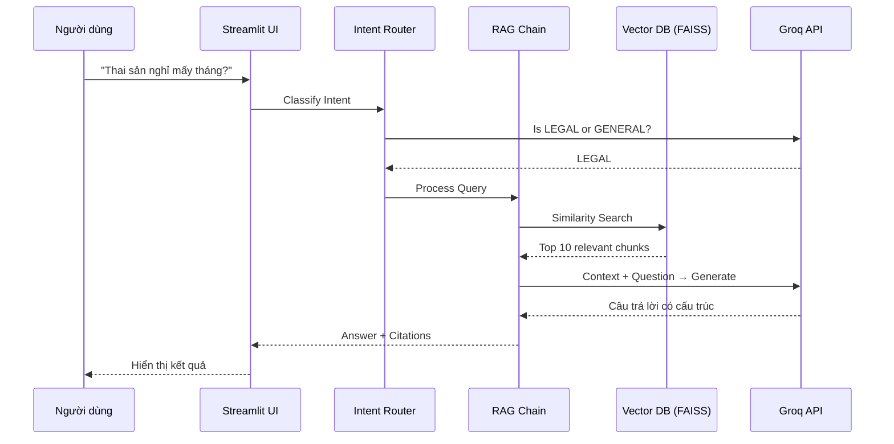

# 🎤 Member 1: Giới thiệu & Kiến trúc Tổng quan - Tài Liệu Thuyết Trình

> **Thời lượng:** ~8-10 phút | **Vai trò:** Mở đầu buổi thuyết trình

---

# PHẦN 1: GIỚI THIỆU (3 phút)

## 📽️ SLIDE 1.1: Tiêu đề

| Nội dung trình chiếu |
|---------------------|
| **AI Legal Assistant** |
| *Trợ lý Pháp luật Thông minh - Luật Lao Động Việt Nam* |
| --- |
| 👤 Member 1: Giới thiệu & Kiến trúc |
| 📅 27/01/2026 |

### 🎙️ Script:

> "Xin chào mọi người. Hôm nay nhóm chúng tôi sẽ trình bày về hệ thống **AI Legal Assistant** - một trợ lý pháp luật thông minh chuyên về Luật Lao động Việt Nam.
>
> Tôi là Member 1, sẽ giới thiệu **tổng quan về dự án, vấn đề cần giải quyết, và kiến trúc hệ thống**.
>
> Sau phần của tôi, các thành viên khác sẽ đi sâu vào từng module cụ thể."

---

## 📽️ SLIDE 1.2: Vấn đề cần giải quyết

| Pain Point | Mô tả |
|------------|-------|
| 🔍 **Tìm kiếm thủ công** | Phải đọc hàng trăm trang văn bản luật để tìm điều khoản liên quan |
| 🤔 **Thiếu ngữ cảnh** | Keyword search không hiểu ý nghĩa câu hỏi |
| ❌ **Không có trích dẫn** | Khó xác minh nguồn thông tin được cung cấp |
| 📚 **Ngôn ngữ pháp lý** | Thuật ngữ chuyên môn khó hiểu với người thường |

### 🎙️ Script:

> "Vậy vấn đề là gì? Khi người dùng muốn tra cứu luật lao động, họ gặp phải nhiều khó khăn:
>
> **Thứ nhất**, phải tìm kiếm thủ công qua hàng trăm trang văn bản. Rất mất thời gian.
>
> **Thứ hai**, các công cụ search thường chỉ tìm keyword, không hiểu được ý nghĩa thực sự của câu hỏi. Ví dụ, hỏi 'nghỉ đẻ bao lâu' sẽ không match với 'thai sản'.
>
> **Thứ ba**, các chatbot thông thường có thể đưa ra câu trả lời sai mà không có nguồn để verify.
>
> **Cuối cùng**, ngôn ngữ pháp lý thường phức tạp, khó hiểu với người bình thường."

---

## 📽️ SLIDE 1.3: Giải pháp - RAG (Retrieval-Augmented Generation)

```
┌─────────────────────────────────────────────────────────────┐
│                    WITHOUT RAG                               │
│                                                             │
│   Câu hỏi ──────────────────────────► LLM ──────► Trả lời   │
│              (Kiến thức giới hạn, có thể sai)               │
└─────────────────────────────────────────────────────────────┘

┌─────────────────────────────────────────────────────────────┐
│                      WITH RAG                                │
│                                                             │
│   Câu hỏi ───► Tìm kiếm ───► Context + Câu hỏi             │
│                   │               │                         │
│              FAISS Index          ▼                         │
│                   │           LLM ────► Trả lời + Trích dẫn │
│              Vector Database                                 │
└─────────────────────────────────────────────────────────────┘
```

### 🎙️ Script:

> "Giải pháp của chúng tôi là sử dụng kỹ thuật **RAG - Retrieval-Augmented Generation**.
>
> Nếu chỉ dùng LLM thông thường, AI chỉ trả lời dựa trên kiến thức đã được training, có thể đã lỗi thời hoặc sai.
>
> Với RAG, chúng tôi **tìm kiếm tài liệu liên quan trước**, sau đó đưa tài liệu đó làm context cho LLM. Nhờ vậy:
> - AI chỉ trả lời dựa trên tài liệu thực tế
> - Mọi câu trả lời đều có **trích dẫn nguồn** cụ thể
> - Có thể cập nhật kiến thức mới mà không cần train lại model"

---

## 📽️ SLIDE 1.4: Tính năng chính của hệ thống

| Tính năng | Mô tả |
|-----------|-------|
| 🧠 **Semantic Search** | Hiểu ý nghĩa câu hỏi, không chỉ keyword |
| 📚 **Citation** | Trích dẫn nguồn: file, trang cụ thể |
| 💬 **Conversational** | Nhớ ngữ cảnh hội thoại, hỏi follow-up |
| 🔄 **Easy Update** | Thêm luật mới chỉ cần copy PDF vào folder |
| 🚀 **Fast Response** | Trả lời trong 1-2 giây |

### 🎙️ Script:

> "Hệ thống của chúng tôi có những tính năng nổi bật:
>
> **Semantic Search**: Hiểu được 'nghỉ đẻ' và 'thai sản' là cùng một khái niệm.
>
> **Citation**: Mọi câu trả lời đều ghi rõ nguồn từ file nào, trang nào. Người dùng có thể verify.
>
> **Conversational**: Hỗ trợ hỏi tiếp. Ví dụ sau khi hỏi về thai sản, có thể hỏi 'còn nam thì sao?' và AI vẫn hiểu ngữ cảnh.
>
> **Easy Update**: Khi có nghị định mới, chỉ cần copy file PDF vào hệ thống là xong.
>
> **Fast**: Response time khoảng 1-2 giây, phù hợp với trải nghiệm chat."

---

# PHẦN 2: KIẾN TRÚC TỔNG QUAN (4 phút)

## 📽️ SLIDE 2.1: Kiến trúc Modular Monolith

```
┌─────────────────────────────────────────────────────────────┐
│                    PRESENTATION LAYER                        │
│                      (app.py - Streamlit)                    │
├─────────────────────────────────────────────────────────────┤
│                    BUSINESS LOGIC LAYER                      │
│  ┌─────────────┐  ┌─────────────┐  ┌─────────────────────┐  │
│  │ RAG Engine  │  │  Ingestion  │  │      Database       │  │
│  │             │  │             │  │                     │  │
│  │ - Generator │  │ - Loader    │  │ - Models            │  │
│  │ - Retriever │  │ - Splitter  │  │ - Repository        │  │
│  │ - Router    │  │ - Indexer   │  │ - Engine            │  │
│  │ - Prompts   │  │ - Metadata  │  │                     │  │
│  └─────────────┘  └─────────────┘  └─────────────────────┘  │
├─────────────────────────────────────────────────────────────┤
│                    DATA ACCESS LAYER                         │
│  ┌─────────────────────┐    ┌────────────────────────────┐  │
│  │   FAISS Vector DB   │    │   SQLite (Chat History)    │  │
│  └─────────────────────┘    └────────────────────────────┘  │
├─────────────────────────────────────────────────────────────┤
│                    EXTERNAL SERVICES                         │
│  ┌─────────────────────┐    ┌────────────────────────────┐  │
│  │       Groq API      │    │     HuggingFace Models     │  │
│  │    (LLM - Kimi K2)  │    │   (vietnamese-bi-encoder)  │  │
│  └─────────────────────┘    └────────────────────────────┘  │
└─────────────────────────────────────────────────────────────┘
```

### 🎙️ Script:

> "Hệ thống được xây dựng theo kiến trúc **Modular Monolith** - đơn giản nhưng có tổ chức rõ ràng.
>
> **Tầng Presentation**: Giao diện Streamlit, xử lý input/output với người dùng.
>
> **Tầng Business Logic** gồm 3 module chính:
> - **RAG Engine**: Xử lý AI, tìm kiếm và sinh câu trả lời
> - **Ingestion**: Nạp và xử lý tài liệu PDF/DOCX
> - **Database**: Lưu trữ lịch sử chat
>
> **Tầng Data Access**: FAISS cho vector search, SQLite cho structured data.
>
> **External Services**: Groq API cho LLM, HuggingFace cho embedding model."

---

## 📽️ SLIDE 2.2: Luồng xử lý câu hỏi



### 🎙️ Script:

> "Đây là luồng xử lý khi người dùng đặt câu hỏi:
>
> **Bước 1**: Câu hỏi được gửi từ UI đến **Intent Router**.
>
> **Bước 2**: Router sử dụng LLM để phân loại: đây là câu hỏi về **LEGAL** (pháp luật) hay **GENERAL** (xã giao, chào hỏi)?
>
> **Bước 3**: Nếu là LEGAL, chuyển sang **RAG Chain**. RAG tìm kiếm trong **Vector Database** để lấy top 10 đoạn văn bản liên quan nhất.
>
> **Bước 4**: Đưa context và câu hỏi vào **LLM** để sinh câu trả lời có cấu trúc.
>
> **Bước 5**: Trả về UI với câu trả lời và trích dẫn nguồn."

---

## 📽️ SLIDE 2.3: Các thành phần RAG Engine

| Component | File | Chức năng |
|-----------|------|-----------|
| **Generator** | `generator.py` | Điều phối toàn bộ flow RAG |
| **Retriever** | `retriever.py` | Tìm kiếm semantic trong FAISS |
| **Router** | `router.py` | Phân loại intent LEGAL/GENERAL |
| **Prompts** | `prompts.py` | Template prompt cho LLM |
| **LLM Factory** | `llm_factory.py` | Tạo LLM instance theo provider |

### 🎙️ Script:

> "Module RAG Engine gồm 5 thành phần chính:
>
> **Generator**: Là 'nhạc trưởng' điều phối toàn bộ flow. Nhận câu hỏi, gọi các component khác, trả về kết quả.
>
> **Retriever**: Chịu trách nhiệm tìm kiếm trong Vector Database. Chuyển câu hỏi thành vector và tìm documents tương tự.
>
> **Router**: Phân loại câu hỏi. Nếu là câu chào hỏi thì không cần search, trả lời trực tiếp.
>
> **Prompts**: Chứa các prompt template được thiết kế cho domain pháp luật.
>
> **LLM Factory**: Cho phép dễ dàng switch giữa Google Gemini và Groq."

---

## 📽️ SLIDE 2.4: Tech Stack

| Layer | Công nghệ | Mục đích |
|-------|-----------|----------|
| **Frontend** | Streamlit | Web UI với Python thuần |
| **AI Framework** | LangChain | Orchestration cho LLM và RAG |
| **Vector DB** | FAISS | Similarity search hiệu quả |
| **Embedding** | vietnamese-bi-encoder | Optimized cho tiếng Việt (768D) |
| **LLM** | Groq (Kimi K2) | Fast inference, free tier |
| **Database** | SQLite + SQLAlchemy | Lưu lịch sử chat |
| **Config** | python-dotenv | Environment variables |

### 🎙️ Script:

> "Về tech stack, chúng tôi chọn các công nghệ phù hợp với yêu cầu:
>
> **Streamlit**: Cho phép xây dựng web app nhanh chóng bằng Python, có sẵn chat components.
>
> **LangChain**: Framework phổ biến cho AI applications, cung cấp abstractions cho RAG pipeline.
>
> **FAISS**: Thư viện của Facebook AI, tìm kiếm vector rất nhanh.
>
> **vietnamese-bi-encoder**: Model embedding được train cho tiếng Việt, đảm bảo hiểu đúng ngữ nghĩa.
>
> **Groq**: LLM provider mới với inference cực nhanh, free tier generous cho development.
>
> **SQLite**: Database file-based, đơn giản nhưng đủ cho MVP."

---

# PHẦN 3: TỔNG KẾT & CHUYỂN TIẾP (1 phút)

## 📽️ SLIDE 3.1: Tóm tắt phần giới thiệu

| Chủ đề | Điểm chính |
|--------|------------|
| **Vấn đề** | Tra cứu luật thủ công, thiếu ngữ cảnh, không có nguồn |
| **Giải pháp** | RAG = Retrieval + Generation |
| **Kiến trúc** | Modular Monolith với Clean Architecture |
| **Luồng xử lý** | Router → Retrieval → Generation → Citation |
| **Tech Stack** | Streamlit, LangChain, FAISS, Groq |

### 🎙️ Script:

> "Tóm lại phần giới thiệu, chúng tôi đã trình bày:
>
> **Vấn đề** mà người dùng gặp phải khi tra cứu luật.
>
> **Giải pháp RAG** kết hợp tìm kiếm ngữ nghĩa với sinh văn bản AI.
>
> **Kiến trúc hệ thống** theo mô hình Modular Monolith.
>
> **Luồng xử lý** từ câu hỏi đến câu trả lời có trích dẫn.
>
> Và **các công nghệ** được sử dụng trong dự án."

---

## 📽️ SLIDE 3.2: Chuyển tiếp

| Tiếp theo | Member 2: Data Ingestion & Vector Database |
|-----------|---------------------------------------------|
| **Chủ đề** | Pipeline xử lý tài liệu, Embedding, FAISS |
| **Câu hỏi** | "Làm sao chuyển PDF thành searchable data?" |

### 🎙️ Script:

> "Đó là phần của tôi về **giới thiệu và kiến trúc tổng quan**.
>
> Bây giờ, **Member 2** sẽ giải thích chi tiết về **Data Ingestion** - làm thế nào để chuyển các file PDF/DOCX thành dữ liệu có thể tìm kiếm được.
>
> Xin mời Member 2."

---

# 📋 CHECKLIST CHUẨN BỊ

- [ ] Đọc kỹ `README.md` và `DEV_LOG.md` để hiểu overview dự án
- [ ] Hiểu rõ khái niệm RAG (Retrieval-Augmented Generation)
- [ ] Xem qua cấu trúc thư mục `src/` để hiểu module layout
- [ ] Chuẩn bị công cụ render Mermaid (VS Code extension hoặc online)
- [ ] Test microphone và screen sharing
- [ ] Đọc qua script 1-2 lần trước khi thuyết trình

---

# ❓ CÂU HỎI CÓ THỂ GẶP

| Câu hỏi | Gợi ý trả lời |
|---------|---------------|
| "Tại sao dùng RAG thay vì fine-tune?" | RAG cho phép cập nhật kiến thức mới mà không cần train lại. Chi phí thấp hơn. |
| "Tại sao chọn Modular Monolith?" | Phù hợp quy mô MVP, đơn giản để deploy, có thể migrate sang microservices sau. |
| "Groq là gì? Tại sao không dùng OpenAI?" | Groq là LLM provider mới với inference cực nhanh (LPU), free tier generous. |
| "FAISS là gì?" | Facebook AI Similarity Search - thư viện tìm kiếm vector hiệu quả, hỗ trợ cả exact và approximate search. |
