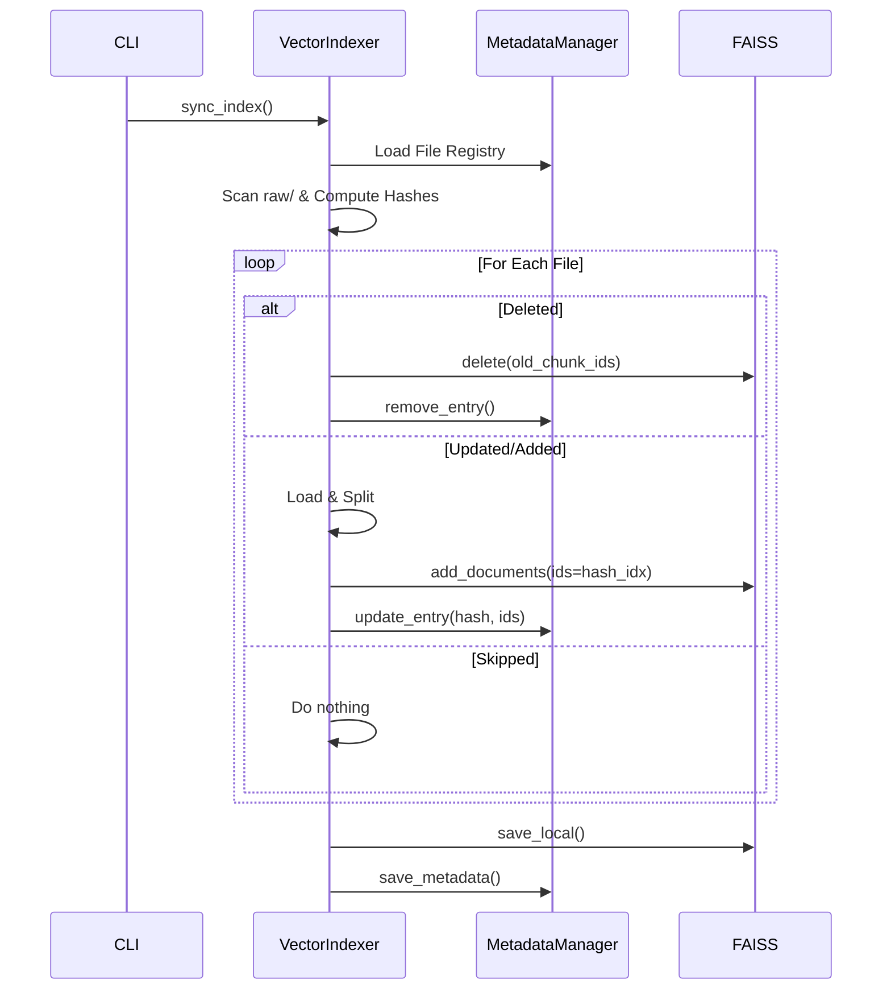

# 📥 Ingestion Pipeline - Luồng Nạp Dữ Liệu

## Mục tiêu học tập
Sau khi đọc tài liệu này, bạn sẽ hiểu:
- Tổng quan pipeline ingestion
- Các bước trong quá trình nạp dữ liệu
- Cơ chế incremental sync

---

## 1. Tổng quan Ingestion Pipeline

### 1.1 Định nghĩa
**Ingestion Pipeline** là quy trình chuyển đổi tài liệu gốc (PDF/DOCX) thành dạng có thể tìm kiếm được (vectors trong FAISS).

### 1.2 Các bước chính

```
┌─────────────────────────────────────────────────────────────┐
│                    INGESTION PIPELINE                        │
│                                                             │
│   PDF/DOCX          Text            Chunks          Vectors │
│   Files    ──────►  Docs  ──────►   List  ──────►  Index   │
│                                                             │
│            LOAD          SPLIT          EMBED       STORE   │
│         (loader.py)  (splitter.py)  (indexer.py)  (FAISS)  │
└─────────────────────────────────────────────────────────────┘
```

---

## 2. Luồng xử lý chi tiết

### 2.1 Step 1: LOAD - Đọc tài liệu

**File**: `src/ingestion/loader.py`

```python
class DocumentLoader:
    SUPPORTED_EXTENSIONS = {
        ".pdf": PyPDFLoader,
        ".docx": Docx2txtLoader,
        ".doc": Docx2txtLoader
    }
```

**Chức năng**:
- Đọc file PDF sử dụng `PyPDFLoader` (LangChain)
- Đọc file DOCX sử dụng `Docx2txtLoader`
- Trích xuất text và metadata (tên file, số trang)

**Output**:
```python
Document(
    page_content="Điều 139. Nghỉ thai sản...",
    metadata={
        "source": "luat_lao_dong.pdf",
        "page": 0  # 0-indexed
    }
)
```

---

### 2.2 Step 2: SPLIT - Chia thành chunks

**File**: `src/ingestion/splitter.py`

**Chiến lược**: `RecursiveCharacterTextSplitter`

```python
splitter = RecursiveCharacterTextSplitter(
    chunk_size=1000,      # Tối đa 1000 ký tự
    chunk_overlap=200,    # Overlap 200 ký tự với chunk liền kề
    separators=["\n\n", "\n", " ", ""]  # Ưu tiên cắt theo paragraph
)
```

**Tại sao cần chunking?**
1. LLM có giới hạn context window
2. Tìm kiếm chính xác hơn với chunks nhỏ
3. Giảm noise - chỉ lấy phần liên quan

**Visualization**:
```
Original Document (5000 chars):
┌────────────────────────────────────────────────────┐
│ Điều 139... text... Điều 140... text... Điều 141. │
└────────────────────────────────────────────────────┘

After Splitting (5 chunks):
┌──────────┐  ┌──────────┐  ┌──────────┐  ┌──────────┐  ┌──────────┐
│ Chunk 1  │  │ Chunk 2  │  │ Chunk 3  │  │ Chunk 4  │  │ Chunk 5  │
│ ~1000    │  │ ~1000    │  │ ~1000    │  │ ~1000    │  │ ~1000    │
└──────────┘  └──────────┘  └──────────┘  └──────────┘  └──────────┘
        ↘──overlap──↙        ↘──overlap──↙
```

**Metadata sau khi split**:
```python
chunk.metadata = {
    "source": "luat_lao_dong.pdf",
    "page": 5,
    "chunk_id": "abc123",       # UUID
    "chunk_index": 0,           # Thứ tự trong file
    "total_chunks": 150,        # Tổng chunks của file
    "created_at": "2026-01-27T..."
}
```

---

### 2.3 Step 3: EMBED - Chuyển text → vector

**File**: `src/ingestion/indexer.py`

**Model**: `bkai-foundation-models/vietnamese-bi-encoder`

```python
embeddings = HuggingFaceEmbeddings(
    model_name="bkai-foundation-models/vietnamese-bi-encoder",
    model_kwargs={'device': 'cpu'},
    encode_kwargs={'normalize_embeddings': True}
)
```

**Process**:
```
Text: "Nghỉ thai sản được 6 tháng"
      │
      ▼
Tokenizer → [Token1, Token2, ..., TokenN]
      │
      ▼
BiEncoder Model
      │
      ▼
Vector: [0.12, -0.34, 0.56, ..., 0.78]  (768 dimensions)
```

**Batch Processing**:
```python
texts = [chunk.page_content for chunk in chunks]
embeddings_matrix = np.array(embeddings.embed_documents(texts))
# Shape: (num_chunks, 768)
```

---

### 2.4 Step 4: INDEX - Lưu vào FAISS

**File**: `src/ingestion/indexer.py`

**Index Types**:

| Type | Factory String | Đặc điểm |
|------|----------------|----------|
| Flat | `"Flat"` | Exact search, brute-force |
| IVF | `"IVF64,Flat"` | Clustering, approximate |
| IVFPQ | `"IVF64,PQ48x8"` | Clustering + compression |

**IVF Index Creation**:
```python
# 1. Create index using factory
index = faiss.index_factory(dimension, "IVF64,Flat", faiss.METRIC_L2)

# 2. Train index (K-means clustering)
if not index.is_trained:
    index.train(embeddings_matrix)  # Learn 64 cluster centroids

# 3. Add vectors
index.add(embeddings_matrix)

# 4. Save to disk
vector_store.save_local("data/vector_store/")
```

**Output Files**:
```
data/vector_store/
├── index.faiss          # FAISS binary index
├── index.pkl            # LangChain metadata (docstore mapping)
└── indexing_metadata.json  # File tracking metadata
```

---

## 3. Incremental Sync (Differential Indexing)

### 3.1 Vấn đề với Full Rebuild
- Rebuild toàn bộ khi thêm 1 file mới = lãng phí
- Với 1000 files, thêm 1 file phải xử lý lại 1001 files

### 3.2 Giải pháp: Incremental Sync

**File**: `src/ingestion/metadata.py`

```python
class MetadataManager:
    """Track file hashes and chunk IDs for incremental updates."""
    
    def calculate_file_hash(file_path):
        # MD5 hash của file content
        return hashlib.md5(file.read()).hexdigest()
```

**Metadata Registry** (`indexing_metadata.json`):
```json
{
    "luat_lao_dong.pdf": {
        "hash": "abc123def456",
        "chunk_ids": ["hash_0", "hash_1", "hash_2", ...],
        "last_indexed": "2026-01-27T10:00:00Z"
    },
    "nghi_dinh_145.pdf": {
        "hash": "xyz789abc012",
        "chunk_ids": ["hash_0", "hash_1"],
        "last_indexed": "2026-01-27T10:05:00Z"
    }
}
```

### 3.3 Sync Algorithm

```python
def sync_index():
    # 1. Scan current files và compute hashes
    current_hashes = {}
    for file in os.listdir(raw_data_path):
        current_hashes[file] = calculate_file_hash(file)
    
    # 2. Compare with metadata registry
    files_to_add = []     # New files
    files_to_update = []  # Changed files (hash mismatch)
    files_to_delete = []  # Removed files
    files_skipped = []    # Unchanged files
    
    # 3. Process changes
    for file in files_to_delete:
        vector_store.delete(old_chunk_ids)
        metadata.remove(file)
    
    for file in files_to_update:
        vector_store.delete(old_chunk_ids)
        new_chunks = load_and_split(file)
        vector_store.add(new_chunks)
        metadata.update(file, new_hash, new_chunk_ids)
    
    for file in files_to_add:
        new_chunks = load_and_split(file)
        vector_store.add(new_chunks)
        metadata.add(file, hash, chunk_ids)
```

### 3.4 Flow Diagram



---

## 4. Chunk ID Strategy

### 4.1 Deterministic IDs
```python
chunk_id = f"{file_hash}_{chunk_index}"
# Example: "abc123def456_0", "abc123def456_1", ...
```

**Tại sao dùng file_hash?**
- Unique per file content
- Stable - same content = same hash
- Cho phép precise deletion khi file bị update

### 4.2 ID Mapping
```
FAISS internal ID: 0, 1, 2, 3, ...
         ↓ mapping
Custom chunk ID: "hash1_0", "hash1_1", "hash2_0", ...
```

---

## 5. Performance Considerations

### 5.1 Benchmarks (1500 vectors)
| Operation | Time |
|-----------|------|
| Load PDF (100 pages) | ~2-3s |
| Split into chunks | ~0.1s |
| Embed all chunks | ~5-10s |
| Create FAISS index | ~0.5s |
| Save to disk | ~0.2s |

### 5.2 IVF Training Requirements
```
Minimum vectors for IVF64: 64 (= nlist)
Recommended vectors: 39 * 64 = 2,496
```

**Fallback**: Nếu không đủ vectors, tự động switch sang Flat index.

---

## 6. Code Walkthrough

### 6.1 Entry Point
```python
# ingest.py
from src.ingestion.indexer import VectorIndexer

if __name__ == "__main__":
    VectorIndexer.sync_index()
```

### 6.2 Streamlit UI Trigger
```python
# app.py
if st.button("🔄 Cập nhật Index"):
    VectorIndexer.sync_index()
    st.cache_resource.clear()  # Clear cached retriever
    st.rerun()
```

---

## 7. Key Takeaways

> [!IMPORTANT]
> **Điểm nhấn khi thuyết trình:**
> 1. **4-step pipeline**: Load → Split → Embed → Index
> 2. **Incremental sync**: Chỉ xử lý files thay đổi
> 3. **Metadata tracking**: JSON registry cho file hashes
> 4. **Deterministic IDs**: Cho phép precise updates/deletes

---

## Tài liệu liên quan
- [Text Chunking](./02_text_chunking.md)
- [Embedding Models](./03_embedding_models.md)
- [FAISS Vector Search](./04_faiss_vector_search.md)
