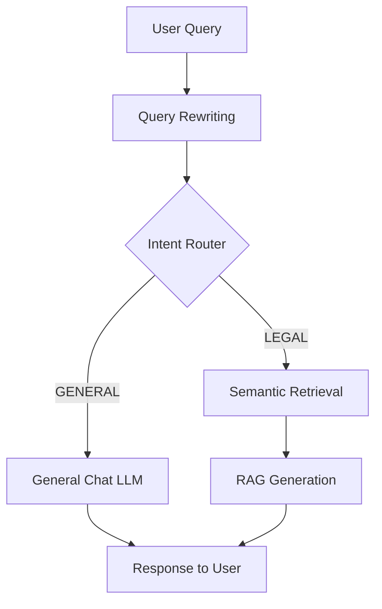

# 🚦 Intent Routing - Phân Loại Ý Định

## Mục tiêu học tập
Sau khi đọc tài liệu này, bạn sẽ hiểu:
- Tại sao cần phân loại intent
- IntentRouter hoạt động như thế nào
- Query Rewriting cho conversational context

---

## 1. Vấn đề: Off-topic Queries

### 1.1 Scenario không có Router

```
User: "Xin chào!"
System: [searches legal database]
System: "Tôi không tìm thấy tài liệu pháp lý về 'xin chào'..."

❌ Bad UX - should just say hello back
```

### 1.2 Giải pháp: Intent Router

```
User: "Xin chào!"
       │
       ▼
   ┌─────────┐
   │ Router  │ ──► GENERAL
   └─────────┘
       │
       ▼
Skip RAG ──► "Xin chào! Tôi là trợ lý pháp lý AI..."

User: "Thai sản được nghỉ mấy tháng?"
       │
       ▼
   ┌─────────┐
   │ Router  │ ──► LEGAL
   └─────────┘
       │
       ▼
Execute RAG ──► [Retrieve + Generate with citations]
```

---

## 2. Intent Types

### 2.1 Hai loại Intent

| Intent | Description | Flow |
|--------|-------------|------|
| **LEGAL** | Câu hỏi về luật pháp | RAG Pipeline |
| **GENERAL** | Chào hỏi, xã giao, off-topic | General Chat |

### 2.2 Ví dụ phân loại

| Query | Intent |
|-------|--------|
| "Xin chào!" | GENERAL |
| "Thời tiết hôm nay thế nào?" | GENERAL |
| "1 + 1 = ?" | GENERAL |
| "Tên tôi là Hùng" | GENERAL |
| "Thai sản được nghỉ bao nhiêu ngày?" | LEGAL |
| "Hợp đồng lao động cần những gì?" | LEGAL |
| "Điều 139 nói gì?" | LEGAL |

---

## 3. IntentRouter Class

### 3.1 Router Template

```python
# src/rag_engine/router.py

ROUTER_TEMPLATE = """Bạn là bộ phân loại câu hỏi cho một Trợ lý Luật sư AI.

Nhiệm vụ: Phân loại câu hỏi của người dùng vào một trong hai nhóm sau:
1. "LEGAL": Câu hỏi liên quan đến luật pháp Việt Nam, quy định, nghị định, 
   thủ tục hành chính, tra cứu luật, hoặc các vấn đề pháp lý.
2. "GENERAL": Câu hỏi chào hỏi, xã giao, thời tiết, toán học, lập trình, 
   khen ngợi, hoặc các kiến thức không liên quan đến luật pháp.

Yêu cầu đầu ra: CHỈ trả về đúng 1 từ duy nhất: "LEGAL" hoặc "GENERAL". 
Không giải thích thêm.

Câu hỏi: {question}

Phân loại:"""
```

### 3.2 Classification Logic

```python
class IntentRouter:
    INTENT_LEGAL = "LEGAL"
    INTENT_GENERAL = "GENERAL"
    
    def __init__(self, llm: BaseChatModel):
        self.llm = llm
        self.prompt = PromptTemplate.from_template(ROUTER_TEMPLATE)
        self.chain = self.prompt | self.llm | StrOutputParser()

    def classify(self, query: str) -> str:
        # Clean input
        query = query.strip()
        if not query:
            return self.INTENT_GENERAL
            
        # Call LLM
        result = self.chain.invoke({"question": query})
        intent = result.strip().upper()
        
        # Safety check - if LLM outputs more than expected
        if "LEGAL" in intent:
            return self.INTENT_LEGAL
        return self.INTENT_GENERAL
```

### 3.3 Fail-safe Behavior

```python
except Exception as e:
    logger.warning(f"Router classification failed: {e}. Defaulting to LEGAL.")
    return self.INTENT_LEGAL  # Fail-safe to try RAG anyway
```

**Rationale**: Nếu router lỗi, thà search legal database (có thể trả lời được) hơn là bỏ qua câu hỏi pháp lý.

---

## 4. Router trong RAG Flow

### 4.1 Integration

```python
# src/rag_engine/generator.py

class RAGChain:
    def __init__(self, retriever):
        # Router uses its own LLM (can be different from generator)
        self.router_llm = LLMFactory.create_llm(
            provider=AppConfig.ROUTER_PROVIDER,
            model_name=AppConfig.ROUTER_MODEL_NAME,
            temperature=0.0  # Deterministic output
        )
        self.router = IntentRouter(self.router_llm)
```

### 4.2 Flow Diagram



---

## 5. Query Rewriting (Conversational Context)

### 5.1 Vấn đề với Follow-up Questions

```
User: "Thai sản được nghỉ bao nhiêu ngày?"
AI: "Theo Điều 139, lao động nữ được nghỉ 6 tháng..."

User: "Còn nam thì sao?"
       ↑
       Vấn đề: "nam" và "sao" không đủ context để search
```

### 5.2 Giải pháp: Query Rewriting

```
Original: "Còn nam thì sao?"
    │
    ▼ (với chat history)
Rewritten: "Lao động nam có được nghỉ thai sản không?"
    │
    ▼
Now searchable!
```

### 5.3 Condense Question Prompt

```python
# src/rag_engine/prompts.py

CONDENSE_QUESTION_SYSTEM_PROMPT = """Bạn là một chuyên gia ngôn ngữ.
Nhiệm vụ: Dựa trên Lịch sử trò chuyện và Câu hỏi mới của người dùng, 
hãy viết lại câu hỏi mới thành một câu hỏi ĐỘC LẬP (Standalone Question) 
rõ ràng, đầy đủ ngữ cảnh để tìm kiếm thông tin.

YÊU CẦU:
1. KHÔNG trả lời câu hỏi. CHỈ viết lại câu hỏi.
2. Câu hỏi viết lại phải đầy đủ chủ ngữ, vị ngữ.
3. Thay thế các đại từ (nó, cái đó, ông ấy...) bằng danh từ cụ thể từ lịch sử.
4. Nếu câu hỏi đã rõ ràng, hãy chép lại y nguyên.
5. KHÔNG thêm các từ đệm như "Bạn Hùng hỏi...", "Người dùng muốn biết..."

[LỊCH SỬ TRÒ CHUYỆN]
{chat_history}

[CÂU HỎI MỚI]
{question}

[CÂU HỎI ĐỘC LẬP]"""
```

### 5.4 Rewriting Flow

```python
# src/rag_engine/generator.py

def generate_answer(self, query: str, chat_history_str: str = ""):
    standalone_query = query
    
    if chat_history_str:
        # Rewrite query using history
        standalone_query = self.condense_question_chain.invoke({
            "chat_history": chat_history_str,
            "question": query
        })
        logger.info(f"Original: '{query}' -> Standalone: '{standalone_query}'")
    
    # Now use standalone_query for intent classification AND retrieval
    intent = self.router.classify(standalone_query)
```

---

## 6. Tại sao dùng riêng LLM cho Router?

### 6.1 Lý do

| Factor | Generator LLM | Router LLM |
|--------|---------------|------------|
| Task | Complex reasoning | Simple classification |
| Output | Long, structured | Single word |
| Temperature | 0.3 (creative) | 0.0 (deterministic) |
| Model size | Can be large | Can be lightweight |
| Cost | Higher | Lower |

### 6.2 Configuration

```bash
# .env
# Generator (main)
LLM_PROVIDER=groq
LLM_MODEL_NAME=moonshotai/kimi-k2-instruct-0905

# Router (can be same or different)
ROUTER_PROVIDER=groq
ROUTER_MODEL_NAME=moonshotai/kimi-k2-instruct-0905

# Rewriter
REWRITER_PROVIDER=groq
REWRITER_MODEL_NAME=moonshotai/kimi-k2-instruct-0905
```

---

## 7. General Chat Handling

### 7.1 GENERAL Intent Flow

```python
if intent == IntentRouter.INTENT_GENERAL:
    # Chat casually WITH history (remembers user context)
    final_answer = self.general_chain.invoke({
        "question": query,
        "chat_history": chat_history_str  # Inject history
    })
```

### 7.2 General Chat Prompt

```python
GENERAL_SYSTEM_PROMPT = """Bạn là Trợ lý Pháp luật AI chuyên về luật lao động Việt Nam.
Người dùng vừa đưa ra một câu hỏi hoặc câu chào xã giao.

Nhiệm vụ:
1. Dựa vào [LỊCH SỬ TRÒ CHUYỆN] để hiểu ngữ cảnh (tên người dùng, chủ đề đang nói).
2. Phản hồi lịch sự, thân thiện, ngắn gọn.
3. Nếu người dùng hỏi về thông tin cá nhân (tên tôi là gì...), hãy trả lời dựa trên lịch sử.
4. Cuối cùng, LUÔN hướng người dùng quay lại chủ đề pháp luật nếu có thể.

[LỊCH SỬ TRÒ CHUYỆN]
{chat_history}

[CÂU HỎI CỦA NGƯỜI DÙNG]
{question}

[CÂU TRẢ LỜI CỦA BẠN]"""
```

---

## 8. UI Integration

### 8.1 Displaying Rewritten Query

```python
# app.py

# Show how AI understood the question
if standalone and standalone != prompt:
    with st.expander("🧠 Tư duy ngữ cảnh"):
        st.info(f"AI đã hiểu: **{standalone}**")
```

### 8.2 Example Display

```
User: "Còn nam thì sao?"

🧠 Tư duy ngữ cảnh
┌────────────────────────────────────────────────┐
│ AI đã hiểu: **Lao động nam có được nghỉ thai  │
│ sản không?**                                   │
└────────────────────────────────────────────────┘
```

---

## 9. Edge Cases

### 9.1 Empty Query

```python
if not query:
    return self.INTENT_GENERAL
```

### 9.2 Ambiguous Query

```
"Luật" → LEGAL
"Điều" → LEGAL (likely referring to law article)
"Toán" → GENERAL
```

### 9.3 Mixed Intent

```
User: "Xin chào, tôi muốn hỏi về thai sản"
→ LEGAL (keyword "thai sản" triggers legal intent)
```

---

## 10. Performance

### 10.1 Router Latency

| Step | Time |
|------|------|
| Router classification | ~200-300ms |
| Query rewriting | ~200-300ms |
| **Total overhead** | ~400-600ms |

### 10.2 Optimization

```python
# Skip rewriting if no history
if chat_history_str:
    # Only rewrite when there's context to use
    standalone_query = self.rewrite(...)
```

---

## 11. Key Takeaways

> [!IMPORTANT]
> **Điểm nhấn khi thuyết trình:**
> 1. **Intent Router**: Phân biệt LEGAL (need RAG) vs GENERAL (casual chat)
> 2. **Query Rewriting**: Giải quyết follow-up questions và pronouns
> 3. **Fail-safe to LEGAL**: Đảm bảo không bỏ sót câu hỏi pháp lý
> 4. **Separate LLMs**: Router/Rewriter có thể dùng model nhẹ hơn Generator

---

## Tài liệu liên quan
- [Semantic Retrieval](./01_semantic_retrieval.md)
- [Prompt Engineering](./03_prompt_engineering.md)
