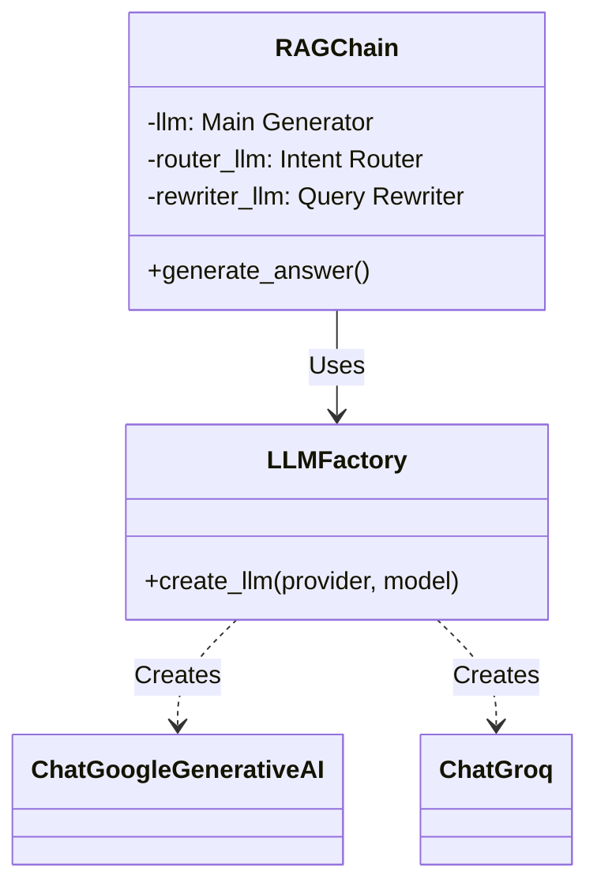

# 🏭 LLM Factory Pattern

## Mục tiêu học tập
Sau khi đọc tài liệu này, bạn sẽ hiểu:
- Factory Pattern là gì
- Cách LLMFactory cho phép switch providers
- Multi-LLM configuration trong dự án

---

## 1. Factory Pattern là gì?

### 1.1 Định nghĩa
**Factory Pattern** là design pattern tạo object mà không expose logic khởi tạo. Client gọi factory method với parameters, nhận về object phù hợp.

### 1.2 Ứng dụng trong dự án

```
Without Factory:              With Factory:
                              
if provider == "google":      llm = LLMFactory.create_llm(
    llm = ChatGoogleAI()          provider="google",
elif provider == "groq":          model_name="gemini-pro"
    llm = ChatGroq()          )
...                           
(repeated everywhere)         (centralized logic)
```

---

## 2. LLMFactory Implementation

### 2.1 Class Structure

```python
# src/rag_engine/llm_factory.py

class LLMFactory:
    """
    Factory to create LLM instances based on provider configuration.
    Supports: Google (Gemini), Groq.
    """
    
    @staticmethod
    def create_llm(provider: str, model_name: str, **kwargs) -> BaseChatModel:
        """
        Create and return a configured LLM instance.
        """
        logger.info(f"Initializing LLM: Provider={provider}, Model={model_name}")
        
        try:
            if provider.lower() == "google":
                return ChatGoogleGenerativeAI(
                    model=model_name,
                    google_api_key=AppConfig.GOOGLE_API_KEY,
                    convert_system_message_to_human=True,
                    **kwargs
                )

            elif provider.lower() == "groq":
                from langchain_groq import ChatGroq
                from pydantic import SecretStr
                
                return ChatGroq(
                    model=model_name,
                    api_key=SecretStr(AppConfig.GROQ_API_KEY),
                    **kwargs
                )

            else:
                raise ValueError(f"Unsupported LLM Provider: {provider}")
                
        except Exception as e:
            logger.error(f"Failed to initialize LLM: {e}")
            raise e
```

---

## 3. Supported Providers

### 3.1 Google Gemini

```python
if provider.lower() == "google":
    return ChatGoogleGenerativeAI(
        model=model_name,                    # "gemini-2.5-flash-lite"
        google_api_key=AppConfig.GOOGLE_API_KEY,
        convert_system_message_to_human=True,  # Gemini quirk
        **kwargs
    )
```

**Đặc điểm**:
- High quality responses
- Larger context window (32K)
- May have rate limits

### 3.2 Groq

```python
elif provider.lower() == "groq":
    return ChatGroq(
        model=model_name,  # "moonshotai/kimi-k2-instruct-0905"
        api_key=SecretStr(AppConfig.GROQ_API_KEY),
        **kwargs
    )
```

**Đặc điểm**:
- Ultra-fast inference (LPU)
- Supports many open models
- Generous free tier

---

## 4. Multi-LLM Architecture

### 4.1 Tại sao cần nhiều LLM?

| Component | Task | Requirements |
|-----------|------|--------------|
| **Generator** | Complex legal reasoning | High quality, structured |
| **Router** | Intent classification | Fast, deterministic |
| **Rewriter** | Query reformulation | Accurate, fast |

### 4.2 Configuration

```bash
# .env

# Main Generator (heavy lifting)
LLM_PROVIDER=groq
LLM_MODEL_NAME=moonshotai/kimi-k2-instruct-0905

# Router (lightweight, fast)
ROUTER_PROVIDER=groq
ROUTER_MODEL_NAME=moonshotai/kimi-k2-instruct-0905

# Rewriter (can use smaller model)
REWRITER_PROVIDER=groq
REWRITER_MODEL_NAME=moonshotai/kimi-k2-instruct-0905
```

### 4.3 Flexibility

```bash
# Switch generator to Google, keep router on Groq
LLM_PROVIDER=google
LLM_MODEL_NAME=gemini-2.5-flash-lite

ROUTER_PROVIDER=groq
ROUTER_MODEL_NAME=moonshotai/kimi-k2-instruct-0905
```

---

## 5. Usage in RAGChain

### 5.1 Initialization

```python
# src/rag_engine/generator.py

class RAGChain:
    def __init__(self, retriever):
        # 1. Main Generator LLM
        self.llm = LLMFactory.create_llm(
            provider=AppConfig.LLM_PROVIDER,
            model_name=AppConfig.LLM_MODEL_NAME,
            temperature=0.3
        )
        self.qa_chain = QA_PROMPT | self.llm | StrOutputParser()
        
        # 2. Router LLM
        self.router_llm = LLMFactory.create_llm(
            provider=AppConfig.ROUTER_PROVIDER,
            model_name=AppConfig.ROUTER_MODEL_NAME,
            temperature=0.0  # Deterministic
        )
        self.router = IntentRouter(self.router_llm)
        
        # 3. Rewriter LLM
        self.rewriter_llm = LLMFactory.create_llm(
            provider=AppConfig.REWRITER_PROVIDER,
            model_name=AppConfig.REWRITER_MODEL_NAME,
            temperature=0.0
        )
```

### 5.2 Flow Diagram



---

## 6. Configuration Validation

### 6.1 Startup Validation

```python
# src/config.py

class AppConfig:
    @classmethod
    def validate(cls):
        """Validate critical configuration for all LLM providers."""
        providers_to_check = [
            ("Main Generator", cls.LLM_PROVIDER),
            ("Router", cls.ROUTER_PROVIDER),
            ("Rewriter", cls.REWRITER_PROVIDER),
        ]

        for name, provider in providers_to_check:
            if provider == "google" and not cls.GOOGLE_API_KEY:
                raise ValueError(
                    f"GOOGLE_API_KEY is missing but {name} provider is set to 'google'"
                )
            if provider == "groq" and not cls.GROQ_API_KEY:
                raise ValueError(
                    f"GROQ_API_KEY is missing but {name} provider is set to 'groq'"
                )
```

### 6.2 App Startup

```python
# app.py

try:
    init_db()
    AppConfig.validate()  # Fail-fast if keys missing
except Exception as e:
    logger.error(f"Failed to initialize: {e}")
    raise e
```

---

## 7. Error Handling

### 7.1 Provider Not Found

```python
else:
    raise ValueError(f"Unsupported LLM Provider: {provider}. Supported: 'google', 'groq'")
```

### 7.2 API Key Missing

```python
if provider == "groq" and not AppConfig.GROQ_API_KEY:
    raise ImportError("GROQ_API_KEY not set")
```

### 7.3 Connection Error

```python
except Exception as e:
    logger.error(f"Failed to initialize LLM ({provider}/{model_name}): {e}")
    raise e
```

---

## 8. Adding New Provider

### 8.1 Steps

1. Add API key to `.env`
2. Add key loading to `AppConfig`
3. Update `LLMFactory.create_llm()`
4. Update `AppConfig.validate()`

### 8.2 Example: Adding OpenAI

```python
# llm_factory.py
elif provider.lower() == "openai":
    from langchain_openai import ChatOpenAI
    return ChatOpenAI(
        model=model_name,
        api_key=AppConfig.OPENAI_API_KEY,
        **kwargs
    )
```

---

## 9. Benefits of Factory Pattern

| Benefit | Description |
|---------|-------------|
| **Centralized** | All LLM creation in one place |
| **Extensible** | Easy to add new providers |
| **Configurable** | Change provider via .env |
| **Testable** | Easy to mock for testing |
| **Decoupled** | RAGChain doesn't know provider details |

---

## 10. Performance Considerations

### 10.1 LLM Initialization

| Task | Time |
|------|------|
| Load API credentials | ~10ms |
| Create LLM instance | ~50-100ms |
| First API call | ~200-500ms |

### 10.2 Caching with Streamlit

```python
# app.py
@st.cache_resource
def get_rag_chain():
    retriever = get_retriever()
    return RAGChain(retriever)  # LLMs created once
```

---

## 11. Comparison: Google vs Groq

| Aspect | Google Gemini | Groq |
|--------|---------------|------|
| **Speed** | Moderate | Ultra-fast |
| **Quality** | High | Good |
| **Free Tier** | Limited | Generous |
| **Models** | Gemini family | Open models (Llama, Kimi) |
| **Vietnamese** | Good | Good |

---

## 12. Key Takeaways

> [!IMPORTANT]
> **Điểm nhấn khi thuyết trình:**
> 1. **Factory Pattern**: Centralized LLM creation
> 2. **Multi-provider**: Dễ dàng switch Google ↔ Groq
> 3. **Multi-LLM**: Mỗi component có thể dùng LLM khác nhau
> 4. **Validation**: Fail-fast nếu thiếu API key

---

## Tài liệu liên quan
- [Semantic Retrieval](./01_semantic_retrieval.md)
- [Prompt Engineering](./03_prompt_engineering.md)
