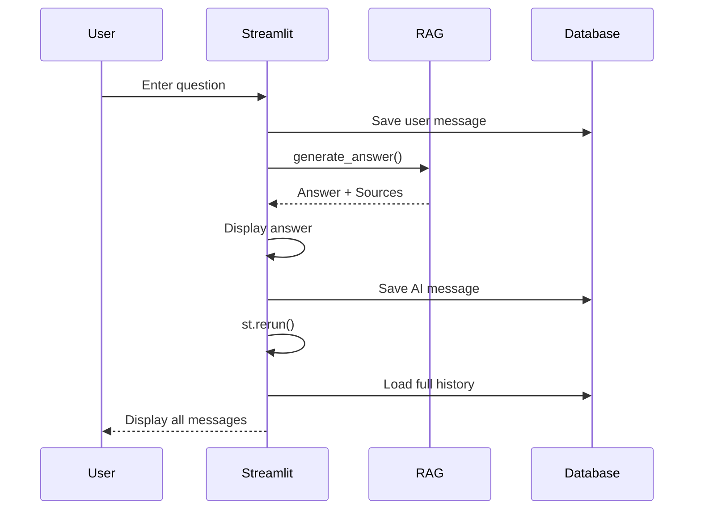

# 🖥️ Streamlit UI - Giao Diện Người Dùng

## Mục tiêu học tập
Sau khi đọc tài liệu này, bạn sẽ hiểu:
- Streamlit là gì và tại sao chọn Streamlit
- Cấu trúc UI của ứng dụng
- Session management và chat interface

---

## 1. Streamlit là gì?

### 1.1 Định nghĩa
**Streamlit** là Python framework để xây dựng web app một cách nhanh chóng, đặc biệt phù hợp cho data science và AI applications.

### 1.2 Tại sao chọn Streamlit?

| Đặc điểm | Lợi ích |
|----------|---------|
| **Pure Python** | Không cần JavaScript, HTML, CSS |
| **Hot reload** | Thay đổi code → UI update ngay |
| **Built-in chat** | `st.chat_input`, `st.chat_message` |
| **Session state** | Quản lý state dễ dàng |
| **Widgets** | Buttons, sliders, file upload... |

### 1.3 So sánh với alternatives

| Framework | Learning Curve | Speed | Customization |
|-----------|----------------|-------|---------------|
| **Streamlit** | ⭐ Easy | ⭐⭐⭐ Fast | ⭐⭐ Medium |
| Gradio | ⭐ Easy | ⭐⭐⭐ Fast | ⭐ Limited |
| Flask + HTML | ⭐⭐⭐ Hard | ⭐⭐ Medium | ⭐⭐⭐ High |
| Next.js | ⭐⭐⭐ Hard | ⭐⭐ Medium | ⭐⭐⭐ High |

---

## 2. App Structure

### 2.1 File: `app.py`

```
app.py
├── Imports & Config
├── Database Initialization
├── Helper Functions
│   ├── get_retriever()
│   ├── get_rag_chain()
│   ├── display_sources()
│   └── format_chat_history()
├── Session Management
├── Sidebar
│   ├── New Chat Button
│   ├── Recent Sessions List
│   ├── Data Management
│   └── Search Mode Selector
└── Main Chat Area
    ├── History Display
    └── Input Handler
```

### 2.2 Layout Visualization

```
┌─────────────────────────────────────────────────────────────┐
│  🤖 Trợ lý AI Tra cứu Pháp Luật                            │
├──────────────────┬──────────────────────────────────────────┤
│                  │                                          │
│  SIDEBAR         │           MAIN CHAT AREA                 │
│                  │                                          │
│  ➕ Cuộc hội     │  👤 User: Thai sản nghỉ mấy tháng?      │
│  thoại mới       │                                          │
│                  │  🤖 AI: Theo Điều 139...                │
│  ─────────       │         📚 Nguồn tham khảo              │
│  Gần đây         │                                          │
│  💬 Session 1    │  ─────────────────────────────────────── │
│  💬 Session 2    │                                          │
│                  │  💬 Nhập câu hỏi của bạn...             │
│  ⚙️ Quản lý     │                                          │
│  ⚡ Chế độ TK    │                                          │
│                  │                                          │
└──────────────────┴──────────────────────────────────────────┘
```

---

## 3. Page Configuration

```python
# app.py

import streamlit as st

st.set_page_config(
    page_title="Trợ lý Luật Lao Động AI",
    layout="wide"
)

st.title("🤖 Trợ lý AI Tra cứu Pháp Luật")
```

---

## 4. Caching với @st.cache_resource

### 4.1 Problem: Cold Start

```
First load: 17 seconds (load embedding model)
Every reload: 17 seconds again 😢
```

### 4.2 Solution: Cache Resource

```python
@st.cache_resource(show_spinner="Đang khởi động Model & Index...")
def get_retriever():
    """Load and cache the Retriever (Embedding Model + FAISS Index)."""
    try:
        return SemanticRetriever()
    except RuntimeError:
        return None

@st.cache_resource(show_spinner="Đang kết nối AI...")
def get_rag_chain():
    """Initialize and cache the RAG Chain logic (Stateless)."""
    retriever = get_retriever()
    if retriever:
        return RAGChain(retriever)
    return None
```

### 4.3 Result

```
First load: 17 seconds
Subsequent loads: < 1 second ✅
```

---

## 5. Session State Management

### 5.1 Initialize Sessions

```python
# Session ID for chat persistence
if "session_id" not in st.session_state:
    db = get_db_session()
    repo = ChatRepository(db)
    new_session = repo.create_session(title="Cuộc hội thoại mới")
    st.session_state.session_id = new_session.id
    db.close()

# Search mode preference
if "search_mode" not in st.session_state:
    st.session_state.search_mode = "balanced"
```

### 5.2 Session State Variables

| Variable | Type | Purpose |
|----------|------|---------|
| `session_id` | str (UUID) | Current active chat session |
| `search_mode` | str | "quality"/"balanced"/"speed" |

---

## 6. Sidebar Components

### 6.1 New Chat Button

```python
with st.sidebar:
    st.header("🗂️ Quản lý Hội thoại")

    if st.button("➕ Cuộc hội thoại mới", use_container_width=True):
        new_session = repo.create_session(title="Cuộc hội thoại mới")
        st.session_state.session_id = new_session.id
        st.rerun()
```

### 6.2 Recent Sessions List

```python
recent_sessions = repo.get_recent_sessions(limit=10)
for s in recent_sessions:
    col_nav, col_del = st.columns([0.8, 0.2])

    with col_nav:
        button_type = "primary" if s.id == st.session_state.session_id else "secondary"
        label = s.title if s.title else "Không tiêu đề"
        if st.button(f"💬 {label}", key=f"nav_{s.id}", type=button_type):
            st.session_state.session_id = s.id
            st.rerun()

    with col_del:
        if st.button("✕", key=f"del_{s.id}", help="Xóa hội thoại này"):
            handle_delete_session(repo, s.id)
```

### 6.3 Data Management

```python
with st.expander("⚙️ Quản lý Dữ liệu"):
    st.info(f"Nguồn: `{AppConfig.RAW_DATA_PATH}`")
    
    if st.button("🔄 Cập nhật Index"):
        VectorIndexer.sync_index()
        st.cache_resource.clear()
        st.rerun()

    if st.button("🔥 Xóa toàn bộ dữ liệu chat"):
        handle_delete_all_sessions(repo)
```

### 6.4 Search Mode Selector (IVF)

```python
if retriever and mode_info.get("is_ivf"):
    with st.expander("⚡ Chế độ tìm kiếm"):
        search_mode = st.radio(
            "Chọn chế độ:",
            options=["balanced", "quality", "speed"],
            format_func=lambda x: {
                "quality": "🎯 Chính xác cao",
                "balanced": "⚖️ Cân bằng (Khuyến nghị)",
                "speed": "🚀 Tốc độ cao"
            }[x]
        )
        
        if search_mode != st.session_state.search_mode:
            st.session_state.search_mode = search_mode
            retriever.set_search_mode(search_mode)
            st.rerun()
```

---

## 7. Chat Interface

### 7.1 Display History

```python
# Get messages from database
messages = repo.get_messages(current_session_id)

# Display each message
for msg in messages:
    with st.chat_message(msg.role):  # "user" or "assistant"
        st.markdown(msg.content)
        
        if msg.role == "assistant":
            # Show context understanding
            if msg.standalone_query:
                with st.expander("🧠 Tư duy ngữ cảnh"):
                    st.info(f"AI đã hiểu: **{msg.standalone_query}**")
            
            # Show sources
            if msg.sources:
                display_sources(msg.sources)
```

### 7.2 Chat Input

```python
if prompt := st.chat_input("Nhập câu hỏi của bạn..."):
    # 1. Display user message
    with st.chat_message("user"):
        st.markdown(prompt)

    # 2. Save to DB
    repo.add_message(current_session_id, "user", prompt)

    # 3. Generate answer
    with st.chat_message("assistant"):
        with st.spinner("Đang tra cứu và phân tích..."):
            history_str = format_chat_history(messages)
            response = rag_chain.generate_answer(prompt, chat_history_str=history_str)
            
        st.markdown(response["answer"])
        display_sources(response["source_documents"])

    # 4. Save AI response to DB
    repo.add_message(current_session_id, "assistant", 
                     response["answer"], sources=json_sources)

    # 5. Rerun to refresh
    st.rerun()
```

---

## 8. Display Sources Helper

```python
def display_sources(sources):
    """Helper to display source documents in an expander."""
    if sources:
        with st.expander("📚 Nguồn tham khảo"):
            for doc in sources:
                # Handle both dict (DB) and Document (RAG)
                if isinstance(doc, dict):
                    source = doc.get("source", "Unknown")
                    page = doc.get("page", "N/A")
                    content = doc.get("page_content", "")
                else:
                    source = doc.metadata.get("source", "Unknown")
                    page = doc.metadata.get("page", "N/A")
                    content = doc.page_content

                # Convert 0-based to 1-based page
                page_display = int(page) + 1 if page != "N/A" else page
                
                st.caption(f"📄 **{source}** (Trang {page_display})")
                st.text(content[:300] + "...")
```

---

## 9. Database Connection Pattern

### 9.1 Safe Connection Handling

```python
db = get_db_session()
try:
    repo = ChatRepository(db)
    
    # ... all UI logic using repo ...
    
finally:
    db.close()  # Always close connection
```

### 9.2 Problem Solved

| Without try/finally | With try/finally |
|---------------------|------------------|
| Connection leak on error | Always closed |
| Memory grows over time | Stable memory |
| DB locks | No locks |

---

## 10. st.rerun() Pattern

### 10.1 When to use

```python
# After state changes that affect UI
if st.button("➕ Cuộc hội thoại mới"):
    new_session = repo.create_session()
    st.session_state.session_id = new_session.id
    st.rerun()  # Refresh UI with new session
```

### 10.2 Chat Flow

```
User Input → Process → Save to DB → st.rerun() → Display from DB
                                         ↑
                              Ensures single source of truth
```

---

## 11. Key UI Flow



---

## 12. Key Takeaways

> [!IMPORTANT]
> **Điểm nhấn khi thuyết trình:**
> 1. **Streamlit = Python-only web UI** - No JS/HTML needed
> 2. **@st.cache_resource**: Cache heavy objects (model, index)
> 3. **st.session_state**: Persist state across reruns
> 4. **st.rerun()**: Refresh UI after state changes

---

## Tài liệu liên quan
- [Database Persistence](./02_database_persistence.md)
- [Performance Optimization](./03_performance_optimization.md)
