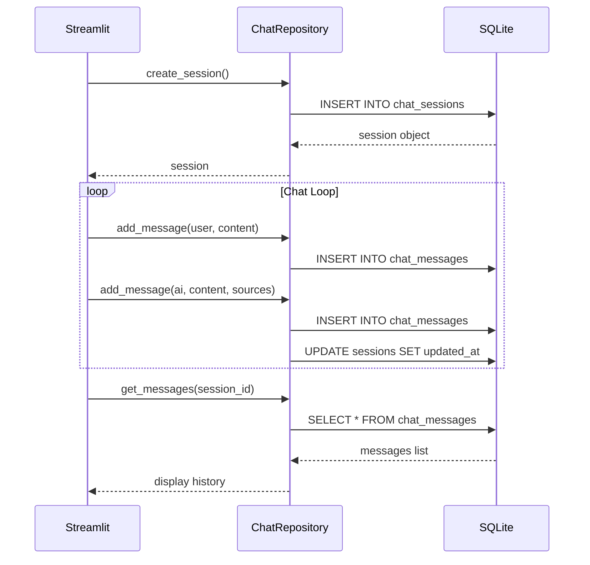

# 💾 Database Persistence - Lưu Trữ Dữ Liệu

## Mục tiêu học tập
Sau khi đọc tài liệu này, bạn sẽ hiểu:
- Tại sao cần database persistence
- Schema design với SQLAlchemy
- Repository pattern cho CRUD operations

---

## 1. Vấn đề: Stateless Chat

### 1.1 Before Database

```
User opens app → Chat with AI → Close browser → All history LOST 😢
```

### 1.2 After Database

```
User opens app → Chat with AI → Close browser
                      ↓
            Saved to SQLite
                      ↓
User reopens app → See all previous conversations ✅
```

---

## 2. Tech Stack

### 2.1 Components

| Component | Technology | Purpose |
|-----------|------------|---------|
| **ORM** | SQLAlchemy 2.0 | Object-Relational Mapping |
| **Database** | SQLite | File-based SQL database |
| **Pattern** | Repository | Abstraction over DB operations |

### 2.2 Tại sao SQLite?

| Benefit | Description |
|---------|-------------|
| **Zero config** | Không cần install DB server |
| **File-based** | Một file `chat_history.db` |
| **Portable** | Copy file = copy database |
| **Sufficient** | Đủ cho MVP scale |

---

## 3. Database Schema

### 3.1 Entity Relationship Diagram

```
┌─────────────────────────┐       ┌─────────────────────────┐
│      ChatSession        │       │      ChatMessage        │
├─────────────────────────┤       ├─────────────────────────┤
│ id: VARCHAR(36) [PK]    │───────│ id: VARCHAR(36) [PK]    │
│ title: VARCHAR(255)     │   1:N │ session_id: VARCHAR [FK]│
│ created_at: DATETIME    │       │ role: VARCHAR(20)       │
│ updated_at: DATETIME    │       │ content: TEXT           │
│ metadata: JSON          │       │ sources: JSON           │
└─────────────────────────┘       │ standalone_query: VARCHAR│
                                  │ created_at: DATETIME    │
                                  └─────────────────────────┘
```

### 3.2 SQLAlchemy Models

```python
# src/database/models.py

from sqlalchemy.orm import DeclarativeBase, Mapped, mapped_column, relationship

class Base(DeclarativeBase):
    pass

class ChatSession(Base):
    __tablename__ = "chat_sessions"
    
    id: Mapped[str] = mapped_column(String(36), primary_key=True, 
                                     default=lambda: str(uuid.uuid4()))
    title: Mapped[Optional[str]] = mapped_column(String(255), nullable=True)
    created_at: Mapped[datetime] = mapped_column(DateTime, 
                                                  default=datetime.utcnow)
    updated_at: Mapped[datetime] = mapped_column(DateTime, 
                                                  default=datetime.utcnow,
                                                  onupdate=datetime.utcnow)
    metadata_: Mapped[dict] = mapped_column("metadata", JSON, default={})

    # Relationship: One session has many messages
    messages: Mapped[List["ChatMessage"]] = relationship(
        back_populates="session", 
        cascade="all, delete-orphan"  # Delete messages when session deleted
    )


class ChatMessage(Base):
    __tablename__ = "chat_messages"

    id: Mapped[str] = mapped_column(String(36), primary_key=True,
                                     default=lambda: str(uuid.uuid4()))
    session_id: Mapped[str] = mapped_column(ForeignKey("chat_sessions.id"))
    role: Mapped[str] = mapped_column(String(20))  # "user" or "assistant"
    content: Mapped[str] = mapped_column(Text)
    sources: Mapped[list] = mapped_column(JSON, default=[])  # Citation data
    standalone_query: Mapped[Optional[str]] = mapped_column(String(500), nullable=True)
    created_at: Mapped[datetime] = mapped_column(DateTime, default=datetime.utcnow)

    # Back-reference to session
    session: Mapped["ChatSession"] = relationship(back_populates="messages")
```

---

## 4. Database Engine

### 4.1 Connection Setup

```python
# src/database/engine.py

from sqlalchemy import create_engine
from sqlalchemy.orm import sessionmaker
from src.config import AppConfig
from src.database.models import Base

DATABASE_URL = f"sqlite:///{AppConfig.SQL_DB_PATH}"

engine = create_engine(DATABASE_URL, connect_args={"check_same_thread": False})

# Session factory
SessionLocal = sessionmaker(autocommit=False, autoflush=False, bind=engine)

def init_db():
    """Create all tables if they don't exist."""
    Base.metadata.create_all(bind=engine)
```

### 4.2 SQLite Settings

```python
connect_args={"check_same_thread": False}
# Required for SQLite + multi-threaded access (Streamlit)
```

---

## 5. Repository Pattern

### 5.1 Tại sao Repository?

| Without Repository | With Repository |
|--------------------|-----------------|
| SQL scattered in UI code | Centralized DB logic |
| Hard to test | Easy to mock |
| Tight coupling | Loose coupling |

### 5.2 ChatRepository Class

```python
# src/database/repository.py

class ChatRepository:
    def __init__(self, db: Session):
        self.db = db

    # === SESSION OPERATIONS ===
    
    def create_session(self, title: str = "New Chat") -> ChatSession:
        session = ChatSession(title=title, metadata_={})
        self.db.add(session)
        self.db.commit()
        self.db.refresh(session)
        return session

    def get_session(self, session_id: str) -> Optional[ChatSession]:
        return self.db.query(ChatSession).filter(
            ChatSession.id == session_id
        ).first()

    def get_recent_sessions(self, limit: int = 10) -> List[ChatSession]:
        return (
            self.db.query(ChatSession)
            .order_by(desc(ChatSession.updated_at))
            .limit(limit)
            .all()
        )

    def update_session_title(self, session_id: str, title: str):
        session = self.get_session(session_id)
        if session:
            session.title = title
            self.db.commit()

    def delete_session(self, session_id: str):
        session = self.get_session(session_id)
        if session:
            self.db.delete(session)  # Cascade deletes messages
            self.db.commit()

    def delete_all_sessions(self) -> int:
        num_deleted = self.db.query(ChatSession).delete()
        self.db.commit()
        return num_deleted

    # === MESSAGE OPERATIONS ===

    def add_message(self, session_id: str, role: str, content: str,
                    sources: List[Dict] = None, standalone_query: str = None):
        msg = ChatMessage(
            session_id=session_id,
            role=role,
            content=content,
            sources=sources or [],
            standalone_query=standalone_query
        )
        self.db.add(msg)
        
        # Update session timestamp
        session = self.get_session(session_id)
        if session:
            session.updated_at = datetime.utcnow()
            
        self.db.commit()
        return msg

    def get_messages(self, session_id: str) -> List[ChatMessage]:
        return (
            self.db.query(ChatMessage)
            .filter(ChatMessage.session_id == session_id)
            .order_by(ChatMessage.created_at.asc())
            .all()
        )
```

---

## 6. Usage in App

### 6.1 Get DB Session

```python
# app.py

def get_db_session():
    return SessionLocal()

# Usage with proper cleanup
db = get_db_session()
try:
    repo = ChatRepository(db)
    # ... use repo ...
finally:
    db.close()
```

### 6.2 Create New Chat

```python
if st.button("➕ Cuộc hội thoại mới"):
    new_session = repo.create_session(title="Cuộc hội thoại mới")
    st.session_state.session_id = new_session.id
    st.rerun()
```

### 6.3 Save Messages

```python
# Save user message
repo.add_message(current_session_id, "user", prompt)

# After RAG processing, save AI response
repo.add_message(
    current_session_id, 
    "assistant", 
    answer,
    sources=json_sources,  # [{source, page, content}, ...]
    standalone_query=standalone
)
```

### 6.4 Load History

```python
messages = repo.get_messages(current_session_id)
for msg in messages:
    with st.chat_message(msg.role):
        st.markdown(msg.content)
```

---

## 7. JSON Columns

### 7.1 Sources Storage

```python
# Sources are stored as JSON array
sources: Mapped[list] = mapped_column(JSON, default=[])

# Example data:
[
    {
        "source": "luat_lao_dong.pdf",
        "page": 45,
        "page_content": "Điều 139. Nghỉ thai sản..."
    },
    {
        "source": "nghi_dinh_145.pdf",
        "page": 12,
        "page_content": "Điều 15. Chế độ khi vợ sinh..."
    }
]
```

### 7.2 Metadata Storage

```python
metadata_: Mapped[dict] = mapped_column("metadata", JSON, default={})

# Can store arbitrary data:
{
    "user_id": "...",
    "tags": ["labor_law", "maternity"],
    "custom_data": {...}
}
```

---

## 8. Cascade Delete

### 8.1 Configuration

```python
messages: Mapped[List["ChatMessage"]] = relationship(
    back_populates="session", 
    cascade="all, delete-orphan"
)
```

### 8.2 Effect

```python
repo.delete_session(session_id)
# Automatically deletes all messages in that session
# No orphan messages left behind
```

---

## 9. Auto-Update Timestamp

### 9.1 Configuration

```python
updated_at: Mapped[datetime] = mapped_column(
    DateTime, 
    default=datetime.utcnow,
    onupdate=datetime.utcnow  # Auto-update on any change
)
```

### 9.2 Manual Update (for Message Addition)

```python
def add_message(self, ...):
    msg = ChatMessage(...)
    self.db.add(msg)
    
    # Manually update session timestamp
    session = self.get_session(session_id)
    if session:
        session.updated_at = datetime.utcnow()
    
    self.db.commit()
```

---

## 10. Database File Location

```python
# src/config.py
SQL_DB_PATH = os.path.join(PROJECT_ROOT, "data", "chat_history.db")

# Result:
# d:\heheboi\Project\chat-bot-law\data\chat_history.db
```

### 10.1 File Structure

```
data/
├── raw/              # Source documents
├── vector_store/     # FAISS index
└── chat_history.db   # SQLite database (this file)
```

---

## 11. Flow Diagram



---

## 12. Key Takeaways

> [!IMPORTANT]
> **Điểm nhấn khi thuyết trình:**
> 1. **SQLite + SQLAlchemy**: Simple, file-based, zero config
> 2. **Repository Pattern**: Centralized DB operations
> 3. **JSON Columns**: Flexible storage for sources/metadata
> 4. **Cascade Delete**: No orphan records

---

## Tài liệu liên quan
- [Streamlit UI](./01_streamlit_ui.md)
- [Performance Optimization](./03_performance_optimization.md)
