```mermaid
flowchart LR
    A["🔍 Query Vector"]
    B["✅ Search Results"]
```

# Mandatory Rules for Slidev Presentation

## 1. Component Usage

All slides **MUST** use the following standardized components found in `presentation/components/`. Do NOT write raw HTML/Markdown layouts manually.

| Content Type        | Component                |
| :------------------ | :----------------------- |
| **Opening / Title** | `<LayoutTitle>`          |
| **Section Header**  | `<LayoutSection>`        |
| **Standard Text**   | `<LayoutTitleContent>`   |
| **Two Columns**     | `<LayoutTwoCol>`         |
| **Comparison**      | `<LayoutComparison>`     |
| **Image & Caption** | `<LayoutPictureCaption>` |
| **Diagrams**        | `<LayoutDiagram>`        |
| **Big Numbers**     | `<LayoutFact>`           |

## 2. Diagram Layout

Do NOT manually wrap diagrams in divs. You **MUST** use the `<LayoutDiagram>` component, which handles scaling and centering automatically.

**Correct:**

````html
<LayoutDiagram title="System Architecture">
```mermaid
graph TD A --> B 
```
</LayoutDiagram>
````

**Incorrect:**

````markdown
# System Architecture

<!-- DO NOT use inline init directives, they break the global ELK config -->


````

## 3. Configuration

Do **NOT** use `%%{init: ...}%%` or per-diagram frontmatter configuration. The global config in `setup/main.ts` handles ELK layout registration. Adding local overrides will break the layout loader.

## 4. Text Formatting

For highlighted technical terms, file extensions (e.g., `.pdf`, `.docx`), or emphasized code-like text, you **MUST** use the `<FileBadge>` component instead of standard markdown backticks (`` `text` ``).

**Correct:**
```html
<FileBadge>.pdf</FileBadge>
<FileBadge>config.json</FileBadge>
```

```markdown
`.pdf`
`config.json`
```

## 5. Title Language

All slide titles, component titles, and diagram titles **MUST** be written in **English only**. Body content can be in Vietnamese.

**Correct:**
```html
<LayoutDiagram title="System Architecture">
<LayoutTwoCol title="Performance Comparison">
```

**Incorrect:**
```html
<LayoutDiagram title="Kiến trúc Hệ thống">
<LayoutTwoCol title="So sánh Hiệu năng">
```

## 6. No Icons or Emojis

Do **NOT** use icons, emojis, or Unicode symbols (🔍, ✅, 📊, etc.) in:
- Mermaid diagram node labels
- Slide titles
- Component props
- Table headers

Use plain text only for maximum compatibility and professional appearance.

**Correct:**


**Incorrect:**

