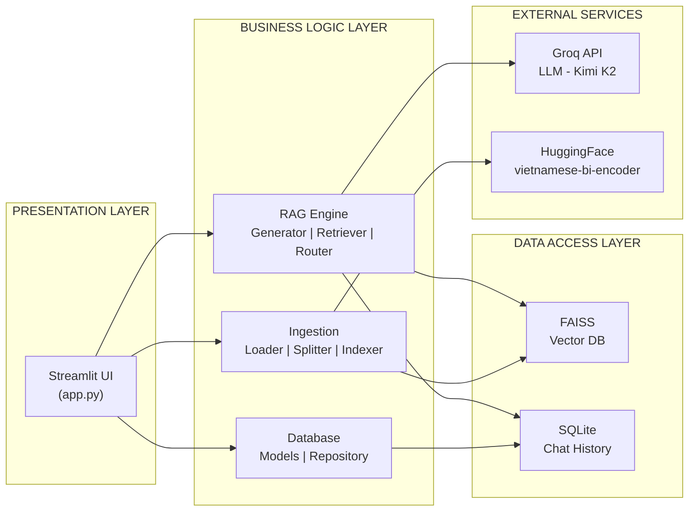
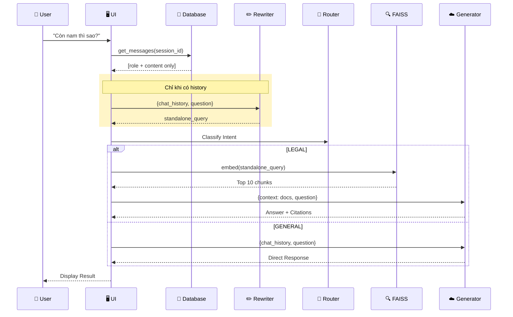

---
---

<LayoutSection title="AI Legal Assistant">

**Trợ lý Pháp luật Thông minh**

*Luật Lao Động Việt Nam*

<div class="my-8 border-t border-slate-300 opacity-50 w-24"></div>

👤 Giang: Giới thiệu & Kiến trúc

</LayoutSection>

---

<LayoutTitleContent title="Problem Statement">

| Pain Point | Mô tả |
|------------|-------|
| 🔍 **Tìm kiếm thủ công** | Phải đọc hàng trăm trang văn bản luật để tìm điều khoản liên quan |
| 🤔 **Thiếu ngữ cảnh** | Keyword search không hiểu ý nghĩa câu hỏi |
| ❌ **Không có trích dẫn** | Khó xác minh nguồn thông tin được cung cấp |
| 📚 **Ngôn ngữ pháp lý** | Thuật ngữ chuyên môn khó hiểu với người thường |

</LayoutTitleContent>

---

<LayoutComparison title="Solution: RAG" leftTitle="Without RAG" rightTitle="With RAG">

<template #left>


```
Câu hỏi → LLM → Trả lời
```

- Kiến thức giới hạn
- Có thể sai/hallucination
- Không có nguồn verify

</template>

<template #right>


```
Câu hỏi → Tìm kiếm (FAISS) → Context
→ LLM → Trả lời + Trích dẫn
```

- Nguồn verify được
- Luôn cập nhật
- Không hallucination

</template>

</LayoutComparison>

---

<LayoutTitleContent title="Key System Features">

| Tính năng | Mô tả |
|-----------|-------|
| 🧠 **Semantic Search** | Hiểu ý nghĩa câu hỏi, không chỉ keyword |
| 📚 **Citation** | Trích dẫn nguồn: file, trang cụ thể |
| 💬 **Conversational** | Nhớ ngữ cảnh hội thoại, hỏi follow-up |
| 🔄 **Easy Update** | Thêm luật mới chỉ cần copy PDF vào folder |
| 🚀 **Fast Response** | Trả lời trong 1-2 giây |

**Ví dụ:** Hiểu được "nghỉ đẻ" và "thai sản" là cùng một khái niệm

</LayoutTitleContent>

---

<LayoutDiagram title="System Architecture">



</LayoutDiagram>

---

<LayoutDiagram title="Complete Query Processing Flow">



</LayoutDiagram>

---

<LayoutTwoCol title="RAG Engine Components">

<template #left>


| Component | Chức năng |
|-----------|-----------|
| **Generator** | Điều phối toàn bộ flow RAG |
| **Retriever** | Tìm kiếm semantic trong FAISS |
| **Router** | Phân loại intent LEGAL/GENERAL |
| **Prompts** | Template prompt cho LLM |
| **LLM Factory** | Tạo LLM instance |

</template>

<template #right>

### Files

```
src/rag_engine/
├── generator.py    # Main orchestrator
├── retriever.py    # Vector search
├── router.py       # Intent classification
├── prompts.py      # Prompt templates
└── llm_factory.py  # LLM provider abstraction
```

</template>

</LayoutTwoCol>

---

<LayoutTitleContent title="Tech Stack">

| LAYER | CÔNG NGHỆ | MỤC ĐÍCH |
|-------|-----------|----------|
| **Frontend** | Streamlit | Web UI với Python thuần |
| **AI Framework** | LangChain | Orchestration cho LLM và RAG |
| **Vector DB** | FAISS | Similarity search hiệu quả |
| **Embedding** | vietnamese-bi-encoder | Optimized cho tiếng Việt (768D) |
| **LLM** | Groq (Kimi K2) | Fast inference, free tier |
| **Database** | SQLite + SQLAlchemy | Lưu lịch sử chat |
| **Config** | python-dotenv | Environment variables |

</LayoutTitleContent>


