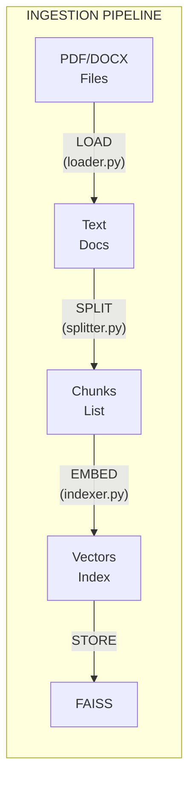
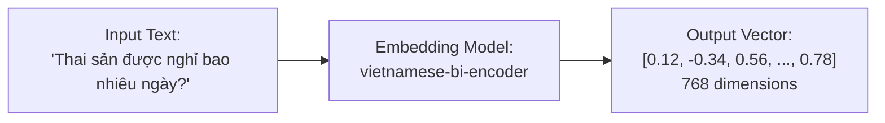
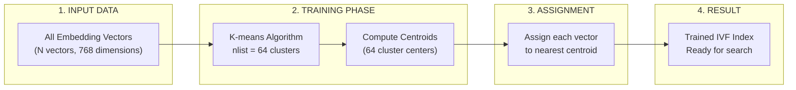
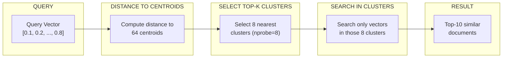
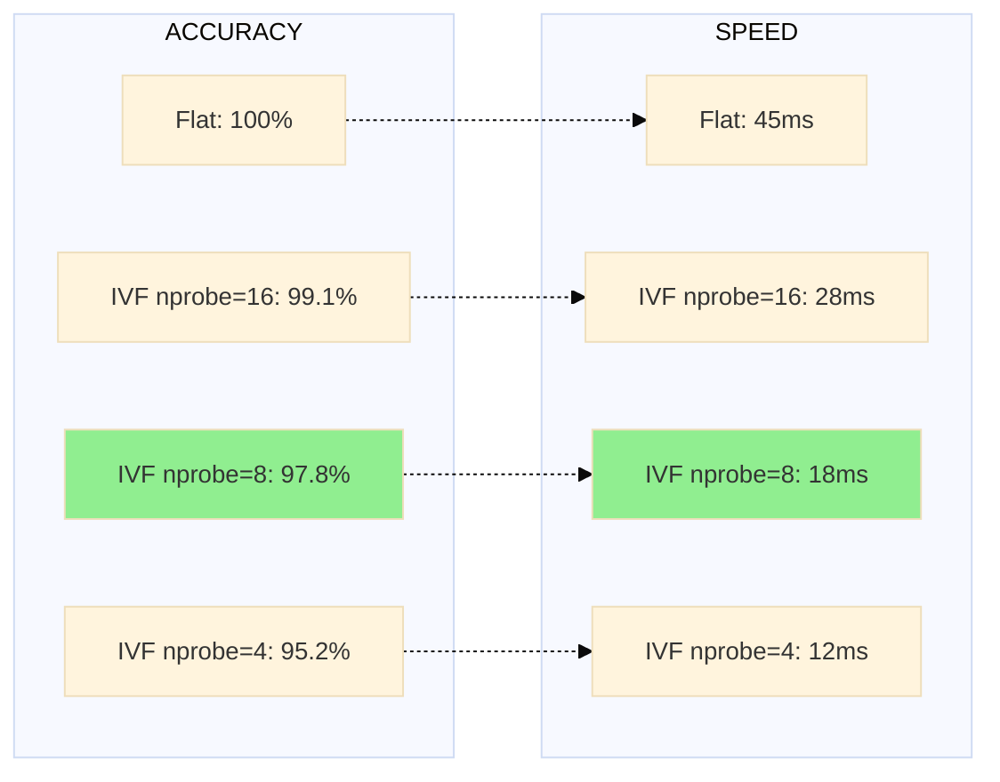

---
---

<LayoutSection title="Data Ingestion & Vector Database">

**Từ PDF → Searchable Knowledge Base**

👤 Member 2

</LayoutSection>

---

<LayoutDiagram title="4-Step Ingestion Pipeline">



</LayoutDiagram>

---

<LayoutTwoCol title="Document Loader">

<template #left>

### Supported Formats

| Format | Loader | Library |
|--------|--------|---------|
| <FileBadge>.pdf</FileBadge> | PyPDFLoader | pypdf |
| <FileBadge>.docx</FileBadge> | Docx2txtLoader | docx2txt |

```python
# src/ingestion/loader.py
SUPPORTED_EXTENSIONS = {
    ".pdf": PyPDFLoader,
    ".docx": Docx2txtLoader,
}
```

</template>

<template #right>

### Output Document

```python
Document(
    page_content="Điều 139. Nghỉ thai sản...",
    metadata={
        "source": "luat_lao_dong.pdf",
        "page": 45
    }
)
```

**Metadata quan trọng** → Cho phép **trích dẫn nguồn chính xác**

</template>

</LayoutTwoCol>

---

<LayoutTitleContent title="Why Chunking?">

| Vấn đề | Giải thích |
|--------|------------|
| **LLM Context Limit** | LLM chỉ xử lý được ~32K tokens |
| **Search Precision** | Chunks nhỏ → Tìm kiếm chính xác hơn |
| **Noise Reduction** | Chỉ lấy phần liên quan |

```
Document gốc (5000 chars):
┌────────────────────────────────────────────┐
│ Điều 139... Điều 140... Điều 141...        │
└────────────────────────────────────────────┘

Sau khi Split (5 chunks):
┌──────┐  ┌──────┐  ┌──────┐  ┌──────┐  ┌──────┐
│~1000 │  │~1000 │  │~1000 │  │~1000 │  │~1000 │
└──────┘  └──────┘  └──────┘  └──────┘  └──────┘
      ↘──overlap 200──↙
```

</LayoutTitleContent>

---

<LayoutTitleContent title="RecursiveCharacterTextSplitter">

```python
# src/ingestion/splitter.py
splitter = RecursiveCharacterTextSplitter(
    chunk_size=1000,      # Tối đa 1000 ký tự
    chunk_overlap=200,    # Overlap 200 ký tự
    separators=["\n\n", "\n", " ", ""]
)
```

### Separators Priority

| Priority | Separator | Meaning |
|----------|-----------|---------|
| 1 | <FileBadge>\n\n</FileBadge> | Paragraph break (ưu tiên cao nhất) |
| 2 | <FileBadge>\n</FileBadge> | Line break |
| 3 | <FileBadge> </FileBadge> | Space |
| 4 | <FileBadge>""</FileBadge> | Character (fallback) |

**Nguyên tắc:** Cố gắng cắt ở vị trí tự nhiên nhất

</LayoutTitleContent>

---

<LayoutDiagram title="What is Embedding?">



</LayoutDiagram>

---

<LayoutTwoCol title="vietnamese-bi-encoder">

<template #left>

### Model Info

| Thuộc tính | Giá trị |
|------------|---------|
| **Model** | <FileBadge>bkai-foundation-models/vietnamese-bi-encoder</FileBadge> |
| **Type** | Bi-Encoder |
| **Dimensions** | 768 |
| **Language** | Vietnamese optimized |

</template>

<template #right>

### Code

```python
# src/ingestion/indexer.py
embeddings = HuggingFaceEmbeddings(
    model_name="bkai-foundation-models/vietnamese-bi-encoder",
    model_kwargs={'device': 'cpu'},
    encode_kwargs={'normalize_embeddings': True}
)
```

**Bi-Encoder**: Encode documents 1 lần → Search nhanh

</template>

</LayoutTwoCol>

---

<LayoutTitleContent title="FAISS Vector Search">

| Thuộc tính | Giá trị |
|------------|---------|
| **Full name** | Facebook AI Similarity Search |
| **Purpose** | Tìm kiếm vector nhanh và hiệu quả |
| **Developer** | Meta AI Research |

```
Query: "nghỉ thai sản mấy tháng?"
   │
   ▼ Embed
[0.1, 0.2, ..., 0.8]  ← Query vector
   │
   ▼ FAISS Search (Top-10 vectors gần nhất)
   │
   ▼
[Document về Điều 139], [Document về thai sản], ...
```

</LayoutTitleContent>

---

<LayoutComparison title="FAISS Index Types" leftTitle="Flat Index" rightTitle="IVF Index">

<template #left>

**Exact Search**

```
●●●●●●●●
●●●●●●●●
(search ALL vectors)
```

- ✅ **100% accuracy**
- ❌ Slower with large data
- Brute-force comparison
- O(N) complexity

</template>

<template #right>

**Approximate Search**

```
┌──●●●┐ Cluster 1
└─────┘
┌──●●●┐ Cluster 2
└─────┘
(search some clusters)
```

- ✅ **~97% accuracy**
- ✅ **5-10x faster**
- K-means clustering
- O(log N) complexity

</template>

</LayoutComparison>

---

<LayoutDiagram title="IVF Training Process: K-means Clustering">



</LayoutDiagram>

---

<LayoutTwoCol title="IVF Training Details">

<template #left>

### Training Algorithm

**K-means Steps:**

1. **Initialize** 64 random centroids
2. **Assign** mỗi vector → nearest centroid
3. **Update** centroids = mean của assigned vectors
4. **Repeat** steps 2-3 cho đến khi converge

**Training Cost:**
- Chỉ chạy 1 lần khi build index
- ~10-30 iterations để converge
- Time: O(N × K × D × iterations)

</template>

<template #right>

### Configuration

```python
# src/config.py
IVF_NLIST = 64   # Số clusters
IVF_NPROBE = 8   # Số clusters search

# Training code (indexer.py)
factory = f"IVF{nlist},Flat"
index = faiss.index_factory(dim, factory)
index.train(embeddings)  # K-means here
index.add(embeddings)
```

**Điều chỉnh nlist:**
- Nhỏ → Faster training, slower search
- Lớn → Slower training, faster search
- Rule of thumb: <FileBadge>nlist ≈ √N</FileBadge>

</template>

</LayoutTwoCol>

---

<LayoutDiagram title="IVF Search Process (nprobe=8)">



</LayoutDiagram>

---

<LayoutTitleContent title="IVF Performance Benchmark">

### Test Setup

| Metric | Value |
|--------|-------|
| **Dataset** | Vietnamese Labor Law |
| **Total Vectors** | ~1,500 chunks |
| **Embedding Model** | vietnamese-bi-encoder (768D) |
| **Hardware** | CPU (Intel i7) |
| **Query Set** | 100 legal questions |

### Results: Flat vs IVF

| Index Type | Config | Avg Search Time | Recall@10 | Memory |
|------------|--------|-----------------|-----------|---------|
| **Flat** | - | 45ms | 100% | 4.5MB |
| **IVF64** | nprobe=4 | 12ms | 95.2% | 4.8MB |
| **IVF64** | nprobe=8 | 18ms | 97.8% | 4.8MB |
| **IVF64** | nprobe=16 | 28ms | 99.1% | 4.8MB |

**Key Findings:**
- **IVF64 (nprobe=8)**: **2.5x faster** với **~98% accuracy** → Best trade-off
- **Memory overhead**: Minimal (~7% cho 64 centroids)
- **Training time**: ~2s cho 1,500 vectors

</LayoutTitleContent>

---

<LayoutDiagram title="Accuracy vs Speed Trade-off">



</LayoutDiagram>

---

<LayoutTwoCol title="When to Use IVF?">

<template #left>

### ✅ Sử dụng IVF khi:

- Dataset **> 10,000 vectors**
- Cần **low latency** (< 50ms)
- Chấp nhận **~2-3% recall loss**
- Production environment
- Frequent queries

**Dự án này:**
- 1,500 vectors → Có thể dùng Flat
- Nhưng chọn IVF để **demo scalability**

</template>

<template #right>

### ❌ Dùng Flat khi:

- Dataset nhỏ (< 10,000)
- Cần **100% accuracy**
- Không quan tâm latency
- Development/testing
- Không train được (< nlist vectors)

**Trade-off equation:**
```
Speed_gain = N / (nlist × nprobe)
Accuracy_loss ≈ 2-5%
```

</template>

</LayoutTwoCol>

---

<LayoutTitleContent title="Incremental Sync">

```
┌─────────────────────────────────────────────────────┐
│                 INCREMENTAL SYNC                    │
├─────────────────────────────────────────────────────┤
│   New file added?     → Index only the new file    │
│   File modified?      → Re-index that file only    │
│   File deleted?       → Remove from index          │
│   File unchanged?     → Skip (no processing)       │
├─────────────────────────────────────────────────────┤
│   Tracking: MD5 hash của mỗi file trong metadata   │
└─────────────────────────────────────────────────────┘
```

**Lợi ích:** Cập nhật luật mới rất nhanh, không cần re-index toàn bộ

</LayoutTitleContent>

---

<LayoutTitleContent title="Data Ingestion Summary">

| Chủ đề | Điểm chính |
|--------|------------|
| **Pipeline** | Load → Split → Embed → Store |
| **Chunking** | 1000 chars, 200 overlap, recursive splitting |
| **Embedding** | vietnamese-bi-encoder, 768D, tiếng Việt |
| **FAISS** | IVF index, ~97% accuracy, fast search |
| **Sync** | Incremental, chỉ xử lý file thay đổi |

### 
**Tiếp theo:** Member 3 - RAG Engine & LLM Integration

*"Làm sao biến search results thành câu trả lời?"*

</LayoutTitleContent>
