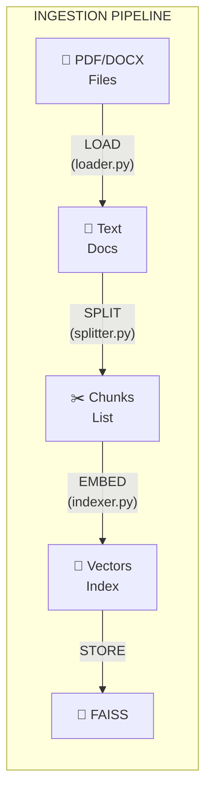
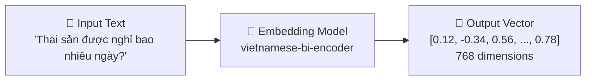

---
---

<LayoutSection title="Data Ingestion & Vector Database">

**Từ PDF → Searchable Knowledge Base**

👤 Member 2

</LayoutSection>

---

<LayoutDiagram title="4-Step Ingestion Pipeline">



</LayoutDiagram>

---

<LayoutTwoCol title="Document Loader">

<template #left>

### Supported Formats

| Format | Loader | Library |
|--------|--------|---------|
| `.pdf` | PyPDFLoader | pypdf |
| `.docx` | Docx2txtLoader | docx2txt |

```python
# src/ingestion/loader.py
SUPPORTED_EXTENSIONS = {
    ".pdf": PyPDFLoader,
    ".docx": Docx2txtLoader,
}
```

</template>

<template #right>

### Output Document

```python
Document(
    page_content="Điều 139. Nghỉ thai sản...",
    metadata={
        "source": "luat_lao_dong.pdf",
        "page": 45
    }
)
```

**Metadata quan trọng** → Cho phép **trích dẫn nguồn chính xác**

</template>

</LayoutTwoCol>

---

<LayoutTitleContent title="Why Chunking?">

| Vấn đề | Giải thích |
|--------|------------|
| **LLM Context Limit** | LLM chỉ xử lý được ~32K tokens |
| **Search Precision** | Chunks nhỏ → Tìm kiếm chính xác hơn |
| **Noise Reduction** | Chỉ lấy phần liên quan |

```
Document gốc (5000 chars):
┌────────────────────────────────────────────┐
│ Điều 139... Điều 140... Điều 141...        │
└────────────────────────────────────────────┘

Sau khi Split (5 chunks):
┌──────┐  ┌──────┐  ┌──────┐  ┌──────┐  ┌──────┐
│~1000 │  │~1000 │  │~1000 │  │~1000 │  │~1000 │
└──────┘  └──────┘  └──────┘  └──────┘  └──────┘
      ↘──overlap 200──↙
```

</LayoutTitleContent>

---

<LayoutTitleContent title="RecursiveCharacterTextSplitter">

```python
# src/ingestion/splitter.py
splitter = RecursiveCharacterTextSplitter(
    chunk_size=1000,      # Tối đa 1000 ký tự
    chunk_overlap=200,    # Overlap 200 ký tự
    separators=["\n\n", "\n", " ", ""]
)
```

### Separators Priority

| Priority | Separator | Meaning |
|----------|-----------|---------|
| 1️⃣ | `\n\n` | Paragraph break (ưu tiên cao nhất) |
| 2️⃣ | `\n` | Line break |
| 3️⃣ | ` ` | Space |
| 4️⃣ | `""` | Character (fallback) |

**Nguyên tắc:** Cố gắng cắt ở vị trí tự nhiên nhất

</LayoutTitleContent>

---

<LayoutDiagram title="What is Embedding?">



</LayoutDiagram>

---

<LayoutTwoCol title="vietnamese-bi-encoder">

<template #left>

### Model Info

| Thuộc tính | Giá trị |
|------------|---------|
| **Model** | `bkai-foundation-models/vietnamese-bi-encoder` |
| **Type** | Bi-Encoder |
| **Dimensions** | 768 |
| **Language** | Vietnamese optimized |

</template>

<template #right>

### Code

```python
# src/ingestion/indexer.py
embeddings = HuggingFaceEmbeddings(
    model_name="bkai-foundation-models/vietnamese-bi-encoder",
    model_kwargs={'device': 'cpu'},
    encode_kwargs={'normalize_embeddings': True}
)
```

**Bi-Encoder**: Encode documents 1 lần → Search nhanh

</template>

</LayoutTwoCol>

---

<LayoutTitleContent title="FAISS Vector Search">

| Thuộc tính | Giá trị |
|------------|---------|
| **Full name** | Facebook AI Similarity Search |
| **Purpose** | Tìm kiếm vector nhanh và hiệu quả |
| **Developer** | Meta AI Research |

```
Query: "nghỉ thai sản mấy tháng?"
   │
   ▼ Embed
[0.1, 0.2, ..., 0.8]  ← Query vector
   │
   ▼ FAISS Search (Top-10 vectors gần nhất)
   │
   ▼
[Document về Điều 139], [Document về thai sản], ...
```

</LayoutTitleContent>

---

<LayoutComparison title="FAISS Index Types" leftTitle="Flat Index" rightTitle="IVF Index">

<template #left>

### Exact Search

```
●●●●●●●●
●●●●●●●●
(search ALL vectors)
```

- ✅ **100% accuracy**
- ❌ Slower with large data
- Brute-force comparison

</template>

<template #right>

### Approximate Search

```
┌──●●●┐ Cluster 1
└─────┘
┌──●●●┐ Cluster 2
└─────┘
(search some clusters)
```

- ✅ **~97% accuracy**
- ✅ **5x faster**
- IVF64 với 8-32 clusters

</template>

</LayoutComparison>

---

<LayoutTitleContent title="Incremental Sync">

```
┌─────────────────────────────────────────────────────┐
│                 INCREMENTAL SYNC                    │
├─────────────────────────────────────────────────────┤
│   New file added?     → Index only the new file    │
│   File modified?      → Re-index that file only    │
│   File deleted?       → Remove from index          │
│   File unchanged?     → Skip (no processing)       │
├─────────────────────────────────────────────────────┤
│   Tracking: MD5 hash của mỗi file trong metadata   │
└─────────────────────────────────────────────────────┘
```

**Lợi ích:** Cập nhật luật mới rất nhanh, không cần re-index toàn bộ

</LayoutTitleContent>

---

<LayoutTitleContent title="Data Ingestion Summary">

| Chủ đề | Điểm chính |
|--------|------------|
| **Pipeline** | Load → Split → Embed → Store |
| **Chunking** | 1000 chars, 200 overlap, recursive splitting |
| **Embedding** | vietnamese-bi-encoder, 768D, tiếng Việt |
| **FAISS** | IVF index, ~97% accuracy, fast search |
| **Sync** | Incremental, chỉ xử lý file thay đổi |

### Chuyển tiếp
**Tiếp theo:** Member 3 - RAG Engine & LLM Integration

*"Làm sao biến search results thành câu trả lời?"*

</LayoutTitleContent>
