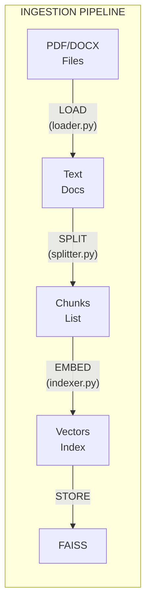
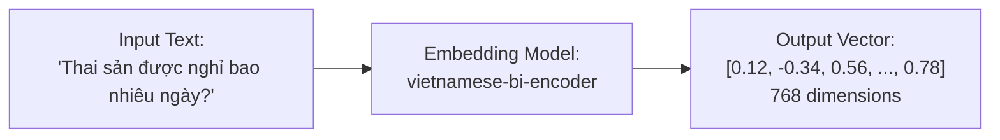
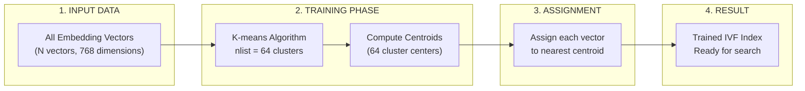
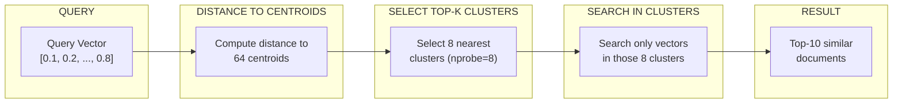
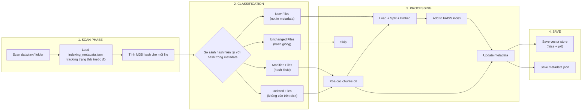

---
---

<LayoutSection title="Data Ingestion & Vector Database">

**Từ PDF → Searchable Knowledge Base**

👤 Hiệp

</LayoutSection>

---

<LayoutDiagram title="4-Step Ingestion Pipeline">



</LayoutDiagram>

---

<LayoutTwoCol title="Document Loader">

<template #left>

### Supported Formats

| Format | Loader | Library |
|--------|--------|---------|
| <FileBadge>.pdf</FileBadge> | PyPDFLoader | pypdf |
| <FileBadge>.docx</FileBadge> | Docx2txtLoader | docx2txt |

```python
# src/ingestion/loader.py
SUPPORTED_EXTENSIONS = {
    ".pdf": PyPDFLoader,
    ".docx": Docx2txtLoader,
}
```

</template>

<template #right>

### Output Document

```python
Document(
    page_content="Điều 139. Nghỉ thai sản...",
    metadata={
        "source": "luat_lao_dong.pdf",
        "page": 45
    }
)
```

**Metadata quan trọng** → Cho phép **trích dẫn nguồn chính xác**

</template>

</LayoutTwoCol>

---

<LayoutTitleContent title="Why Chunking?">

| Vấn đề | Giải thích |
|--------|------------|
| **LLM Context Limit** | LLM chỉ xử lý được ~32K tokens |
| **Search Precision** | Chunks nhỏ → Tìm kiếm chính xác hơn |
| **Noise Reduction** | Chỉ lấy phần liên quan |

```
Document gốc (5000 chars):
┌────────────────────────────────────────────┐
│ Điều 139... Điều 140... Điều 141...        │
└────────────────────────────────────────────┘

Sau khi Split (5 chunks):
┌──────┐  ┌──────┐  ┌──────┐  ┌──────┐  ┌──────┐
│~1000 │  │~1000 │  │~1000 │  │~1000 │  │~1000 │
└──────┘  └──────┘  └──────┘  └──────┘  └──────┘
      ↘──overlap 200──↙
```

</LayoutTitleContent>

---

<LayoutTitleContent title="Text Splitter">

```python
# src/ingestion/splitter.py
splitter = RecursiveCharacterTextSplitter(
    chunk_size=1000,      # Tối đa 1000 ký tự
    chunk_overlap=200,    # Overlap 200 ký tự
    separators=["\n\n", "\n", " ", ""]
)
```

### Separators Priority

| Priority | Separator | Meaning |
|----------|-----------|---------|
| 1 | <FileBadge>\n\n</FileBadge> | Paragraph break (ưu tiên cao nhất) |
| 2 | <FileBadge>\n</FileBadge> | Line break |
| 3 | <FileBadge> </FileBadge> | Space |
| 4 | <FileBadge>""</FileBadge> | Character (fallback) |

**Nguyên tắc:** Cố gắng cắt ở vị trí tự nhiên nhất

</LayoutTitleContent>

---

<LayoutDiagram title="What is Embedding?">



</LayoutDiagram>

---

<LayoutTwoCol title="vietnamese-bi-encoder">

<template #left>

### Model Info

| Thuộc tính | Giá trị |
|------------|---------|
| **Model** | <FileBadge>bkai-foundation-models/vietnamese-bi-encoder</FileBadge> |
| **Type** | Bi-Encoder |
| **Dimensions** | 768 |
| **Language** | Vietnamese optimized |

</template>

<template #right>

### Code

```python
# src/ingestion/indexer.py
embeddings = HuggingFaceEmbeddings(
    model_name="bkai-foundation-models/vietnamese-bi-encoder",
    model_kwargs={'device': 'cpu'},
    encode_kwargs={'normalize_embeddings': True}
)
```

**Bi-Encoder**: Encode documents 1 lần → Search nhanh

</template>

</LayoutTwoCol>

---

<LayoutTitleContent title="FAISS Vector Search">

| Thuộc tính | Giá trị |
|------------|---------|
| **Full name** | Facebook AI Similarity Search |
| **Purpose** | Tìm kiếm vector nhanh và hiệu quả |
| **Developer** | Meta AI Research |

```
Query: "nghỉ thai sản mấy tháng?"
   │
   ▼ Embed
[0.1, 0.2, ..., 0.8]  ← Query vector
   │
   ▼ FAISS Search (Top-10 vectors gần nhất)
   │
   ▼
[Document về Điều 139], [Document về thai sản], ...
```

</LayoutTitleContent>

---

<LayoutComparison title="FAISS Index Types" leftTitle="Flat Index" rightTitle="IVF Index">

<template #left>

**Exact Search**

```
●●●●●●●●
●●●●●●●●
(search ALL vectors)
```

- ✅ **100% accuracy**
- ❌ Slower with large data
- Brute-force comparison

</template>

<template #right>

**Approximate Search**

```
┌──●●●┐ Cluster 1
└─────┘
┌──●●●┐ Cluster 2
└─────┘
(search some clusters)
```

- ✅ **~97% accuracy**
- ✅ **5-10x faster**
- K-means clustering

</template>

</LayoutComparison>

---

<LayoutDiagram title="IVF Training Process: K-means Clustering">



</LayoutDiagram>

---

<LayoutTwoCol title="IVF Training Details">

<template #left>

### Training Algorithm

**K-means Steps:**

1. **Initialize:** Chọn 64 điểm ngẫu nhiên làm centroids ban đầu

2. **Assign:** Gán mỗi vector vào centroid gần nhất
3. **Update:** Tính lại centroid = trung bình của các vectors trong cluster
4. **Repeat:** Lặp lại 2-3 cho đến khi converge (centroids không thay đổi nhiều)

**Training Cost:**
- Chỉ chạy 1 lần khi build index
- ~10-30 iterations để converge
- Time: O(N × K × D × iterations) 
- Trong đó:
    - N: Tổng số vectors
    - K: Số clusters (nlist)
    - D: Số chiều của vector
    - iterations: Số lần lặp


</template>

<template #right>

### Configuration

```python
# src/config.py
IVF_NLIST = 64   # Số clusters
IVF_NPROBE = 8   # Số clusters search

# Training code (indexer.py)
factory = f"IVF{nlist},Flat"
index = faiss.index_factory(dim, factory)
index.train(embeddings)  # K-means here
index.add(embeddings)
```

**Điều chỉnh nlist:**
- Nhỏ → Faster training, slower search
- Lớn → Slower training, faster search
- Rule of thumb: <FileBadge>nlist ≈ √N</FileBadge> Với 1500 vectors, √1500 ≈ 39, nên 64 là hợp lý. (FAISS thường hoạt động hiệu quả hơn với các số là lũy thừa của 2)

</template>

</LayoutTwoCol>

---

<LayoutDiagram title="IVF Search Process (nprobe=8)">



</LayoutDiagram>

---

<LayoutTitleContent title="IVF Performance Benchmark">

### Test Setup

| Metric | Value |
|--------|-------|
| **Dataset** | Vietnamese Labor Law |
| **Total Vectors** | ~1,500 chunks |
| **Embedding Model** | vietnamese-bi-encoder (768D) |
| **Hardware** | CPU (Intel i7) |
| **Query Set** | 100 legal questions |

### Results: Flat vs IVF

| Index Type | Config | Avg Search Time | Recall@10 | Memory |
|------------|--------|-----------------|-----------|---------|
| **Flat** | - | 45ms | 100% | 4.5MB |
| **IVF64** | nprobe=4 | 12ms | 95.2% | 4.8MB |
| **IVF64** | nprobe=8 | 18ms | 97.8% | 4.8MB |
| **IVF64** | nprobe=16 | 28ms | 99.1% | 4.8MB |

**Key Findings:**
- **IVF64 (nprobe=8)**: **2.5x faster** với **~98% accuracy** → Best trade-off
- **Memory overhead**: Chỉ tốn thêm ~7% memory 

</LayoutTitleContent>

---

<LayoutTwoCol title="When to Use IVF?">

<template #left>

### Sử dụng IVF khi:

- Dataset **> 10,000 vectors**
- Cần **low latency** (< 50ms)
- Chấp nhận **~2-3% recall loss**
- Production environment
- Frequent queries

**Dự án này:**
- 1,500 vectors → Có thể dùng Flat
- Nhưng chọn IVF để **demo scalability**

</template>

<template #right>

### Dùng Flat khi:

- Dataset nhỏ (< 10,000)
- Cần **100% accuracy**
- Không quan tâm latency
- Development/testing


</template>

</LayoutTwoCol>

---


<LayoutDiagram title="Incremental Sync Flow">



</LayoutDiagram>

---

<LayoutTitleContent title="Data Structure: Folder Layout">

### Cấu trúc vật lý

```
data/
├── raw/                          
│   ├── luat_lao_dong.pdf
│   └── bo_luat_dan_su.pdf
│
└── vector_store/                 
    ├── index.faiss               
    ├── index.pkl                 
    └── indexing_metadata.json    
```

**Mục đích:** Tách biệt file nguồn và dữ liệu đã xử lý

**Luồng dữ liệu:**
- `data/raw/` → Tài liệu nguồn (PDF/DOCX)
- `data/vector_store/` → Cơ sở tri thức đã index

**Chi tiết các file trong vector_store:**
- `indexing_metadata.json` → Theo dõi trạng thái file (hash, chunk IDs)
- `index.faiss` → Lưu trữ embedding vectors (dữ liệu số để tìm kiếm)
- `index.pkl` → Lưu trữ nội dung văn bản gốc (để hiển thị kết quả)

</LayoutTitleContent>

---

<LayoutTitleContent title="Data Structure: Metadata JSON">

### indexing_metadata.json

```json
{
  "last_updated": "2026-01-27T10:30:15Z",
  "files": {
    "luat_lao_dong.pdf": {
      "hash": "a1b2c3d4e5f6g7h8...",
      "last_modified": 1706353815.234,
      "chunk_ids": ["a1b2c3d4_0", "a1b2c3d4_1", "a1b2c3d4_2"]
    },
    "bo_luat_dan_su.pdf": {
      "hash": "x9y8z7w6v5u4t3s2...",
      "last_modified": 1706353820.456,
      "chunk_ids": ["x9y8z7w6_0", ..., "x9y8z7w6_45"]
    }
  }
}
```

**Các trường quan trọng:**
- <FileBadge>hash</FileBadge>: MD5 để phát hiện thay đổi
- <FileBadge>chunk_ids</FileBadge>: IDs của vectors trong FAISS

</LayoutTitleContent>

---

<LayoutTitleContent title="Data Structure: index.pkl">

### Cấu trúc dữ liệu trong Pickle

```python
# index.pkl (Pickle file, ~2.1 MB)
{
  "docstore": {
    # Key: chunk_id, Value: Document object
    "a1b2c3d4_0": Document(
      page_content="Điều 139. Nghỉ thai sản\n1. Người lao động nữ...",
      metadata={
        "source": "luat_lao_dong.pdf",
        "page": 45,
        "chunk_id": "a1b2c3d4_0"
      }
    ),
    
    "a1b2c3d4_1": Document(
      page_content="được nghỉ thai sản trước và sau khi sinh...",
      metadata={
        "source": "luat_lao_dong.pdf",
        "page": 45,
        "chunk_id": "a1b2c3d4_1"
      }
    ),
    
    # ... (1,500 documents total)
  },
  
  "index_to_docstore_id": {
    0: "a1b2c3d4_0",
    1: "a1b2c3d4_1",
    2: "a1b2c3d4_2",
    # ... mapping FAISS index position → chunk_id
  }
}
```

**Chức năng:** Lưu văn bản gốc để hiển thị kết quả

</LayoutTitleContent>

---
<LayoutComparison title="Data Structure: index.faiss" leftTitle="Flat Index" rightTitle="IVF Index">

<template #left>

**Cấu trúc đơn giản**

```
index.faiss (~4.5 MB)
│
├── Metadata
│   ├── Type: IndexFlatL2
│   └── Dimension: 768
│
└── Vector Data
    ├── [0.12, -0.34, ...]
    ├── [0.89, 0.23, ...]
    └── ... (1,500 vectors)
```

</template>

<template #right>

**Cấu trúc có clustering**
    
```
index.faiss (~4.8 MB)
│
├── Metadata
│   ├── Type: IndexIVFFlat
│   ├── Dimension: 768
│   └── nlist: 64
│
├── Centroids (64 × 768 floats)
│   ├── C0: [0.15, -0.23, ...]
│   └── C63: [0.31, 0.18, ...]
│
├── Inverted Lists
│   ├── Cluster 0 → [id5, id23]
│   └── Cluster 63 → [id12, id45]
│
└── Vector Data (1,500 vectors)
```

</template>

</LayoutComparison>
