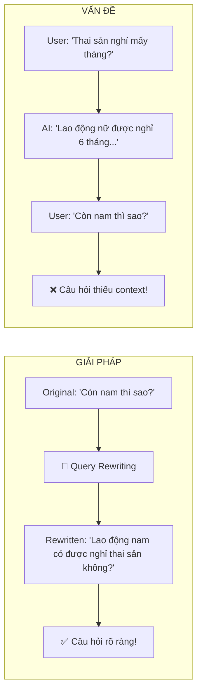
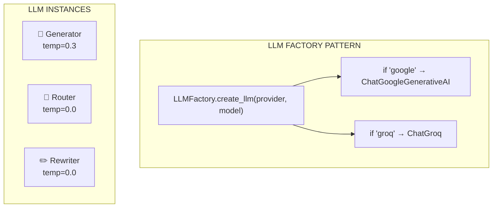

---
---

<LayoutSection title="RAG Engine & LLM Integration">

**Từ Search Results → Câu Trả Lời Thông Minh**

👤 Phúc

</LayoutSection>

---

<LayoutComparison title="Intent Routing" leftTitle="Without Router" rightTitle="With Router">

<template #left>

### Bad UX

```
User: "Xin chào!"

System: [searches legal database]

System: "Tôi không tìm thấy 
tài liệu về 'xin chào'..."
```

❌ Cố search mọi thứ

</template>

<template #right>

### Good UX

```
User: "Xin chào!"

Router: → GENERAL

System: "Xin chào! Tôi là 
trợ lý pháp lý AI..."
```

✅ Phản hồi thông minh

</template>

</LayoutComparison>

---

<LayoutTwoCol title="Intent Router Implementation">

<template #left>

### Router Prompt

```python
ROUTER_TEMPLATE = """
Phân loại câu hỏi:
1. "LEGAL": Luật pháp, quy định
2. "GENERAL": Chào hỏi, xã giao

CHỈ trả về: "LEGAL" hoặc "GENERAL"

Câu hỏi: {question}
"""
```

</template>

<template #right>

### Ví dụ phân loại

| Query | Intent |
|-------|--------|
| "Thai sản nghỉ mấy tháng?" | **LEGAL** |
| "Xin chào!" | **GENERAL** |
| "Điều 139 nói gì?" | **LEGAL** |
| "1 + 1 = ?" | **GENERAL** |

**LEGAL** → RAG Pipeline  
**GENERAL** → Direct Response

</template>

</LayoutTwoCol>

---

<LayoutTitleContent title="General Response Prompt">

```python
GENERAL_SYSTEM_PROMPT = """
Bạn là Trợ lý Pháp luật AI chuyên về luật lao động VN.
Người dùng vừa đưa ra câu chào xã giao.

Nhiệm vụ:
1. Dựa vào [LỊCH SỬ] để hiểu ngữ cảnh.
2. Phản hồi lịch sự, thân thiện, ngắn gọn.
3. Nếu hỏi về thông tin cá nhân → trả lời từ lịch sử.
4. LUÔN hướng người dùng quay lại chủ đề pháp luật.

[LỊCH SỬ TRÒ CHUYỆN]
{chat_history}

[CÂU HỎI CỦA NGƯỜI DÙNG]
{question}

[CÂU TRẢ LỜI CỦA BẠN]"""
```

</LayoutTitleContent>

---

<LayoutTitleContent title="LEGAL Response Prompt">

```python
QA_SYSTEM_PROMPT = """
Bạn là Cố vấn Pháp lý AI cấp cao, chuyên về Luật Lao động Việt Nam.
Phong cách: Chuyên nghiệp, Khách quan, Dựa trên bằng chứng.

QUY TRÌNH TƯ DUY (Chain of Thought):
1. Đọc kỹ câu hỏi để xác định vấn đề pháp lý cốt lõi
2. Rà soát [TÀI LIỆU THAM KHẢO] để tìm Điều khoản liên quan
3. Xây dựng câu trả lời theo cấu trúc IRAC

NGUYÊN TẮC BẮT BUỘC:
1. TUYỆT ĐỐI KHÔNG BỊA ĐẶT (Hallucination)
2. CHỈ sử dụng thông tin từ Context
3. LUÔN trích dẫn nguồn cụ thể [Nguồn: file.pdf, Trang: X]
"""
```

</LayoutTitleContent>

---

<LayoutTwoCol title="IRAC Structure">

<template #left>

### Framework

| Component | Meaning |
|-----------|---------|
| **I**ssue | Vấn đề pháp lý |
| **R**ule | Điều luật áp dụng |
| **A**nalysis | Phân tích cụ thể |
| **C**onclusion | Kết luận ngắn gọn |

</template>

<template #right>

### Example Response

```markdown
### 1. Căn cứ pháp lý
- Điều 139 BLLĐ 2019 
  [Nguồn: blld.pdf, Trang: 46]

### 2. Phân tích
Theo Điều 139, lao động nữ 
được nghỉ thai sản tổng cộng 
6 tháng...

### 3. Kết luận
Bạn được nghỉ **6 tháng**.
```

</template>

</LayoutTwoCol>

---

<LayoutDiagram title="Query Rewriting">



</LayoutDiagram>

---

<LayoutTitleContent title="Query Rewriting Prompt">

```python
CONDENSE_QUESTION_SYSTEM_PROMPT = """
Bạn là một chuyên gia ngôn ngữ.
Nhiệm vụ: Viết lại câu hỏi thành câu hỏi ĐỘC LẬP.

YÊU CẦU:
1. KHÔNG trả lời câu hỏi. CHỈ viết lại.
2. Câu hỏi phải đầy đủ chủ ngữ, vị ngữ.
3. Thay đại từ (nó, cái đó...) bằng danh từ cụ thể.
4. Nếu câu hỏi đã rõ → chép lại y nguyên.
5. KHÔNG thêm "Người dùng muốn biết..."

[LỊCH SỬ TRÒ CHUYỆN]
{chat_history}

[CÂU HỎI MỚI]
{question}

[CÂU HỎI ĐỘC LẬP]"""
```

</LayoutTitleContent>


---

<LayoutTwoCol title="Context ">

<template #left>

### Query Rewriting

```python
# Input cho Rewriter LLM
{
    "chat_history": chat_history_str,
    "question": query
}
```

| Input | Source |  
|-------|---------|
| `chat_history_str` | role + content |


</template>

<template #right>

### RAG Generation

```python
# Input cho Generator LLM
{
    "context": format_context(docs),
    "question": standalone_query
}
```

| Input | Source |
|-------|--------|
| `context` | Vector Search |
| `question` | Rewriter output |

</template>

</LayoutTwoCol>

---

<LayoutDiagram title="Multi-LLM Architecture">



</LayoutDiagram>

---

<LayoutTwoCol title="Supported LLM Providers">

<template #left>

### Groq

| Thuộc tính | Giá trị |
|------------|---------|
| Model | Kimi K2 |
| Speed | Ultra-fast (~300ms) |
| Free Tier | Generous |

```bash
LLM_PROVIDER=groq
LLM_MODEL_NAME=moonshotai/kimi-k2-instruct
```

</template>

<template #right>

### Google Gemini

| Thuộc tính | Giá trị |
|------------|---------|
| Model | Gemini 2.5 Flash |
| Quality | High |
| Context | Large window |

```bash
LLM_PROVIDER=google
LLM_MODEL_NAME=gemini-2.5-flash-lite
```

</template>

</LayoutTwoCol>


