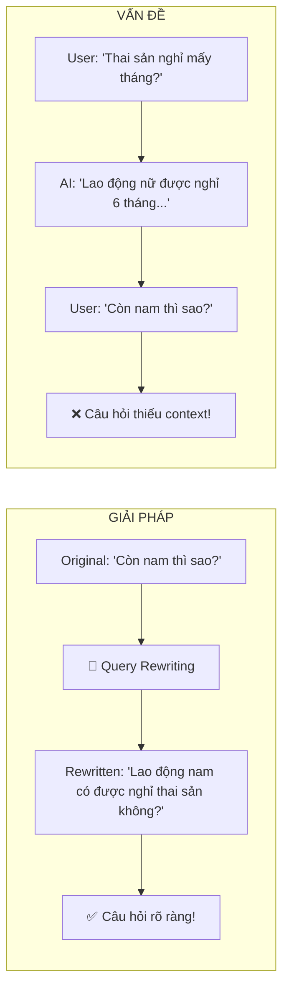
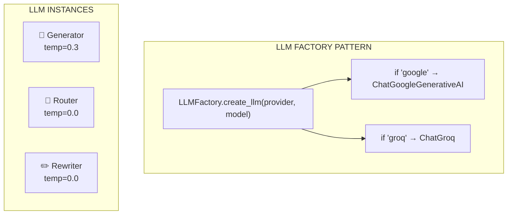

---
---

<LayoutSection title="RAG Engine & LLM Integration">

**Từ Search Results → Câu Trả Lời Thông Minh**

👤 Phúc

</LayoutSection>

---

<LayoutComparison title="Keyword vs Semantic Search" leftTitle="Keyword Search" rightTitle="Semantic Search">

<template #left>

### Exact Word Matching

```
Query: "nghỉ đẻ được mấy tháng?"

❌ Không match "thai sản"
❌ Miss relevant documents
```

- Chỉ tìm **exact words**
- Miss: "nghỉ đẻ", "maternity"

</template>

<template #right>

### Meaning-based Matching

```
Query: "nghỉ đẻ được mấy tháng?"

✅ Match "nghỉ thai sản"
✅ Match "sinh con"
```

- Hiểu **ý nghĩa/khái niệm**
- Catch tất cả related terms

</template>

</LayoutComparison>

---

<LayoutTitleContent title="SemanticRetriever Class">

```python
# src/rag_engine/retriever.py
class SemanticRetriever:
    def __init__(self):
        self.embeddings = HuggingFaceEmbeddings(...)  # vietnamese-bi-encoder
        self.vector_store = FAISS.load_local(...)     # FAISS index
    
    def get_relevant_docs(self, query: str, k: int = 10):
        """Retrieve top-k relevant documents."""
        docs = self.vector_store.similarity_search(query, k=k)
        return docs
```

| Parameter | Giá trị | Ý nghĩa |
|-----------|---------|---------|
| **k** | 10 | Lấy top 10 documents liên quan nhất |
| **Search** | similarity_search | Dựa trên cosine similarity |

</LayoutTitleContent>

---

<LayoutComparison title="Intent Routing" leftTitle="Without Router" rightTitle="With Router">

<template #left>

### Bad UX

```
User: "Xin chào!"

System: [searches legal database]

System: "Tôi không tìm thấy 
tài liệu về 'xin chào'..."
```

❌ Cố search mọi thứ

</template>

<template #right>

### Good UX

```
User: "Xin chào!"

Router: → GENERAL

System: "Xin chào! Tôi là 
trợ lý pháp lý AI..."
```

✅ Phản hồi thông minh

</template>

</LayoutComparison>

---

<LayoutTwoCol title="Intent Router Implementation">

<template #left>

### Router Prompt

```python
ROUTER_TEMPLATE = """
Phân loại câu hỏi:
1. "LEGAL": Luật pháp, quy định
2. "GENERAL": Chào hỏi, xã giao

CHỈ trả về: "LEGAL" hoặc "GENERAL"

Câu hỏi: {question}
"""
```

</template>

<template #right>

### Ví dụ phân loại

| Query | Intent |
|-------|--------|
| "Thai sản nghỉ mấy tháng?" | **LEGAL** |
| "Xin chào!" | **GENERAL** |
| "Điều 139 nói gì?" | **LEGAL** |
| "1 + 1 = ?" | **GENERAL** |

**LEGAL** → RAG Pipeline  
**GENERAL** → Direct Response

</template>

</LayoutTwoCol>

---

<LayoutDiagram title="Query Rewriting">



</LayoutDiagram>

---

<LayoutTitleContent title="System Prompt - AI Definition">

```python
QA_SYSTEM_PROMPT = """
Bạn là Cố vấn Pháp lý AI cấp cao, chuyên về Luật Lao động Việt Nam.
Phong cách: Chuyên nghiệp, Khách quan, Dựa trên bằng chứng.

QUY TRÌNH TƯ DUY (Chain of Thought):
1. Đọc kỹ câu hỏi để xác định vấn đề pháp lý cốt lõi
2. Rà soát [TÀI LIỆU THAM KHẢO] để tìm Điều khoản liên quan
3. Xây dựng câu trả lời theo cấu trúc IRAC

NGUYÊN TẮC BẮT BUỘC:
1. TUYỆT ĐỐI KHÔNG BỊA ĐẶT (Hallucination)
2. CHỈ sử dụng thông tin từ Context
3. LUÔN trích dẫn nguồn cụ thể [Nguồn: file.pdf, Trang: X]
"""
```

</LayoutTitleContent>

---

<LayoutTwoCol title="IRAC Structure">

<template #left>

### Framework

| Component | Meaning |
|-----------|---------|
| **I**ssue | Vấn đề pháp lý |
| **R**ule | Điều luật áp dụng |
| **A**nalysis | Phân tích cụ thể |
| **C**onclusion | Kết luận ngắn gọn |

</template>

<template #right>

### Example Response

```markdown
### 1. Căn cứ pháp lý
- Điều 139 BLLĐ 2019 
  [Nguồn: blld.pdf, Trang: 46]

### 2. Phân tích
Theo Điều 139, lao động nữ 
được nghỉ thai sản tổng cộng 
6 tháng...

### 3. Kết luận
Bạn được nghỉ **6 tháng**.
```

</template>

</LayoutTwoCol>

---

<LayoutTwoCol title="Context ">

<template #left>

### Query Rewriting

```python
# Input cho Rewriter LLM
{
    "chat_history": chat_history_str,
    "question": query
}
```

| Input | Source |  
|-------|---------|
| `chat_history_str` | role + content |


</template>

<template #right>

### RAG Generation

```python
# Input cho Generator LLM
{
    "context": format_context(docs),
    "question": standalone_query
}
```

| Input | Source |
|-------|--------|
| `context` | Vector Search |
| `question` | Rewriter output |

</template>

</LayoutTwoCol>

<!--
"Hai context quan trọng:

1. Query Rewriting: Chỉ lấy role và content từ database để tạo chat_history. Không cần sources hay timestamp vì LLM chỉ cần hiểu ngữ cảnh hội thoại.

2. RAG Generation: Dùng context từ Vector Search (các đoạn văn bản pháp luật) và câu hỏi đã được rewrite."
-->

---

<LayoutDiagram title="Multi-LLM Architecture">



</LayoutDiagram>

---

<LayoutTwoCol title="Supported LLM Providers">

<template #left>

### Groq

| Thuộc tính | Giá trị |
|------------|---------|
| Model | Kimi K2 |
| Speed | Ultra-fast (~300ms) |
| Free Tier | Generous |

```bash
LLM_PROVIDER=groq
LLM_MODEL_NAME=moonshotai/kimi-k2-instruct
```

</template>

<template #right>

### Google Gemini

| Thuộc tính | Giá trị |
|------------|---------|
| Model | Gemini 2.5 Flash |
| Quality | High |
| Context | Large window |

```bash
LLM_PROVIDER=google
LLM_MODEL_NAME=gemini-2.5-flash-lite
```

</template>

</LayoutTwoCol>


