```mermaid
flowchart LR
    subgraph Solution["GIẢI PHÁP"]
        E["Original: 'Còn nam thì sao?'"]
        F["🧠 Query Rewriting"]
        G["Rewritten: 'Lao động nam có được nghỉ thai sản không?'"]
        H["✅ Câu hỏi rõ ràng!"]
    end
    
    subgraph Problem["VẤN ĐỀ"]
        A["User: 'Thai sản nghỉ mấy tháng?'"]
        B["AI: 'Lao động nữ được nghỉ 6 tháng...'"]
        C["User: 'Còn nam thì sao?'"]
        D["❌ Câu hỏi thiếu context!"]
    end
    
    A --> B --> C --> D
    E --> F --> G --> H
```

```mermaid
flowchart TB
    subgraph Factory["LLM FACTORY PATTERN"]
        F["LLMFactory.create_llm(provider, model)"]
        G["if 'google' → ChatGoogleGenerativeAI"]
        H["if 'groq' → ChatGroq"]
        F --> G
        F --> H
    end
    
    subgraph Instances["LLM INSTANCES"]
        I1["🤖 Generator<br/>temp=0.3"]
        I2["🔀 Router<br/>temp=0.0"]
        I3["✏️ Rewriter<br/>temp=0.0"]
    end
```

---
---

<LayoutSection title="RAG Engine & LLM Integration">

**Từ Search Results → Câu Trả Lời Thông Minh**

👤 Member 3

</LayoutSection>

---

<LayoutComparison title="Keyword vs Semantic Search" leftTitle="Keyword Search" rightTitle="Semantic Search">

<template #left>

### Exact Word Matching

```
Query: "nghỉ đẻ được mấy tháng?"

❌ Không match "thai sản"
❌ Miss relevant documents
```

- Chỉ tìm **exact words**
- Miss: "nghỉ đẻ", "maternity"

</template>

<template #right>

### Meaning-based Matching

```
Query: "nghỉ đẻ được mấy tháng?"

✅ Match "nghỉ thai sản"
✅ Match "sinh con"
```

- Hiểu **ý nghĩa/khái niệm**
- Catch tất cả related terms

</template>

</LayoutComparison>

---

<LayoutTitleContent title="SemanticRetriever Class">

```python
# src/rag_engine/retriever.py
class SemanticRetriever:
    def __init__(self):
        self.embeddings = HuggingFaceEmbeddings(...)  # vietnamese-bi-encoder
        self.vector_store = FAISS.load_local(...)     # FAISS index
    
    def get_relevant_docs(self, query: str, k: int = 10):
        """Retrieve top-k relevant documents."""
        docs = self.vector_store.similarity_search(query, k=k)
        return docs
```

| Parameter | Giá trị | Ý nghĩa |
|-----------|---------|---------|
| **k** | 10 | Lấy top 10 documents liên quan nhất |
| **Search** | similarity_search | Dựa trên cosine similarity |

</LayoutTitleContent>

---

<LayoutComparison title="Intent Routing" leftTitle="Without Router" rightTitle="With Router">

<template #left>

### Bad UX

```
User: "Xin chào!"

System: [searches legal database]

System: "Tôi không tìm thấy 
tài liệu về 'xin chào'..."
```

❌ Cố search mọi thứ

</template>

<template #right>

### Good UX

```
User: "Xin chào!"

Router: → GENERAL

System: "Xin chào! Tôi là 
trợ lý pháp lý AI..."
```

✅ Phản hồi thông minh

</template>

</LayoutComparison>

---

<LayoutTwoCol title="Intent Router Implementation">

<template #left>

### Router Prompt

```python
ROUTER_TEMPLATE = """
Phân loại câu hỏi:
1. "LEGAL": Luật pháp, quy định
2. "GENERAL": Chào hỏi, xã giao

CHỈ trả về: "LEGAL" hoặc "GENERAL"

Câu hỏi: {question}
"""
```

</template>

<template #right>

### Ví dụ phân loại

| Query | Intent |
|-------|--------|
| "Thai sản nghỉ mấy tháng?" | **LEGAL** |
| "Xin chào!" | **GENERAL** |
| "Điều 139 nói gì?" | **LEGAL** |
| "1 + 1 = ?" | **GENERAL** |

**LEGAL** → RAG Pipeline  
**GENERAL** → Direct Response

</template>

</LayoutTwoCol>

---

<LayoutDiagram title="Query Rewriting">



</LayoutDiagram>

---

<LayoutTitleContent title="What is Prompt Engineering?">

| Khái niệm | Giải thích |
|-----------|------------|
| **Prompt** | Input text gửi cho LLM |
| **Engineering** | Thiết kế prompt để nhận output chất lượng cao |

```
Same LLM, Different Prompts:

Prompt 1: "Nói về thai sản"
→ "Thai sản là quá trình mang thai và sinh con..."
   ❌ Generic, không focus pháp lý

Prompt 2: "Bạn là Cố vấn Pháp lý AI. Dựa trên tài liệu sau..."
→ "Theo Điều 139 Bộ luật Lao động, lao động nữ được nghỉ..."
   ✅ Professional, có trích dẫn nguồn
```

</LayoutTitleContent>

---

<LayoutTitleContent title="System Prompt - AI Definition">

```python
QA_SYSTEM_PROMPT = """
Bạn là Cố vấn Pháp lý AI cấp cao, chuyên về Luật Lao động Việt Nam.
Phong cách: Chuyên nghiệp, Khách quan, Dựa trên bằng chứng.

QUY TRÌNH TƯ DUY (Chain of Thought):
1. Đọc kỹ câu hỏi để xác định vấn đề pháp lý cốt lõi
2. Rà soát [TÀI LIỆU THAM KHẢO] để tìm Điều khoản liên quan
3. Xây dựng câu trả lời theo cấu trúc IRAC

NGUYÊN TẮC BẮT BUỘC:
1. TUYỆT ĐỐI KHÔNG BỊA ĐẶT (Hallucination)
2. CHỈ sử dụng thông tin từ Context
3. LUÔN trích dẫn nguồn cụ thể [Nguồn: file.pdf, Trang: X]
"""
```

</LayoutTitleContent>

---

<LayoutTwoCol title="IRAC Structure">

<template #left>

### Framework

| Component | Meaning |
|-----------|---------|
| **I**ssue | Vấn đề pháp lý |
| **R**ule | Điều luật áp dụng |
| **A**nalysis | Phân tích cụ thể |
| **C**onclusion | Kết luận ngắn gọn |

</template>

<template #right>

### Example Response

```markdown
### 1. Căn cứ pháp lý
- Điều 139 BLLĐ 2019 
  [Nguồn: blld.pdf, Trang: 46]

### 2. Phân tích
Theo Điều 139, lao động nữ 
được nghỉ thai sản tổng cộng 
6 tháng...

### 3. Kết luận
Bạn được nghỉ **6 tháng**.
```

</template>

</LayoutTwoCol>

---

<LayoutDiagram title="Multi-LLM Architecture">



</LayoutDiagram>

---

<LayoutTwoCol title="Supported LLM Providers">

<template #left>

### Groq

| Thuộc tính | Giá trị |
|------------|---------|
| Model | Kimi K2 |
| Speed | Ultra-fast (~300ms) |
| Free Tier | Generous |

```bash
LLM_PROVIDER=groq
LLM_MODEL_NAME=moonshotai/kimi-k2-instruct
```

</template>

<template #right>

### Google Gemini

| Thuộc tính | Giá trị |
|------------|---------|
| Model | Gemini 2.5 Flash |
| Quality | High |
| Context | Large window |

```bash
LLM_PROVIDER=google
LLM_MODEL_NAME=gemini-2.5-flash-lite
```

</template>

</LayoutTwoCol>

---

<LayoutTitleContent title="RAG Engine Summary">

| Chủ đề | Điểm chính |
|--------|------------|
| **Semantic Search** | Hiểu nghĩa, không chỉ keyword |
| **Intent Router** | LEGAL vs GENERAL, skip search khi không cần |
| **Query Rewriting** | Biến follow-up thành standalone question |
| **Prompt Engineering** | IRAC structure, Chain-of-Thought, anti-hallucination |
| **LLM Factory** | Multi-provider, easy switching |

**Tiếp theo:** Member 4 - Frontend, Database & Demo

*"Trải nghiệm người dùng như thế nào?"*

</LayoutTitleContent>
