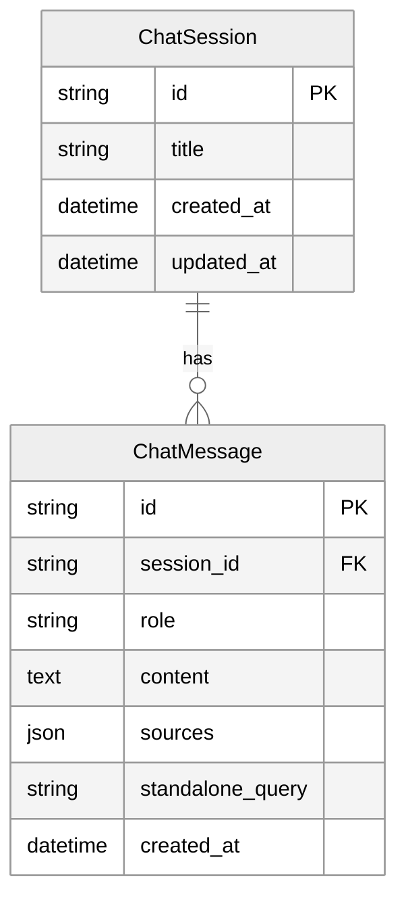

---
---

<LayoutSection title="Frontend, Database & Live Demo">

**Trải nghiệm người dùng thực tế**

👤 Member 4

</LayoutSection>

---

<LayoutTwoCol title="Why use Streamlit?">

<template #left>

### Đặc điểm

| Feature | Lợi ích |
|---------|---------|
| **Pure Python** | Không cần JS, HTML, CSS |
| **Hot reload** | Code → UI update ngay |
| **Chat components** | Built-in sẵn |
| **Session state** | Quản lý state dễ |

</template>

<template #right>

### Code Example

```python
import streamlit as st

st.title("🤖 Trợ lý AI")

if prompt := st.chat_input("Nhập câu hỏi..."):
    with st.chat_message("user"):
        st.markdown(prompt)
```

**~300 dòng code** → Chat interface hoàn chỉnh

</template>

</LayoutTwoCol>

---

<LayoutTitleContent title="Interface Layout">

```
┌─────────────────────────────────────────────────────────────┐
│  🤖 Trợ lý AI Tra cứu Pháp Luật                            │
├──────────────────┬──────────────────────────────────────────┤
│                  │                                          │
│  SIDEBAR         │           MAIN CHAT AREA                 │
│                  │                                          │
│  ➕ Cuộc hội     │  👤 User: Thai sản nghỉ mấy tháng?      │
│  thoại mới       │                                          │
│                  │  🤖 AI: Theo Điều 139...                │
│  ─────────       │         📚 Nguồn tham khảo              │
│  Gần đây         │             └─ [expandable]             │
│  💬 Session 1    │                                          │
│  💬 Session 2    │  ─────────────────────────────────────── │
│                  │                                          │
│  ⚙️ Quản lý     │  💬 Nhập câu hỏi của bạn...             │
│  ⚡ Chế độ TK    │                                          │
└──────────────────┴──────────────────────────────────────────┘
```

</LayoutTitleContent>

---

<LayoutTitleContent title="UI Features">

| Tính năng | Mô tả |
|-----------|-------|
| **Session Management** | Tạo mới, chuyển đổi, xóa hội thoại |
| **Source Display** | Expandable panel hiển thị nguồn trích dẫn |
| **Context Understanding** | Hiển thị câu hỏi đã được viết lại |
| **Search Mode** | Chọn quality/balanced/speed |
| **Data Update** | Button cập nhật index khi có luật mới |

```python
# Hiển thị nguồn tham khảo
with st.expander("📚 Nguồn tham khảo"):
    for doc in sources:
        st.caption(f"📄 {doc.source} (Trang {doc.page})")

# Hiển thị query rewriting
with st.expander("🧠 Tư duy ngữ cảnh"):
    st.info(f"AI đã hiểu: **{standalone_query}**")
```

</LayoutTitleContent>

---

<LayoutComparison title="Database Persistence" leftTitle="No Database" rightTitle="With Database">

<template #left>

### Vấn đề

```
User chat 
    ↓
Close browser 
    ↓
Mất hết lịch sử 😢
```

❌ Frustrating UX

</template>

<template #right>

### Giải pháp

```
User chat 
    ↓
Close browser 
    ↓
Reopen 
    ↓
Thấy lại lịch sử ✅
```

✅ Persistent data

</template>

</LayoutComparison>

---

<LayoutDiagram title="Database Schema">



</LayoutDiagram>

<!--
"Schema rất đơn giản với 2 bảng:

ChatSession: Đại diện cho một cuộc hội thoại. Có ID, tiêu đề (tự động từ tin nhắn đầu), và timestamps.

ChatMessage: Mỗi tin nhắn trong session. Có role (user hoặc assistant), nội dung, và quan trọng là sources - lưu nguồn trích dẫn dưới dạng JSON.

Relationship là 1:N - một session có nhiều messages."
-->

---

<LayoutTitleContent title="Repository Pattern">

```python
# src/database/repository.py
class ChatRepository:
    def create_session(self, title: str) -> ChatSession:
        """Tạo hội thoại mới."""
        
    def get_messages(self, session_id: str) -> List[ChatMessage]:
        """Lấy tất cả tin nhắn của một session."""
        
    def add_message(self, session_id, role, content, sources):
        """Thêm tin nhắn mới."""
        
    def delete_session(self, session_id: str):
        """Xóa hội thoại (cascade delete messages)."""
```

| Pattern | Lợi ích |
|---------|---------|
| **Centralized** | Tất cả DB logic ở một nơi |
| **Abstraction** | UI không cần biết SQL details |
| **Testable** | Dễ dàng mock cho testing |

</LayoutTitleContent>

<!--
"Chúng tôi dùng Repository Pattern - một layer abstraction trên database.

ChatRepository cung cấp các methods như create_session, get_messages, add_message.

UI layer chỉ cần gọi repo.add_message(...), không cần biết SQL như thế nào bên dưới.

Pattern này giúp code clean hơn và dễ test hơn."
-->

---

<LayoutTitleContent title="Cold Start Problem">

```
User opens app
    └── Load Embedding Model (~17s) ← CHẬM!
        └── Load FAISS Index (~0.5s)
            └── Initialize LLMs (~1s)
                └── Ready to chat (~18.5s total)

Mỗi lần reload page: 18.5s delay!
```

### Giải pháp: @st.cache_resource

| Load | Time |
|------|------|
| **First load** | ~17s (unavoidable) |
| **Subsequent loads** | <1s ✅ |

</LayoutTitleContent>

<!--
"Một vấn đề lớn với AI apps là cold start.

Embedding model nặng 1.5GB. Load lần đầu mất 17 giây. Nếu mỗi lần reload page đều phải load lại, user experience sẽ rất tệ.

Giải pháp là caching. Streamlit có decorator @st.cache_resource - load model một lần, cache trong memory.

Kết quả: Lần đầu vẫn 17 giây, nhưng reload sau đó chỉ dưới 1 giây."
-->

---

<LayoutTwoCol title="Caching Strategy">

<template #left>

### Code

```python
@st.cache_resource(show_spinner="Đang khởi động...")
def get_retriever():
    """Load ONCE, reuse forever."""
    return SemanticRetriever()

@st.cache_resource
def get_rag_chain():
    """Load ONCE, reuse across all users."""
    retriever = get_retriever()
    return RAGChain(retriever)
```

</template>

<template #right>

### What's Cached

| Component | Size | Load Time |
|-----------|------|-----------|
| Embedding Model | ~1.5 GB | ~15s |
| FAISS Index | ~10 MB | ~0.5s |
| LLM Connections | ~100 MB | ~1s |

**First load ~17s → Subsequent <1s**

</template>

</LayoutTwoCol>

<!--
"Đây là code caching:

get_retriever() load embedding model và FAISS index. Được cache, chỉ chạy một lần.

get_rag_chain() tạo RAG chain với LLM connections. Cũng được cache.

Kết quả: First load ~17s, subsequent loads <1s. Trải nghiệm user smooth hơn nhiều."
-->

---

<LayoutComparison title="Stateless Design" leftTitle="❌ Stateful (Cannot cache)" rightTitle="✅ Stateless (Can cache)">

<template #left>

```python
class RAGChain:
    def __init__(self):
        self.history = []  # State inside
    
    def answer(self, query):
        # Uses internal history
```

- Mỗi user cần instance riêng
- Không thể share

</template>

<template #right>

```python
class RAGChain:
    def __init__(self):
        pass  # No internal state
    
    def answer(self, query, history_str):
        # History injected
```

- Một instance phục vụ tất cả
- Cacheable

</template>

</LayoutComparison>

<!--
"Để caching hoạt động, RAGChain phải là stateless.

Nếu RAGChain lưu history bên trong, mỗi user cần một instance riêng, không thể share.

Thiết kế của chúng tôi: RAGChain không lưu state. History được pass vào từ bên ngoài mỗi lần gọi.

Nhờ vậy, một RAGChain instance có thể phục vụ tất cả users."
-->

---

<LayoutTitleContent title="Demo Flow">

| Bước | Nội dung | Mục đích |
|------|----------|----------|
| 1 | Giới thiệu giao diện | Show layout |
| 2 | Câu hỏi pháp lý đầu tiên | Show RAG + citations |
| 3 | Follow-up question | Show query rewriting |
| 4 | General chat | Show intent routing |
| 5 | Session management | Show persistence |

### Demo Questions

```
1. "Thai sản được nghỉ bao nhiêu ngày?"
2. "Còn nam thì sao?"
3. "Xin chào, tên tôi là Hùng"
4. "Tên tôi là gì?"
```

</LayoutTitleContent>

---

<LayoutTitleContent title="System Recap">

| Thành phần | Người trình bày | Key Points |
|------------|-----------------|------------|
| **Kiến trúc** | Member 1 | RAG, Modular Monolith |
| **Data Ingestion** | Member 2 | Load, Split, Embed, Index |
| **RAG Engine** | Member 3 | Semantic Search, Prompts |
| **Frontend & DB** | Member 4 | Streamlit, SQLite, Caching |

### Kết quả đạt được

| Metric | Kết quả |
|--------|---------|
| **Response Time** | ~1-2 giây |
| **Accuracy** | Có trích dẫn nguồn verify được |
| **User Experience** | Chat tự nhiên, nhớ context |
| **Maintainability** | Cập nhật luật mới dễ dàng |

</LayoutTitleContent>

---

<LayoutSection title="❓ Q&A & Discussion">

**Mời mọi người đặt câu hỏi**

<div class="my-8 border-t border-slate-300 opacity-50 w-24"></div>

🙏 Cảm ơn đã lắng nghe!

</LayoutSection>
