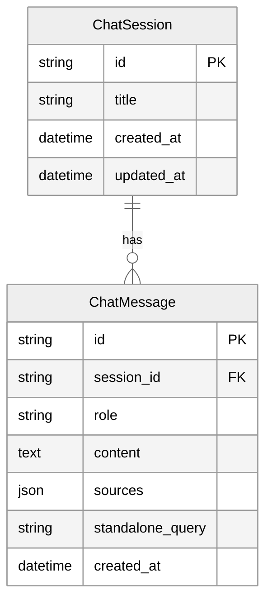

---
---

<LayoutSection title="Frontend, Database & Live Demo">

**Trải nghiệm người dùng thực tế**

👤 Hùng

</LayoutSection>

---

<LayoutTitleContent title="UI Features">

| Tính năng | Mô tả |
|-----------|-------|
| **Session Management** | Tạo mới, chuyển đổi, xóa hội thoại |
| **Source Display** | Expandable panel hiển thị nguồn trích dẫn |
| **Context Understanding** | Hiển thị câu hỏi đã được viết lại |
| **Search Mode** | Chọn quality/balanced/speed |
| **Data Update** | Button cập nhật index khi có luật mới |

```python
# Hiển thị nguồn tham khảo
with st.expander("📚 Nguồn tham khảo"):
    for doc in sources:
        st.caption(f"📄 {doc.source} (Trang {doc.page})")

# Hiển thị query rewriting
with st.expander("🧠 Tư duy ngữ cảnh"):
    st.info(f"AI đã hiểu: **{standalone_query}**")
```

</LayoutTitleContent>

---

<LayoutComparison title="Database Persistence" leftTitle="No Database" rightTitle="With Database">

<template #left>

### Vấn đề

```
User chat 
    ↓
Close browser 
    ↓
Mất hết lịch sử 😢
```

❌ Frustrating UX

</template>

<template #right>

### Giải pháp

```
User chat 
    ↓
Close browser 
    ↓
Reopen 
    ↓
Thấy lại lịch sử ✅
```

✅ Persistent data

</template>

</LayoutComparison>

---

<LayoutDiagram title="Database Schema">



</LayoutDiagram>

<!--
"Schema rất đơn giản với 2 bảng:

ChatSession: Đại diện cho một cuộc hội thoại. Có ID, tiêu đề (tự động từ tin nhắn đầu), và timestamps.

ChatMessage: Mỗi tin nhắn trong session. Có role (user hoặc assistant), nội dung, và quan trọng là sources - lưu nguồn trích dẫn dưới dạng JSON.

Relationship là 1:N - một session có nhiều messages."
-->

---

<LayoutTitleContent title="Demo Flow">

| Bước | Nội dung | Mục đích |
|------|----------|----------|
| 1 | Giới thiệu giao diện | Show layout |
| 2 | Câu hỏi pháp lý đầu tiên | Show RAG + citations |
| 3 | Follow-up question | Show query rewriting |
| 4 | General chat | Show intent routing |
| 5 | Session management | Show persistence |

### Demo Questions

```
1. "Thai sản được nghỉ bao nhiêu ngày?"
2. "Còn nam thì sao?"
3. "Xin chào, tên tôi là Hùng"
4. "Tên tôi là gì?"
```

</LayoutTitleContent>

---

<LayoutTitleContent title="System Recap">

| Thành phần | Người trình bày | Key Points |
|------------|-----------------|------------|
| **Kiến trúc** | Giang | RAG, Modular Monolith |
| **Data Ingestion** | Hiệp | Load, Split, Embed, Index |
| **RAG Engine** | Phúc | Semantic Search, Prompts |
| **Frontend & DB** | Hùng | Streamlit, SQLite, Caching |

### Kết quả đạt được

| Metric | Kết quả |
|--------|---------|
| **Response Time** | ~1-2 giây |
| **Accuracy** | Có trích dẫn nguồn verify được |
| **User Experience** | Chat tự nhiên, nhớ context |
| **Maintainability** | Cập nhật luật mới dễ dàng |

</LayoutTitleContent>

---

<LayoutSection title="❓ Q&A & Discussion">

**Mời mọi người đặt câu hỏi**

<div class="my-8 border-t border-slate-300 opacity-50 w-24"></div>

🙏 Cảm ơn đã lắng nghe!

</LayoutSection>
