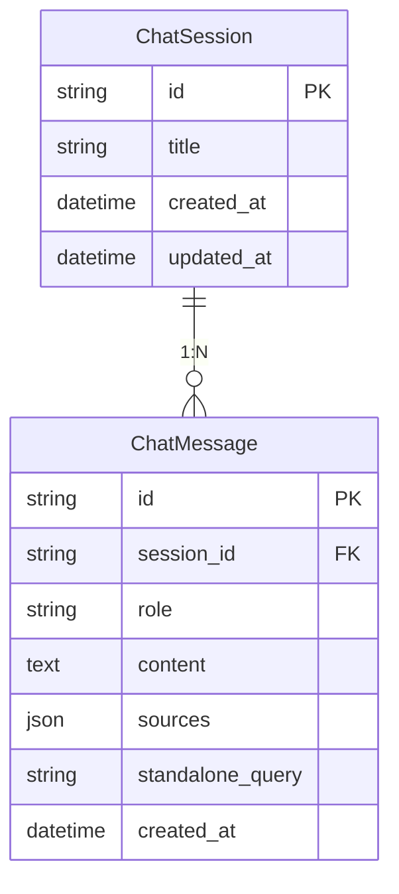

---
---

<LayoutSection title="Frontend, Database & Live Demo">

**Trải nghiệm người dùng thực tế**

👤 Member 4

</LayoutSection>

---

<LayoutTwoCol title="Why use Streamlit?">

<template #left>

### Đặc điểm

| Feature | Lợi ích |
|---------|---------|
| **Pure Python** | Không cần JS, HTML, CSS |
| **Hot reload** | Code → UI update ngay |
| **Chat components** | Built-in sẵn |
| **Session state** | Quản lý state dễ |

</template>

<template #right>

### Code Example

```python
import streamlit as st

st.title("🤖 Trợ lý AI")

if prompt := st.chat_input("Nhập câu hỏi..."):
    with st.chat_message("user"):
        st.markdown(prompt)
```

**~300 dòng code** → Chat interface hoàn chỉnh

</template>

</LayoutTwoCol>

---

<LayoutTitleContent title="Interface Layout">

```
┌─────────────────────────────────────────────────────────────┐
│  🤖 Trợ lý AI Tra cứu Pháp Luật                            │
├──────────────────┬──────────────────────────────────────────┤
│                  │                                          │
│  SIDEBAR         │           MAIN CHAT AREA                 │
│                  │                                          │
│  ➕ Cuộc hội     │  👤 User: Thai sản nghỉ mấy tháng?      │
│  thoại mới       │                                          │
│                  │  🤖 AI: Theo Điều 139...                │
│  ─────────       │         📚 Nguồn tham khảo              │
│  Gần đây         │             └─ [expandable]             │
│  💬 Session 1    │                                          │
│  💬 Session 2    │  ─────────────────────────────────────── │
│                  │                                          │
│  ⚙️ Quản lý     │  💬 Nhập câu hỏi của bạn...             │
│  ⚡ Chế độ TK    │                                          │
└──────────────────┴──────────────────────────────────────────┘
```

</LayoutTitleContent>

---

<LayoutTitleContent title="UI Features">

| Tính năng | Mô tả |
|-----------|-------|
| **Session Management** | Tạo mới, chuyển đổi, xóa hội thoại |
| **Source Display** | Expandable panel hiển thị nguồn trích dẫn |
| **Context Understanding** | Hiển thị câu hỏi đã được viết lại |
| **Search Mode** | Chọn quality/balanced/speed |
| **Data Update** | Button cập nhật index khi có luật mới |

```python
# Hiển thị nguồn tham khảo
with st.expander("📚 Nguồn tham khảo"):
    for doc in sources:
        st.caption(f"📄 {doc.source} (Trang {doc.page})")

# Hiển thị query rewriting
with st.expander("🧠 Tư duy ngữ cảnh"):
    st.info(f"AI đã hiểu: **{standalone_query}**")
```

</LayoutTitleContent>

---

<LayoutComparison title="Database Persistence" leftTitle="No Database" rightTitle="With Database">

<template #left>

### Vấn đề

```
User chat 
    ↓
Close browser 
    ↓
Mất hết lịch sử 😢
```

❌ Frustrating UX

</template>

<template #right>

### Giải pháp

```
User chat 
    ↓
Close browser 
    ↓
Reopen 
    ↓
Thấy lại lịch sử ✅
```

✅ Persistent data

</template>

</LayoutComparison>

---

<LayoutDiagram title="Database Schema">



</LayoutDiagram>

---

<LayoutTitleContent title="Repository Pattern">

```python
# src/database/repository.py
class ChatRepository:
    def create_session(self, title: str) -> ChatSession:
        """Tạo hội thoại mới."""
        
    def get_messages(self, session_id: str) -> List[ChatMessage]:
        """Lấy tất cả tin nhắn của một session."""
        
    def add_message(self, session_id, role, content, sources):
        """Thêm tin nhắn mới."""
        
    def delete_session(self, session_id: str):
        """Xóa hội thoại (cascade delete messages)."""
```

| Pattern | Lợi ích |
|---------|---------|
| **Centralized** | Tất cả DB logic ở một nơi |
| **Abstraction** | UI không cần biết SQL details |
| **Testable** | Dễ dàng mock cho testing |

</LayoutTitleContent>

---

<LayoutTitleContent title="Cold Start Problem">

```
User opens app
    └── Load Embedding Model (~17s) ← CHẬM!
        └── Load FAISS Index (~0.5s)
            └── Initialize LLMs (~1s)
                └── Ready to chat (~18.5s total)

Mỗi lần reload page: 18.5s delay!
```

### Giải pháp: @st.cache_resource

| Load | Time |
|------|------|
| **First load** | ~17s (unavoidable) |
| **Subsequent loads** | <1s ✅ |

</LayoutTitleContent>

---

<LayoutTwoCol title="Caching Strategy">

<template #left>

### Code

```python
@st.cache_resource(show_spinner="Đang khởi động...")
def get_retriever():
    """Load ONCE, reuse forever."""
    return SemanticRetriever()

@st.cache_resource
def get_rag_chain():
    """Load ONCE, reuse across all users."""
    retriever = get_retriever()
    return RAGChain(retriever)
```

</template>

<template #right>

### What's Cached

| Component | Size | Load Time |
|-----------|------|-----------|
| Embedding Model | ~1.5 GB | ~15s |
| FAISS Index | ~10 MB | ~0.5s |
| LLM Connections | ~100 MB | ~1s |

**First load ~17s → Subsequent <1s**

</template>

</LayoutTwoCol>

---

<LayoutComparison title="Stateless Design" leftTitle="❌ Stateful (Cannot cache)" rightTitle="✅ Stateless (Can cache)">

<template #left>

```python
class RAGChain:
    def __init__(self):
        self.history = []  # State inside
    
    def answer(self, query):
        # Uses internal history
```

- Mỗi user cần instance riêng
- Không thể share

</template>

<template #right>

```python
class RAGChain:
    def __init__(self):
        pass  # No internal state
    
    def answer(self, query, history_str):
        # History injected
```

- Một instance phục vụ tất cả
- Cacheable

</template>

</LayoutComparison>

---

<LayoutTitleContent title="Demo Flow">

| Bước | Nội dung | Mục đích |
|------|----------|----------|
| 1 | Giới thiệu giao diện | Show layout |
| 2 | Câu hỏi pháp lý đầu tiên | Show RAG + citations |
| 3 | Follow-up question | Show query rewriting |
| 4 | General chat | Show intent routing |
| 5 | Session management | Show persistence |

### Demo Questions

```
1. "Thai sản được nghỉ bao nhiêu ngày?"
2. "Còn nam thì sao?"
3. "Xin chào, tên tôi là Hùng"
4. "Tên tôi là gì?"
```

</LayoutTitleContent>

---

<LayoutTitleContent title="System Recap">

| Thành phần | Người trình bày | Key Points |
|------------|-----------------|------------|
| **Kiến trúc** | Member 1 | RAG, Modular Monolith |
| **Data Ingestion** | Member 2 | Load, Split, Embed, Index |
| **RAG Engine** | Member 3 | Semantic Search, Prompts |
| **Frontend & DB** | Member 4 | Streamlit, SQLite, Caching |

### Kết quả đạt được

| Metric | Kết quả |
|--------|---------|
| **Response Time** | ~1-2 giây |
| **Accuracy** | Có trích dẫn nguồn verify được |
| **User Experience** | Chat tự nhiên, nhớ context |
| **Maintainability** | Cập nhật luật mới dễ dàng |

</LayoutTitleContent>

---

<LayoutSection title="❓ Q&A & Discussion">

**Mời mọi người đặt câu hỏi**

<div class="my-8 border-t border-slate-300 opacity-50 w-24"></div>

🙏 Cảm ơn đã lắng nghe!

</LayoutSection>
