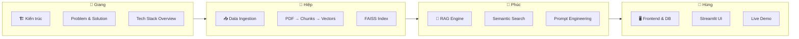

---
---

<LayoutDiagram title="Presentation Timeline">

```mermaid
flowchart LR
    subgraph M1["👤 Giang"]
        A1["🏗️ Kiến trúc"]
        A2["Problem & Solution"]
        A3["Tech Stack Overview"]
    end
    
    subgraph M2["👤 Hiệp"]
        B1["📥 Data Ingestion"]
        B2["PDF → Chunks → Vectors"]
        B3["FAISS Index"]
    end
    
    subgraph M3["👤 Phúc"]
        C1["🧠 RAG Engine"]
        C2["Semantic Search"]
        C3["Prompt Engineering"]
    end
    
    subgraph M4["👤 Hùng"]
        D1["🖥️ Frontend & DB"]
        D2["Streamlit UI"]
        D3["Live Demo"]
    end
    
    M1 --> M2 --> M3 --> M4
```

</LayoutDiagram>

